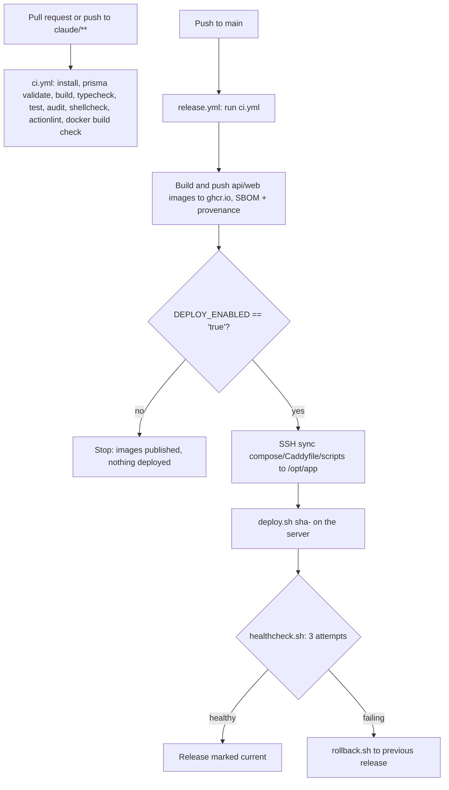

# CI/CD Rehberi

Bu doküman GitHub Actions pipeline'ını açıklar: continuous integration (sürekli entegrasyon),
image yayınlama, smoke test ve otomatik rollback içeren deploy, opsiyonel pull tabanlı gece
(nightly) deploy, güvenlik workflow'ları ve agentic (Claude) workflow'ları. `.github/workflows/`
içindeki workflow'ları ve `deploy/scripts/` içindeki scriptleri yansıtır.

## 1. Genel bakış



## 2. `ci.yml` - Continuous Integration

Her pull request'te ve `claude/**` branch'lerine yapılan push'larda çalışır. `main`'e yapılan
push'lar, `release.yml`'in ilk job'u olarak dolaylı biçimde bunu çalıştırır.

Adımlar:
- `pnpm install --frozen-lockfile`
- `pnpm --filter @platform/database exec prisma validate`
- `pnpm turbo run build`
- `pnpm turbo run typecheck`
- `pnpm turbo run test`
- `pnpm audit --audit-level high` (high ve critical uyarılarında başarısız olur)
- `shellcheck -x deploy/scripts/*.sh`
- `actionlint` (shellcheck entegrasyonu, sabitlenmiş (pinned) sürüm ve checksum ile)
- `api` ve `web` image'ları için Docker build kontrolü (sadece build, push yok; `main` push
  yolunda atlanır çünkü gerçek build'i orada `release.yml` yapar)

## 3. `release.yml` - Build, publish, deploy

`main`'e yapılan bir push ile veya manuel olarak (`workflow_dispatch`), zaten yayınlanmış bir
tag'i yeniden derlemeden yeniden deploy etmek veya geri almak için opsiyonel bir `tag` girdisiyle
tetiklenir.

1. **`ci`**: `ci.yml`'i yeniden kullanılabilir bir workflow olarak çalıştırır (bir `tag` girdisi
   verildiğinde atlanır).
2. **`publish`**: `api` ve `web` Docker image'larını build eder ve `sha-<commit>` ile `main`
   etiketleriyle `ghcr.io/<owner>/<repo>/api` ve `ghcr.io/<owner>/<repo>/web` adreslerine
   push eder. SBOM ve build provenance attestation'ları ekler.
3. **`deploy`**: yalnızca repository değişkeni `DEPLOY_ENABLED` `'true'` olduğunda, `production`
   ortamında çalışır. Şunları yapar:
   - `deploy/docker-compose.prod.yml`, `deploy/caddy/Caddyfile` ve `deploy/scripts/*.sh`
     dosyalarını SSH üzerinden sunucuda `/opt/app` içine senkronize eder;
   - sunucuda `deploy.sh sha-<commit>` (veya verilen `tag`) komutunu çalıştırır.

Deploy'ları manuel onay arkasında kapı altına almak için GitHub ayarlarında `production`
ortamına gerekli reviewer'lar (inceleyiciler) ekleyin.

### Gerekli secret'lar ve değişkenler

| İsim | Tür | Amaç |
| --- | --- | --- |
| `DEPLOY_SSH_KEY` | secret | Sunucuya SSH ile bağlanmak için kullanılan private key |
| `DEPLOY_SSH_KNOWN_HOSTS` | secret | `ssh-keyscan` çıktısı, güvenilir bir makineden bir kez çalıştırılır; sabitlenmiş (pinned), trust-on-first-use yok |
| `DEPLOY_USER` | secret | Sunucudaki SSH kullanıcısı |
| `DEPLOY_HOST` | secret | Sunucu hostname'i veya IP'si |
| `DEPLOY_ENABLED` | variable | `deploy` job'unun çalışabilmesi için `'true'` olmalıdır |
| `PRODUCTION_URL` | variable (optional) | GitHub'da ortam URL'si olarak gösterilir |

## 4. `deploy.sh` - sunucuda neler oluyor

`deploy/scripts/deploy.sh <tag>` (örneğin `deploy.sh sha-abc1234`):

1. İki deploy'un aynı anda çalışmaması için bir flock kilidi alır.
2. Eğer zaten çalışan bir `postgres` konteyneri varsa önce `backup.sh`'ı çalıştırır.
3. Verilen tag için `api` ve `web` image'larını çeker (asla build etmez).
4. `postgres` ve `redis`'i başlatır, ardından tek seferlik bir `api` konteyneri içinde
   `prisma migrate deploy` komutunu çalıştırır. Migration'lar başarısız olursa, deploy trafiği
   değiştirmeden önce iptal edilir - halihazırda çalışan release hizmet vermeye devam eder.
5. Tüm stack'i ayağa kaldırır (`compose up -d --wait`).
6. `healthcheck.sh`'ı en fazla 3 deneme olacak şekilde çalıştırır. Probe'lar konteynerlerin
   **içinde** çalışır (host'ta port yayınlamaya gerek yoktur): API'nin `/health` endpoint'i
   PostgreSQL ve Redis'in ikisinin de OK olduğunu bildirmelidir, web uygulaması ise `/` üzerinde
   yanıt vermelidir.
7. Başarı durumunda release'i kaydeder: `/opt/app/releases/current`, `previous` ve sadece
   ekleme yapılan (append-only) bir `history` dosyası.
8. Başarısızlık durumunda otomatik olarak `rollback.sh`'ı çalıştırıp önceki release'e döner.

Veritabanı migration'ları yalnızca ileri yönlüdür (expand/contract). Bir rollback bir migration'ı
asla geri almaz - şema değişiklikleri en az bir deploy döngüsü boyunca önceki release ile geriye
dönük uyumlu kalmalıdır.

## 5. `nightly-deploy.sh` - opsiyonel pull tabanlı alternatif

`release.yml` içindeki SSH tabanlı `deploy` job'una bir alternatif; GitHub Actions'tan push
edilmek yerine doğrudan sunucuda bir cron job'undan çalıştırılmak üzere tasarlanmıştır:

```cron
0 3 * * * /opt/app/scripts/nightly-deploy.sh >> /opt/app/deploy.log 2>&1
```

`git ls-remote "$GIT_REMOTE" refs/heads/main` ile `main` üzerindeki en son commit'i çözer,
`sha-<commit>` tag'ini hesaplar ve yalnızca bu tag'e sahip bir image'ın CI tarafından zaten
yayınlanmış olması durumunda (`docker manifest inspect` ile kontrol edilir) `deploy.sh`'ı bu
tag'le çağırır; aksi halde temiz bir şekilde çıkar ve bir sonraki çalıştırmada yeniden dener.
Sunucuda asla hiçbir şey build etmez. `GIT_REMOTE` (ve opsiyonel olarak `DEPLOY_BRANCH`)
`/opt/app/.env` içinde ayarlanmış olmalıdır.

Bunu yalnızca GitHub Actions deploy job'una bir alternatif olarak kullanın, onunla birlikte aynı
release dizini üzerinde değil, çünkü ikisi de aynı `/opt/app/releases` durumuna yazar.

### Sunucu registry erişimi

Sunucunun GHCR'den image çekebilmesi gerekir. Ya:
- GitHub organizasyonu/kullanıcısının packages ayarları altında `api` ve `web` paketlerini
  public yapın, ya da
- sunucuda bir kez `read:packages` kapsamına sahip bir personal access token ile
  `docker login ghcr.io` çalıştırın.

## 6. Güvenlik workflow'ları

- **`codeql.yml`**: `javascript-typescript` ve `actions` için `security-extended` sorgu paketiyle
  CodeQL. Pull request'lerde, `main`'e push'larda ve haftalık olarak çalışır.
- **`security.yml`**: pull request'lerde dependency review (high severity'de başarısız olur,
  GPL/AGPL/SSPL gibi copyleft lisansları reddeder), TruffleHog secret scanning ve `zizmor`
  GitHub Actions workflow denetimi.
- **`scorecard.yml`**: OpenSSF Scorecard, `main`'e push'larda ve haftalık olarak yayınlanır.

Tüm üçüncü taraf action'lar, değişken (floating) tag'lere değil commit SHA'larına sabitlenmiştir.

### Önerilen GitHub repository ayarları

Bunlar public repository'ler için ücretsizdir ve kendileri GitHub Actions workflow'u değildir,
bu yüzden repository Settings altında elle açılmaları gerekir:

- Secret scanning ve push protection
- Private vulnerability reporting
- Dependabot alerts ve security updates
- `main` üzerinde CI kontrollerinin geçmesini ve merge öncesi en az bir review'u zorunlu kılan
  bir branch protection rule veya ruleset
- CodeQL default setup **kapalı** kalmalıdır - bu repository zaten gelişmiş `codeql.yml`
  workflow'unu çalıştırıyor ve ikisini birden etkinleştirmek yinelenen/çelişen analizlere
  neden olur

### Dependabot

`.github/dependabot.yml`, `npm` minor ve patch güncellemelerini haftalık tek bir PR'da (Pazartesi)
gruplar; major güncellemeler ayrı PR'lar olarak gelir, böylece kırıcı bir upgrade bir batch içinde
gizlenemez. 7 günlük bir bekleme süresi (major'lar için 14 gün), bundan daha genç sürümleri atlar,
çünkü kötü niyetli çoğu yayın birkaç gün içinde tespit edilip geri çekilir. `docker`
(`deploy/docker` için) ve `github-actions` ekosistemleri de haftalık olarak kapsanır.

## 7. Agentic workflow'lar

Dört workflow `anthropics/claude-code-action`'ı çağırır. Bunların hepsi - repository değişkeni
`CLAUDE_AGENTS_ENABLED` `'true'` olmadıkça **ve** `ANTHROPIC_API_KEY` secret'ı ya da
`CLAUDE_CODE_OAUTH_TOKEN` secret'ı yapılandırılmadıkça - devre dışıdır: hemen çıkarlar.

| Workflow | Tetikleyici | Model | Ne yapar |
| --- | --- | --- | --- |
| `claude-triage.yml` | yeni bir issue açıldığında | Haiku | Issue'yu okur ve mevcut etiketlerden en fazla üç tanesini ekler. Yalnızca etiketleme araçları; yorum yapamaz veya kod yazamaz. |
| `claude-ci-doctor.yml` | aynı repository'deki bir pull request'te CI başarısız olduğunda | Haiku | Başarısız run'ın loglarını okur ve PR'a bir kök neden yorumu gönderir. Kodu değiştiremez. |
| `claude-review.yml` | PR açıldığında/yeniden açıldığında/review için hazır olduğunda | 80 değişen satır ve 5 dosyaya kadar olan diff'ler için Haiku, aksi halde Sonnet | Diff'i `CLAUDE.md`'ye göre inceler (tenant izolasyonu, güvenlik, doğruluk, emoji/kural ihlalleri) ve satır içi yorumlarla birlikte bir özet gönderir. |
| `claude.yml` | write erişimine sahip bir kullanıcıdan gelen bir issue/PR yorumunda veya review'da `@claude` bahsi (mention) | Varsayılan olarak Sonnet; yorumda Opus için `/opus`, Haiku için `/haiku` | Genel amaçlı asistan: kodu düzenleyebilir, build/test/lint komutlarını çalıştırabilir ve PR açabilir. |

### Maliyet kademelendirmesi

Daha ucuz modeller yüksek hacimli, düşük riskli işleri üstlenir (triage, CI teşhisi, küçük
diff'ler); kod değiştiren veya önemsiz olmayan bir diff'i inceleyen her şey için varsayılan
model Sonnet'tir; Opus hiçbir zaman otomatik olarak seçilmez ve yalnızca bir `@claude` yorumunda
`/opus` ile açıkça istendiğinde çalışır.

### Güvenlik modeli

- Kod yazabilen veya PR açabilen tek workflow olan `claude.yml`, yalnızca repository'ye write
  erişimi olan kullanıcılardan gelen yorumlar ve issue'lar için çalışır.
- `workflow_run` tarafından tetiklenen workflow'lar (`claude-ci-doctor.yml`), fork run'larını
  açıkça hariç tutar ve PR kodunu veya artifact'lerini asla checkout etmez ya da çalıştırmaz;
  yalnızca logları okur ve bir yorum gönderirler.
- `claude-triage.yml` herhangi bir kullanıcının onu tetiklemesine izin verir (public bir
  repository'de herkes issue açabilir) ancak araçlarını issue okuma ve label ekleme ile
  sınırlar - yorum yok, kod yok.
- Her workflow'un `allowedTools` listesi, sınırsız shell erişimi yerine ihtiyaç duyduğu belirli
  komutlarla sınırlıdır (örneğin `gh label list`, `gh issue edit`, `pnpm turbo run`).
