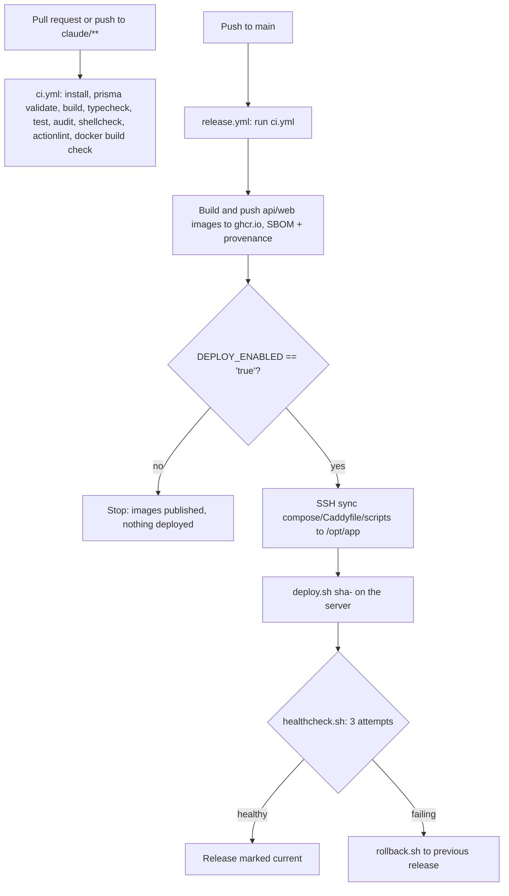

# CI/CD Guide

This document describes the GitHub Actions pipeline: continuous integration, image publishing,
deployment with smoke tests and automatic rollback, the optional pull-based nightly deploy, the
security workflows, and the agentic (Claude) workflows. It reflects the workflows in
`.github/workflows/` and the scripts in `deploy/scripts/`.

## 1. Overview



## 2. `ci.yml` - Continuous Integration

Runs on every pull request and on pushes to `claude/**` branches. Pushes to `main` run it
indirectly, as the first job of `release.yml`.

Steps:
- `pnpm install --frozen-lockfile`
- `pnpm --filter @platform/database exec prisma validate`
- `pnpm turbo run build`
- `pnpm turbo run typecheck`
- `pnpm turbo run test`
- `pnpm audit --audit-level high` (fails on high and critical advisories)
- `shellcheck -x deploy/scripts/*.sh`
- `actionlint` (with shellcheck integration, pinned version and checksum)
- Docker build check for `api` and `web` images (build only, no push; skipped on the `main`
  push path since `release.yml` performs the real build there)

## 3. `release.yml` - Build, publish, deploy

Triggered by a push to `main`, or manually (`workflow_dispatch`) with an optional `tag` input
to redeploy or roll back an already-published tag without rebuilding.

1. **`ci`**: runs `ci.yml` as a reusable workflow (skipped when a `tag` input is given).
2. **`publish`**: builds the `api` and `web` Docker images and pushes them to
   `ghcr.io/<owner>/<repo>/api` and `ghcr.io/<owner>/<repo>/web`, tagged `sha-<commit>` and
   `main`. Attaches SBOM and build provenance attestations.
3. **`deploy`**: runs only when the repository variable `DEPLOY_ENABLED` is `'true'`, in the
   `production` environment. It:
   - syncs `deploy/docker-compose.prod.yml`, `deploy/caddy/Caddyfile` and
     `deploy/scripts/*.sh` to `/opt/app` on the server over SSH;
   - runs `deploy.sh sha-<commit>` (or the given `tag`) on the server.

Add required reviewers to the `production` environment in GitHub settings to gate deploys
behind manual approval.

### Required secrets and variables

| Name | Kind | Purpose |
| --- | --- | --- |
| `DEPLOY_SSH_KEY` | secret | Private key used to SSH into the server |
| `DEPLOY_SSH_KNOWN_HOSTS` | secret | Output of `ssh-keyscan`, run once from a trusted machine; pinned, no trust-on-first-use |
| `DEPLOY_USER` | secret | SSH user on the server |
| `DEPLOY_HOST` | secret | Server hostname or IP |
| `DEPLOY_ENABLED` | variable | Must be `'true'` for the `deploy` job to run at all |
| `PRODUCTION_URL` | variable (optional) | Shown as the environment URL in GitHub |

## 4. `deploy.sh` - what happens on the server

`deploy/scripts/deploy.sh <tag>` (for example `deploy.sh sha-abc1234`):

1. Takes an flock lock so two deploys cannot run at once.
2. Runs `backup.sh` first, if a `postgres` container is already running.
3. Pulls the `api` and `web` images for the given tag (never builds).
4. Starts `postgres` and `redis`, then runs `prisma migrate deploy` inside a one-off `api`
   container. If migrations fail, the deploy aborts before switching traffic - the previously
   running release keeps serving.
5. Brings the full stack up (`compose up -d --wait`).
6. Runs `healthcheck.sh`, up to 3 attempts. Probes run **inside** the containers (no ports need
   to be published on the host): the API `/health` endpoint must report PostgreSQL and Redis
   both OK, and the web app must answer on `/`.
7. On success, records the release: `/opt/app/releases/current`, `previous` and an append-only
   `history` file.
8. On failure, runs `rollback.sh` back to the previous release automatically.

Database migrations are forward-only (expand/contract). A rollback never reverts a migration -
schema changes must stay backward compatible with the previous release for at least one
deploy cycle.

## 5. `nightly-deploy.sh` - optional pull-based alternative

An alternative to the SSH-based `deploy` job in `release.yml`, meant to run from a cron job
directly on the server instead of being pushed to from GitHub Actions:

```cron
0 3 * * * /opt/app/scripts/nightly-deploy.sh >> /opt/app/deploy.log 2>&1
```

It resolves the latest commit on `main` with `git ls-remote "$GIT_REMOTE" refs/heads/main`,
computes the `sha-<commit>` tag, and calls `deploy.sh` with it only if an image with that tag
has already been published by CI (checked with `docker manifest inspect`); otherwise it exits
cleanly and retries on the next run. It never builds anything on the server. `GIT_REMOTE` (and
optionally `DEPLOY_BRANCH`) must be set in `/opt/app/.env`.

Use this only as an alternative to the GitHub Actions deploy job, not alongside it with the
same release directory, since both write to the same `/opt/app/releases` state.

### Server registry access

The server needs to be able to pull images from GHCR. Either:
- make the `api` and `web` packages public under the GitHub organization/user's packages
  settings, or
- run `docker login ghcr.io` once on the server with a personal access token scoped to
  `read:packages`.

## 6. Security workflows

- **`codeql.yml`**: CodeQL with the `security-extended` query pack, for `javascript-typescript`
  and `actions`. Runs on pull requests, pushes to `main`, and weekly.
- **`security.yml`**: dependency review on pull requests (fails on high severity, denies
  copyleft licenses such as GPL/AGPL/SSPL), TruffleHog secret scanning, and `zizmor` GitHub
  Actions workflow auditing.
- **`scorecard.yml`**: OpenSSF Scorecard, published on pushes to `main` and weekly.

All third-party actions are pinned to commit SHAs, not floating tags.

### Recommended GitHub repository settings

These are free for public repositories and are not themselves GitHub Actions workflows, so
they must be turned on by hand under repository Settings:

- Secret scanning and push protection
- Private vulnerability reporting
- Dependabot alerts and security updates
- A branch protection rule or ruleset on `main` requiring the CI checks to pass and at least
  one review before merge
- CodeQL default setup must stay **off** - this repository already runs the advanced
  `codeql.yml` workflow, and enabling both causes duplicate/conflicting analyses

### Dependabot

`.github/dependabot.yml` groups `npm` minor and patch updates into one weekly PR (Monday);
major updates arrive as separate PRs so a breaking upgrade cannot hide in a batch. A 7-day
cooldown (14 days for majors) skips versions younger than that, since most malicious publishes
are caught and yanked within days. `docker` (for `deploy/docker`) and `github-actions`
ecosystems are also covered weekly.

## 7. Agentic workflows

Four workflows call `anthropics/claude-code-action`. All of them are inert - they exit
immediately - unless the repository variable `CLAUDE_AGENTS_ENABLED` is `'true'` **and** either
the `ANTHROPIC_API_KEY` secret or the `CLAUDE_CODE_OAUTH_TOKEN` secret is configured.

| Workflow | Trigger | Model | What it does |
| --- | --- | --- | --- |
| `claude-triage.yml` | new issue opened | Haiku | Reads the issue and adds up to three existing labels. Label-only tools; cannot comment or write code. |
| `claude-ci-doctor.yml` | CI fails on a same-repo pull request | Haiku | Reads the failed run's logs and posts one root-cause comment on the PR. Cannot change code. |
| `claude-review.yml` | PR opened/reopened/ready for review | Haiku for diffs <= 80 changed lines and <= 5 files, otherwise Sonnet | Reviews the diff against `CLAUDE.md` (tenant isolation, security, correctness, emoji/rule violations) and posts inline comments plus a summary. |
| `claude.yml` | `@claude` mention in an issue/PR comment or review, from a user with write access | Sonnet by default; `/opus` in the comment for Opus, `/haiku` for Haiku | General-purpose assistant: can edit code, run the build/test/lint commands, and open PRs. |

### Cost tiering

Cheaper models handle the high-volume, low-stakes work (triage, CI diagnosis, small diffs);
Sonnet is the default for anything that edits code or reviews a non-trivial diff; Opus is never
selected automatically and only runs when explicitly requested with `/opus` in a `@claude`
comment.

### Security model

- `claude.yml`, the only workflow that can write code or open PRs, only runs for comments and
  issues from users with write access to the repository.
- Workflows triggered by `workflow_run` (`claude-ci-doctor.yml`) explicitly exclude fork runs
  and never check out or execute PR code or artifacts; they only read logs and post a comment.
- `claude-triage.yml` allows any user to trigger it (anyone can open an issue on a public repo)
  but restricts its tools to reading the issue and adding labels - no comments, no code.
- Each workflow's `allowedTools` list is scoped to the specific commands it needs (for example
  `gh label list`, `gh issue edit`, `pnpm turbo run`) rather than unrestricted shell access.
