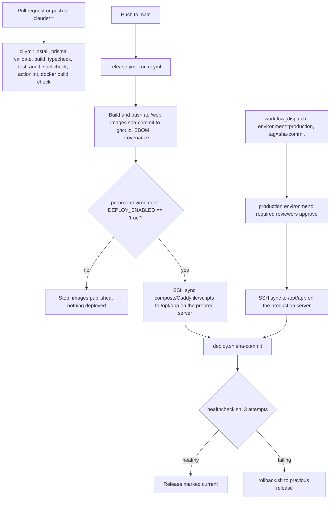

# CI/CD Rehberi

Bu doküman GitHub Actions pipeline'ını açıklar: continuous integration (sürekli entegrasyon),
image yayınlama, smoke test ve otomatik rollback içeren deploy, opsiyonel pull tabanlı gece
(nightly) deploy, güvenlik workflow'ları ve agentic (Claude) workflow'ları. `.github/workflows/`
içindeki workflow'ları ve `deploy/scripts/` içindeki scriptleri yansıtır.

## 1. Genel bakış


```mermaid
flowchart TD
    A[Pull request or push to claude/**] --> B[ci.yml: install, prisma validate, build, typecheck, test, audit, shellcheck, actionlint, docker build check]
    C[Push to main] --> D[release.yml: run ci.yml]
    D --> E[Build and push api/web images sha-commit to ghcr.io, SBOM + provenance]
    E --> F{preprod environment: DEPLOY_ENABLED == 'true'?}
    F -- no --> G[Stop: images published, nothing deployed]
    F -- yes --> H[SSH sync compose/Caddyfile/scripts to /opt/app on the preprod server]
    M[workflow_dispatch: environment=production, tag=sha-commit] --> N[production environment: required reviewers approve]
    N --> H2[SSH sync to /opt/app on the production server]
    H --> I[deploy.sh sha-commit]
    H2 --> I
    I --> J{healthcheck.sh: 3 attempts}
    J -- healthy --> K[Release marked current]
    J -- failing --> L[rollback.sh to previous release]
```

Tek image, iki ortam: her commit için image CI'da bir kez build edilir; preprod'da doğrulanan
aynı `sha-<commit>` image'ı production'a terfi ettirilir. Ortama özgü hiçbir şey image'a gömülmez
(web'in tarayıcıya verdiği API adresi dahil; bkz. bölüm 5b).

## 2. `ci.yml` - Continuous Integration

Her pull request'te ve `claude/**` branch'lerine yapılan push'larda çalışır. `main`'e yapılan
push'lar, `release.yml`'in ilk job'u olarak dolaylı biçimde bunu çalıştırır.

Adımlar:
- `pnpm install --frozen-lockfile`
- `pnpm --filter @platform/database exec prisma validate`
- `pnpm turbo run build`
- `pnpm turbo run typecheck`
- `pnpm turbo run test`
- `pnpm audit --audit-level high` (high ve critical uyarılarında başarısız olur)
- `shellcheck -x deploy/scripts/*.sh`
- `actionlint` (shellcheck entegrasyonu, sabitlenmiş (pinned) sürüm ve checksum ile)
- `api` ve `web` image'ları için Docker build kontrolü (sadece build, push yok; `main` push
  yolunda atlanır çünkü gerçek build'i orada `release.yml` yapar)

Bu adımları çalıştıran `verify` job'unun yanında `ci.yml` üç job daha içerir: `e2e` (API'nin
NestJS e2e testleri, gerçek bir Postgres servis konteynerine karşı, migrate + seed sonrası),
`web-e2e` (aşağıda), ve `scripts` (`shellcheck`/`actionlint`).

### `web-e2e` - Web paneli tarayıcı e2e testleri

`e2e` job'uyla aynı Postgres servis konteynerini (ayrı bir veritabanı adıyla, `ci_web_e2e`)
kullanır, aynı şekilde migrate + seed eder, ardından:
- `pnpm --filter @platform/web exec playwright install --with-deps chromium` -- yalnızca
  Chromium'u (resmi Playwright kurulum adımıyla) indirir, diğer tarayıcıları değil.
- `pnpm --filter @platform/web test:e2e` -- `apps/web/playwright.config.ts`, build edilmiş
  API'yi (`node dist/main.js`) ve web uygulamasını (`next build && next start`) kendi
  `webServer` girdileri olarak başlatıp gerçek bir Chromium'da uçtan uca senaryoları çalıştırır
  (giriş/çıkış çerezleri, izne göre nav, takvim, üye paket satışı, ayarlar rolleri, raporlar CSV
  indirme, CSRF). Detaylar ve yerelde çalıştırma: `docs/WEB_PANEL.md` "Tarayıcı e2e testleri".
- Test'ler başarısız olursa (yalnızca o durumda) `apps/web/playwright-report/` HTML raporu
  `web-e2e-playwright-report` adıyla iş akışı artifact'ı olarak yüklenir.

Bu job'un job-seviyesi izinleri de yalnızca `contents: read` (kökteki varsayılandan miras) --
artifact yükleme bunun ötesinde bir izin gerektirmez.

## 2a. `lighthouse.yml` - Lighthouse CI (S3)

Herkese açık sayfaların performans, SEO, erişilebilirlik ve en iyi uygulamalar bütçesini her pull request'te
ölçer. Ayrı bir workflow'dur (`on: pull_request`, `workflow_dispatch`; `permissions: contents: read`), çünkü
tarayıcı e2e'sinden farklı olarak yalnızca üretim build'ini çalıştırır ve `ci.yml`'i yavaşlatmaz.

- Aynı Postgres servis konteyneri (`ci_lighthouse`), migrate + seed, ardından API (`node dist/main.js`, 4000)
  ve web (`next start`, 3000) arka planda başlatılır; `/health` ve `/tr` yanıt verene kadar beklenir.
- `treosh/lighthouse-ci-action` tam commit SHA'sına sabitlidir (yorumda `v12.6.2`); `temporaryPublicStorage: false`
  olduğundan rapor herkese açık bir depoya gitmez, `uploadArtifacts: true` ile iş akışı artifact'ı olarak yüklenir
  (`lighthouse-results`).
- Bütçe `apps/web/lighthouserc.json` içindedir: her URL için bir koşu, masaüstü ön ayarı. URL'ler: `/tr`,
  `/tr/blog`, `/tr/pilates` (sektör açılış sayfası) ve `/booking/zen-reformer-pilates/book`.

| Kategori | Eşik | Sonuç |
| --- | --- | --- |
| `seo` | >= 0,95 | hata (job kırmızı) |
| `accessibility` | >= 0,9 | hata |
| `performance` | >= 0,8 | uyarı |
| `best-practices` | >= 0,9 | uyarı |

Yerelde çalıştırmak: seed'li bir veritabanıyla API ve web'i başlatın, sonra `npx @lhci/cli autorun --config=apps/web/lighthouserc.json`
(Chrome gerekir; CI'da runner'da hazırdır). Eşik değiştirmek için `lighthouserc.json` düzenlenir; yeni bir sayfa eklemek
için `collect.url` listesine eklenir. Seed'deki yayınlı bir sayfa kaldırılırsa listedeki URL'yi de güncelleyin.

## 3. `release.yml` - Build, publish, deploy

İki tetikleyicisi vardır:

- **`main`'e push**: CI, image build ve **preprod**'a deploy (preprod ortamında
  `DEPLOY_ENABLED` `'true'` ise).
- **`workflow_dispatch`**: `environment` (`preprod` veya `production`) ve `tag`
  (`sha-<40 karakterlik commit>`) girdileriyle. Production için `tag` zorunludur ve iş yalnızca
  `main` üzerinden başlatılabilir; production hiçbir zaman build etmez, preprod'da çalışmış
  image'ı terfi ettirir. Preprod için `tag` boş bırakılırsa bu commit build edilip deploy edilir.
  Geri almak için de aynı yol kullanılır: önceki `sha-<commit>` tag'ini verin.

Job'lar:

1. **`plan`**: hedef ortamı, tag'i ve build gerekip gerekmediğini belirler; kuralları
   (production = tag zorunlu, yalnızca `main`, tag biçimi) burada uygular.
2. **`ci`**: `ci.yml`'i yeniden kullanılabilir workflow olarak çalıştırır (build yoksa atlanır).
3. **`publish`**: `api` ve `web` image'larını build eder, `sha-<commit>` ve `main` etiketleriyle
   `ghcr.io/<owner>/<repo>/api` ve `.../web` adreslerine push eder, SBOM ve build provenance
   attestation'ı ekler. Ortama özgü build argümanı yoktur.
4. **`deploy`**: `plan`'ın seçtiği GitHub Environment'ında (`preprod` veya `production`) çalışır;
   secret'lar ve değişkenler o ortamdan okunur. İlk adım ortamın açık olduğunu doğrular
   (`DEPLOY_ENABLED == 'true'`, aksi halde bir uyarıyla atlanır) ve `DEPLOY_ENVIRONMENT`
   değişkeninin ortam adıyla aynı olduğunu kontrol eder (aynı isimli repository seviyesindeki bir
   secret'ın job'u yanlış sunucuya yöneltmesine karşı koruma). Ardından
   `deploy/docker-compose.prod.yml`, `deploy/caddy/Caddyfile` ve `deploy/scripts/*.sh`
   dosyalarını sunucuda `/opt/app` içine senkronize eder ve `deploy.sh <tag>` çalıştırır.

`publish` ayrıca `web` için kaynak haritalarını yayınlar (`ghcr.io/<owner>/<repo>/web-sourcemaps:sha-<commit>`
ve `web-sourcemaps-sha-<commit>` Actions artifact'ı, 30 gün), `deploy` da bunları hedef ortamın API'sine yükler;
ayrıntı aşağıda "Kaynak haritası yükleme".

Eşzamanlılık ortam başınadır (`release-preprod`, `release-production`): `main`'e yapılan yeni bir
push, bekleyen bir production deploy'unu asla iptal etmez.

### Kaynak haritası yükleme (H2)

Web bundle'ları küçültülmüştür; hata sistemi (`docs/HATA_RAPORLAMA.md`) yığın izlerini sürümün kaynak
haritasıyla çözer. Akış: `web.Dockerfile` haritaları sunulan imajdan çıkarıp `web-sourcemaps` aşamasına
taşır (imajda `.map` dosyası yoktur) -> `publish` bu aşamayı ayrı imaj ve artifact olarak yayınlar ->
`deploy` hedef ortamın API'sine `deploy/scripts/upload-sourcemaps.mjs` ile yükler (dağıtımdan önce, böylece
yeni sürümün ilk hataları da çözülür). Production terfisi build etmez ama aynı `sha-<commit>` haritası
imajını çektiği için çalışır.

Sahibin yapması gerekenler, her ortam için: (1) API sunucusunun `/opt/app/.env` dosyasına
`SOURCEMAP_UPLOAD_TOKEN=$(openssl rand -hex 32)`; (2) aynı değeri GitHub Environment secret'ı
`SOURCEMAP_UPLOAD_TOKEN` olarak; (3) `PUBLIC_API_URL` değişkenini API'nin herkese açık adresi olarak. İkisi de
yoksa yükleme bildirimle atlanır ve dağıtım etkilenmez; adım `continue-on-error`'dır. Haritalar sunucuda
`sourcemaps_data` volume'unda 30 gün tutulur. `release.yml`'in `deploy` job'una `packages: read` izni
eklendi (imajı çekmek için); başka yeni izin veya action yok.

### Sayfa önbelleği temizleme sırrı (S3)

Web uygulaması sayfa motoru sayfalarını ISR ile önbellekler; API bir sayfa veya yazı yayınlandığında web'in `POST /api/revalidate` ucunu çağırarak önbelleği temizletir (`docs/SEO.md` bölüm 11). İki taraf aynı sırrı paylaşır: sahibin yapması gereken, her ortamın `/opt/app/.env` dosyasına `REVALIDATE_SECRET=$(openssl rand -hex 24)` yazmaktır (en az 16 karakter; `deploy/docker-compose.prod.yml` değeri hem `api` hem `web` konteynerine geçirir, API ayrıca `WEB_INTERNAL_URL=http://web:3000` kullanır). Boşsa uç kapalıdır (503) ve sayfalar 300 saniye penceresiyle yenilenir; dağıtım ve sağlık kontrolleri etkilenmez. Sır GitHub secret'ı değildir, yalnızca sunucu ortamıdır; yeni action veya izin yoktur.

### Ortam değişkenleri envanteri

Tüm değişkenler `.env.example` içinde Zod şemalarıyla (`apps/api/src/config/env.ts`, `apps/web/src/lib/server-env.ts`) uyumlu olarak listelenir; `apps/api/src/config/compose-env.spec.ts` bir şema anahtarı compose'a aktarılmadıkça başarısız olur. `/opt/app/.env` dosyasına yalnızca sahibin değer verdiği anahtarlar yazılır; geri kalanlar `deploy/docker-compose.prod.yml` tarafından türetilir:

| Değişken | Kim ayarlar | Not |
|---|---|---|
| `IMAGE_REPO`, `GIT_REMOTE`, `WEB_DOMAIN`, `API_DOMAIN`, `ACME_EMAIL`, `POSTGRES_*`, `REDIS_PASSWORD`, `JWT_SECRET` | sahip (`/opt/app/.env`) | zorunlu |
| `SITES_DOMAIN` | sahip, opsiyonel | işletme siteleri `<slug>.<SITES_DOMAIN>`; boşsa `WEB_DOMAIN` |
| `REVALIDATE_SECRET` | sahip, opsiyonel | en az 16 karakter; `api` ve `web` konteynerlerine geçer; boşsa önbellek temizleme kapalı |
| `SITE_ENV` | sahip | `production` veya `preprod` (Caddy) |
| `WEB_INTERNAL_URL` | compose | `http://web:3000`; API'nin `POST /api/revalidate` çağrısı için |
| `API_INTERNAL_URL` | compose | `http://api:4000`; web sunucusunun API adresi |
| `PUBLIC_API_URL`, `PUBLIC_APP_URL`, `CORS_ORIGIN` | compose | `API_DOMAIN` ve `WEB_DOMAIN` değerlerinden |
| `DATABASE_URL`, `REDIS_URL`, `NODE_ENV`, `PORT` | compose | `POSTGRES_*` ve `REDIS_PASSWORD` değerlerinden |
| `APP_VERSION`, `APP_RELEASE` | compose | dağıtımın `RELEASE_TAG` değeri (`sha-<commit>`) |
| `SOURCEMAP_DIR`, `BACKUP_LOCAL_DIR` | compose | konteyner içi volume yolları |
| Sağlayıcı anahtarları (SMS, e-posta, ödeme, fatura, yedek, WhatsApp, İYS) | sahip, opsiyonel | `.env.example` bölümleri; yan etkili olanlar `[SIDE EFFECT]` ile işaretlidir |
| `OTP_TEST_CODE`, `AI_FAKE_PROVIDER`, `SOCIAL_FAKE_PROVIDER` | yalnızca test | üretimde reddedilir, compose'a bilerek aktarılmaz |

### GitHub Environments, secret'lar ve değişkenler

Settings > Environments altında iki ortam oluşturun: `preprod` ve `production`. Aşağıdakilerin
hepsi **ortam seviyesinde** tanımlanır (repository seviyesinde değil); eski repository seviyesindeki
`DEPLOY_*` secret'larını ve `DEPLOY_ENABLED` değişkenini ortamlara taşıdıktan sonra silin.

| İsim | Tür | `preprod` | `production` |
| --- | --- | --- | --- |
| `DEPLOY_HOST` | secret | preprod sunucusunun hostname'i/IP'si | production sunucusu |
| `DEPLOY_USER` | secret | `deploy` (server-init.sh'ın oluşturduğu kullanıcı) | `deploy` |
| `DEPLOY_SSH_KEY` | secret | yalnızca bu ortama ait deploy private key'i | ayrı bir key |
| `DEPLOY_SSH_KNOWN_HOSTS` | secret | güvenilir bir makineden bir kez alınan `ssh-keyscan -t ed25519 <host>` çıktısı (TOFU yok) | aynı şekilde |
| `DEPLOY_ENABLED` | variable | `true` olunca `main`'e her push preprod'a deploy edilir | `true` olunca manuel deploy çalışır |
| `DEPLOY_ENVIRONMENT` | variable | `preprod` | `production` |
| `PUBLIC_URL` | variable (opsiyonel) | örn. `https://panel.preprod.<alan-adi>` | örn. `https://panel.<alan-adi>` |

| `SOURCEMAP_UPLOAD_TOKEN` | secret (opsiyonel) | hedef API sunucusundaki `SOURCEMAP_UPLOAD_TOKEN` ile aynı değer (en az 32 karakter) | aynı şekilde, farklı bir değer |
| `PUBLIC_API_URL` | variable (opsiyonel) | örn. `https://api.preprod.<alan-adi>` (sonunda `/` olmadan) | örn. `https://api.<alan-adi>` |

`production` ortamı için ayrıca: **Required reviewers** (en az bir kişi) ve **Deployment
branches and tags: Selected branches -> `main`**. `preprod` için onay gerekmez.

## 4. `deploy.sh` - sunucuda neler oluyor

`deploy/scripts/deploy.sh <tag>` (örneğin `deploy.sh sha-abc1234`):

1. İki deploy'un aynı anda çalışmaması için bir flock kilidi alır.
2. Eğer zaten çalışan bir `postgres` konteyneri varsa önce `backup.sh`'ı çalıştırır.
3. Verilen tag için `api` ve `web` image'larını çeker (asla build etmez).
4. `postgres` ve `redis`'i başlatır ve healthcheck'lerinin geçmesini bekler
   (`compose up -d --wait`; boş bir volume'da Postgres'in ilk açılışıyla migration yarışmaz),
   ardından tek seferlik bir `api` konteyneri içinde `prisma migrate deploy` ve
   `node dist/cli/bootstrap.js --defaults-only` (eksik platform varsayılanlarını oluşturur, hiçbir
   satırı güncellemez veya silmez; bkz. bölüm 5b) çalıştırır. Bunlardan biri başarısız olursa,
   deploy trafiği değiştirmeden önce iptal edilir - halihazırda çalışan release hizmet vermeye
   devam eder.
5. Tüm stack'i ayağa kaldırır (`compose up -d --wait`).
6. `healthcheck.sh`'ı en fazla 3 deneme olacak şekilde çalıştırır. Probe'lar konteynerlerin
   **içinde** çalışır (host'ta port yayınlamaya gerek yoktur): API'nin `/health` endpoint'i
   PostgreSQL ve Redis'in ikisinin de OK olduğunu bildirmelidir, web uygulaması ise `/` üzerinde
   yanıt vermelidir.
7. Başarı durumunda release'i kaydeder: `/opt/app/releases/current`, `previous` ve sadece
   ekleme yapılan (append-only) bir `history` dosyası.
8. Başarısızlık durumunda otomatik olarak `rollback.sh`'ı çalıştırıp önceki release'e döner.

Veritabanı migration'ları yalnızca ileri yönlüdür (expand/contract). Bir rollback bir migration'ı
asla geri almaz - şema değişiklikleri en az bir deploy döngüsü boyunca önceki release ile geriye
dönük uyumlu kalmalıdır.

## 5. `nightly-deploy.sh` - opsiyonel pull tabanlı alternatif

`release.yml` içindeki SSH tabanlı `deploy` job'una bir alternatif; GitHub Actions'tan push
edilmek yerine doğrudan sunucuda bir cron job'undan çalıştırılmak üzere tasarlanmıştır
(`deploy` kullanıcısının crontab'ına, `crontab -e`; root olarak değil). Main'i doğrudan deploy
ettiği için yalnızca preprod için uygundur; production her zaman onaylı `workflow_dispatch` ile
deploy edilir:

```cron
0 3 * * * /opt/app/scripts/nightly-deploy.sh >> /opt/app/deploy.log 2>&1
```

`git ls-remote "$GIT_REMOTE" refs/heads/main` ile `main` üzerindeki en son commit'i çözer,
`sha-<commit>` tag'ini hesaplar ve yalnızca bu tag'e sahip bir image'ın CI tarafından zaten
yayınlanmış olması durumunda (`docker manifest inspect` ile kontrol edilir) `deploy.sh`'ı bu
tag'le çağırır; aksi halde temiz bir şekilde çıkar ve bir sonraki çalıştırmada yeniden dener.
Sunucuda asla hiçbir şey build etmez. `GIT_REMOTE` (ve opsiyonel olarak `DEPLOY_BRANCH`)
`/opt/app/.env` içinde ayarlanmış olmalıdır.

Bunu yalnızca GitHub Actions deploy job'una bir alternatif olarak kullanın, onunla birlikte aynı
release dizini üzerinde değil, çünkü ikisi de aynı `/opt/app/releases` durumuna yazar.

### Sunucu registry erişimi

Sunucunun GHCR'den image çekebilmesi gerekir. Ya:
- GitHub organizasyonu/kullanıcısının packages ayarları altında `api` ve `web` paketlerini
  public yapın, ya da
- sunucuda `deploy` kullanıcısıyla bir kez `read:packages` kapsamına sahip bir personal access
  token ile `docker login ghcr.io` çalıştırın.

## 5a. Yedekler

Yedeklerin tek yönetim ekranı süper admin panelindeki **Yedekler** sayfasıdır (`/admin/yedekler`);
mimari, uyarılar ve geri yükleme adımları `docs/YEDEKLER.md` belgesindedir. Kısaca:

1. **API (birincil)**: paneldeki zamanlamaya göre her gün (varsayılan 01:00 UTC) ve "Şimdi yedek al"
   ile API konteynerinde `pg_dump` (imajdaki PostgreSQL 16 istemcisi) alınır, gzip ve AES-256
   (PBKDF2) ile şifrelenip S3 uyumlu depoya `db_YYYYMMDD_HHMMSSZ-api.sql.gz.enc` adıyla ve bir
   `.sha256` dosyasıyla yüklenir, hemen doğrulanır; sonra saklama süresinden eski uzak yedekler
   silinir (yalnızca en yeni yedek doğrulandıysa).
2. **Sunucu cron'u (yedek)**: `deploy/scripts/backup.sh` her gün 02:30'da
   (`server-init.sh`'ın kurduğu `/etc/cron.d/app-backup`) ve her deploy'dan önce çalışır.
   `pg_dump` çıktısını `/opt/app/backups/db_YYYYMMDD_HHMMSSZ-host.sql.gz` olarak yazar (yerelde
   14 gün), `BACKUP_S3_BUCKET` doluysa aynı biçimde şifreleyip aynı bucket ve öneke
   `-host` işaretiyle yükler. Ek araç kurulmaz; yükleme curl'ün SigV4 imzasıyla yapılır.
   Günlük çalıştırmada yükleme başarısız olursa betik hata kodu döndürür ve durum
   `/opt/app/deploy.log`'a yazılır. Deploy öncesi çalıştırmada yükleme hatası yalnızca uyarıdır:
   geri dönüş için gereken yerel kopyadır ve depolama kesintisi bir sürümü engellememelidir.
3. Panel iki kaynağın dosyalarını da listeler (sunucu klasörü API'ye salt okunur bağlıdır),
   doğrular, indirme bağlantısı verir, onaylı siler ve 26 saattir başarılı yedek yoksa süper
   adminlere e-posta gönderir.

Gerekli ortam değişkenleri `.env.example` içindedir; compose bunları API'ye de aktarır.
`BACKUP_ENCRYPTION_KEY` (`openssl rand -hex 32`) sunucu dışında da (parola yöneticisi)
saklanmalıdır; bu anahtar olmadan uzak yedekler açılamaz. Uzak taraftaki saklama paneldeki
"Saklama süresi" ile yönetilir; 0 seçilirse bucket'ın yaşam döngüsü (lifecycle) kuralı geçerlidir
(öneri: 35 gün).

**Geri yükleme**: `docs/YEDEKLER.md`, bölüm 6 (önce `restore_check` veritabanında kuru
çalıştırma, sonra üretim). Şifre çözme komutu iki kaynak için de aynıdır:

```bash
openssl enc -d -aes-256-cbc -pbkdf2 -iter 200000 -pass env:BACKUP_ENCRYPTION_KEY \
  -in db_YYYYMMDD_HHMMSSZ-api.sql.gz.enc -out db.sql.gz
```

Yerel kopyalar şifresizdir (sunucu diskindedir); geri yüklemede şifre çözme adımı atlanır.
Geri yükleme en az üç ayda bir ayrı bir veritabanında denenmelidir.

## 5b. Preprod ortamı

Preprod, production'ın birebir kopyası olan ayrı bir sunucudur: aynı `docker-compose.prod.yml`,
aynı Caddyfile, aynı scriptler ve **aynı image'lar**. Farklar yalnızca `/opt/app/.env`
değerlerinde ve GitHub `preprod` ortamının secret'larındadır. `main`'e giren her commit önce
preprod'a gider; production'a yalnızca preprod'da doğrulanmış bir `sha-<commit>` tag'i manuel
olarak (onaylı) terfi ettirilir.

Web uygulamasının tarayıcıya verdiği API adresi build anında gömülmez: `web` konteyneri
`PUBLIC_API_URL`'i (compose `https://${API_DOMAIN}` olarak verir) çalışma anında okur ve kök
layout bunu bir `<meta>` etiketine yazar (`apps/web/src/lib/public-api-url.ts`). Bu yüzden aynı
image iki ortamda da doğru API'ye bağlanır.

### İlk kurulum (bir kez)

1. **Sunucu.** Ubuntu 24.04 sunucuda, `deploy/scripts/server-init.sh` dosyasını kopyalayıp root
   olarak (veya kendi sudo kullanıcınızla) çalıştırın:

   ```bash
   sudo DEPLOY_SSH_PUBKEY="ssh-ed25519 AAAA... preprod-deploy" TIMEZONE=UTC bash server-init.sh deploy
   ```

   Script `deploy` kullanıcısını oluşturur (docker grubunda, `/opt/app`'in sahibi, yalnızca SSH
   anahtarıyla giriş), Docker log döndürmeyi (konteyner başına 10 MB x 5) ayarlar, yedek cron'unu
   `deploy` kullanıcısıyla kurar ve saat dilimini ayarlar (varsayılan UTC). SSH'ta parola girişini
   ve root girişini **yalnızca** deploy kullanıcısının bir anahtarı olduğunu ve sizin için anahtarla
   bir yönetici girişi (root'un `authorized_keys`'i veya script'i sudo ile çalıştıran kullanıcı)
   bulunduğunu doğruladıktan sonra kapatır; aksi halde ne eksik olduğunu yazar ve SSH'a dokunmaz.
   Root girişi, ayrı bir sudo kullanıcınız yoksa kapatılmaz, yalnızca anahtara kısıtlanır
   (`prohibit-password`). Script idempotenttir; anahtarı ekledikten sonra tekrar çalıştırın.

   Deploy anahtarını ortam başına ayrı üretin (`ssh-keygen -t ed25519 -f preprod-deploy -N ''`);
   private key GitHub'daki `preprod` ortamının `DEPLOY_SSH_KEY` secret'ına gider.

2. **GitHub.** `preprod` ortamını ve secret/değişkenlerini bölüm 3'teki tabloya göre oluşturun
   (`DEPLOY_ENVIRONMENT=preprod`; `DEPLOY_ENABLED`'ı ilk deploy'a hazır olunca `true` yapın).
   `DEPLOY_SSH_KNOWN_HOSTS` için güvenilir bir makineden `ssh-keyscan -t ed25519 <preprod-host>`
   çıktısını, sunucu konsolundaki `ssh-keygen -lf /etc/ssh/ssh_host_ed25519_key.pub` parmak
   iziyle karşılaştırdıktan sonra kaydedin.

3. **DNS.** Preprod sunucusunun IP'sine işaret eden `A` kayıtları: `WEB_DOMAIN` (örn.
   `panel.preprod.<alan-adi>`), `API_DOMAIN` (örn. `api.preprod.<alan-adi>`) ve işletme siteleri
   kullanılacaksa `SITES_DOMAIN` için bir joker kayıt (`*.sites.preprod.<alan-adi>`). Caddy
   sertifikaları kendisi alır.

4. **`/opt/app/.env`.** `deploy` kullanıcısı olarak repo kökündeki `.env.example`'ı
   `/opt/app/.env` olarak kopyalayıp doldurun (`chmod 600`). Preprod için:
   - `SITE_ENV=preprod` (Caddy tüm host'larda `X-Robots-Tag: noindex, nofollow` gönderir ve HSTS
     `preload` bayrağını kaldırır),
   - bütün secret'ları (`POSTGRES_PASSWORD`, `REDIS_PASSWORD`, `JWT_SECRET`,
     `MESSAGING_TRACKING_SECRET`, `INTEGRATION_ENCRYPTION_KEY`, `BACKUP_ENCRYPTION_KEY`, ...)
     **yeniden üretin**; production değerlerini asla kopyalamayın,
   - sağlayıcı anahtarları için aşağıdaki tabloya bakın.

5. **GHCR erişimi.** Paketler private ise sunucuda `deploy` kullanıcısıyla bir kez
   `docker login ghcr.io -u <github-kullanicisi>` çalıştırın (parola yerine yalnızca
   `read:packages` kapsamlı bir token). Alternatif: paketleri public yapın (bölüm 5).

6. **İlk deploy.** `preprod` ortamında `DEPLOY_ENABLED=true` yapıp `main`'e bir push yapın veya
   Actions > Release > Run workflow ile `environment=preprod` seçin. `deploy.sh` migration'ları
   çalıştırır, ardından `bootstrap.js --defaults-only` ile eksik platform verisini oluşturur:
   platform kiracısı (`isPlatform`) ve sitesinin ana sayfası, planlar ve para birimi başına
   fiyatları (`plan_prices`), işletme türü şablonları, SMS paketleri, global sözleşme/KVKK
   metinleri, mesaj şablonları ve rozetler. Bu adım yalnızca eksik olanı oluşturur, hiçbir satırı
   güncellemez veya silmez; demo işletme, kullanıcı veya parola oluşturmaz. Sonra smoke test
   (`/health` ve web `/`) çalışır.

7. **İlk süper admin (bir kez, elle).** Sunucuda `deploy` kullanıcısıyla:

   ```bash
   cd /opt/app
   docker compose -f docker-compose.prod.yml run --rm --no-deps api \
     node dist/cli/bootstrap.js \
     --super-admin-phone +90XXXXXXXXXX \
     --super-admin-email sahip@<alan-adi> \
     --super-admin-name "Ad Soyad"
   ```

   Parola üretilir ve **yalnızca bir kez** ekrana yazılır; hemen bir parola yöneticisine kaydedin.
   Kendi parolanızı vermek için (en az 12 karakter, dosyaya yazmadan):

   ```bash
   read -rs BOOTSTRAP_SUPER_ADMIN_PASSWORD && export BOOTSTRAP_SUPER_ADMIN_PASSWORD
   docker compose -f docker-compose.prod.yml run --rm --no-deps -e BOOTSTRAP_SUPER_ADMIN_PASSWORD api \
     node dist/cli/bootstrap.js --super-admin-phone ... --super-admin-email ... --super-admin-name "..."
   unset BOOTSTRAP_SUPER_ADMIN_PASSWORD
   ```

   Aynı telefonla tekrar çalıştırmak hiçbir şeyi değiştirmez. Başka bir süper admin zaten varsa
   komut reddeder (çıkış kodu 3) ve `--allow-additional-super-admin` bayrağı olmadan kimseyi
   eklemez; bu telefon veya e-postayla süper admin olmayan bir kullanıcı varsa o hesaba asla
   dokunmaz. Telefon E.164 biçiminde (`+` ile) verilmelidir; ülke varsayılmaz.

8. **İlk işletme.** `https://<WEB_DOMAIN>/giris` adresinde süper admin e-postası (veya telefonu) ve
   parolayla giriş yapın, Süper admin > İşletmeler ekranından işletmeyi oluşturun (işletme türü,
   plan, ülke, sahip adı ve telefonu). Sahip daveti QR/bağlantı olarak ekranda gösterilir; davet
   SMS/WhatsApp ile gönderilecekse ilgili sağlayıcının yapılandırılmış olması gerekir.

### Sağlayıcı anahtarları: preprod'da ne yapılmalı

Preprod, `NODE_ENV=production` ile çalışır; bu yüzden production'daki korumalar preprod'da da
geçerlidir (MOCK ödeme ve MOCK e-fatura devre dışı, SES'siz e-posta başarısız sayılır). Yan etkisi
olan anahtarlar `.env.example`'da `[SIDE EFFECT]` ile işaretlidir.

| Grup | Preprod önerisi | Sonuç |
| --- | --- | --- |
| SMS (`SMS_PROVIDER`, Netgsm/İleti Merkezi/Twilio) | Gerçek sağlayıcının test hesabı veya düşük limitli ayrı bir alt hesap; yalnızca test telefonlarına gönderin | MOCK SMS ile OTP kodu hiçbir yerde görünmez (`OTP_TEST_CODE` production modunda reddedilir), yani **mobil uygulamada telefon + OTP girişi ve üye daveti çalışmaz**. Web panelde parola girişi etkilenmez |
| WhatsApp (`WHATSAPP_*`) | Boş bırakın veya Meta test numarası | Boşken WhatsApp gönderimleri MOCK gibi davranır (loglar, başarılı sayar) |
| E-posta (`SES_*`, `AWS_*`, `MESSAGING_TRACKING_SECRET`) | SES sandbox (yalnızca doğrulanmış alıcılara gider); `MESSAGING_TRACKING_SECRET` her ortamda ayrı | SES yoksa e-postalar "yapılandırılmamış" hatasıyla başarısız olur; tracking secret yoksa ticari e-posta gönderilmez |
| Ödeme (`PAYMENT_PROVIDER`, `STRIPE_*`, `IYZICO_*`, `PAYTR_*`) | `PAYMENT_PROVIDER=STRIPE` ve Stripe **test** anahtarları (`sk_test_...`, test webhook secret'ı); iyzico için sandbox `IYZICO_BASE_URL` | MOCK ödeme production modunda kapalıdır: sağlayıcı yoksa her online ödeme/checkout başarısız olur. Canlı anahtar gerçek kart çeker |
| e-Fatura (`PARASUT_*`, `ELOGO_*`, `FORIBA_*`, `UYUMSOFT_*`) | Boş bırakın (varsa entegratörün test ortamı) | Boşken fatura kesme "yapılandırılmamış" hatası verir; canlı anahtar yasal fatura keser |
| İYS (`IYS_*`) | Boş bırakın | MOCK İYS istemcisi kullanılır; canlı anahtar gerçek izin kaydı yapar |
| Push (`PUSH_PROVIDER`, `EXPO_ACCESS_TOKEN`) | Preprod mobil build'iyle test edilecekse `EXPO` | MOCK iken bildirimler yalnızca loglanır |
| Yapay zeka (`ANTHROPIC_API_KEY`) | Boş bırakın; gerekirse süper admin ekranından düşük limitli ayrı bir anahtar | Ücretli kullanım |
| `INTEGRATION_ENCRYPTION_KEY` | Preprod'a özel yeni anahtar | Partner bağlantısı kurulduğunda production'da zorunludur |

### Bootstrap komutu

`apps/api/src/cli/bootstrap.ts` API image'ında `dist/cli/bootstrap.js` olarak bulunur ve
yalnızca `DATABASE_URL`'e ihtiyaç duyar (compose verir).

| Kullanım | Ne yapar |
| --- | --- |
| `node dist/cli/bootstrap.js --defaults-only` | Eksik platform varsayılanlarını oluşturur. Her deploy'da `deploy.sh` çalıştırır |
| `node dist/cli/bootstrap.js --super-admin-phone ... --super-admin-email ... --super-admin-name "..."` | Varsayılanlar + ilk süper admin (bir kez, elle) |
| `--allow-additional-super-admin` | Başka bir süper admin varken yenisini eklemeye izin verir |
| `--help` | Kullanım bilgisi |

Çıkış kodları: `0` başarılı (hiçbir şey değişmediyse de), `2` hatalı argüman, `3` reddedildi
(zaten süper admin var veya kullanıcı çakışması), `1` beklenmeyen hata. Varsayılan veriler
`packages/database/src/platform-defaults.ts` içindedir ve geliştirme seed'i de aynı tanımları
kullanır (tek kaynak). Her adım aynı Postgres advisory lock'u altında bir transaction içinde
çalışır; iki eşzamanlı çalıştırma birbirini bekler.

**Neden `--defaults-only` her deploy'da çalışıyor?** Yalnızca eksik satırları doğal anahtarla
(plan anahtarı, şablon anahtarı + kanal + dil, belge türü, ...) oluşturur, hiçbir şeyi
güncellemez veya silmez: süper adminin değiştirdiği fiyatlar, metinler, yeni belge sürümleri
korunur; bir planın fiyat para birimleri ve platform sitesinin ana sayfası yalnızca plan veya site
ilk kez oluşturulurken yazılır, sonradan silinenler geri gelmez. Yeni bir sürümle gelen yeni
yerleşik mesaj şablonları da böylece veritabanına eklenir. Boş bir ortamda smoke test'in
(`/` platform ana sayfası) ve ilk işletmenin (plan, işletme türü) ihtiyaç duyduğu veriyi sağlar.
Kullanıcı oluşturmaz; süper admin adımı her zaman elle ve bir kez yapılır.

### Mobil uygulama (EAS) preprod build'i

`apps/mobile/eas.json` içindeki `preprod` profili (`APP_VARIANT=preprod`) uygulamayı
"Platform Preprod" adı ve `.preprod` ekli paket kimliğiyle (`com.platform.member.preprod`) build
eder; production uygulamasının yanına kurulabilir. API adresi repoda tutulmaz: EAS ortam
değişkeni olarak tanımlanır.

```bash
eas env:create --environment preview --name EXPO_PUBLIC_API_URL --value https://api.preprod.<alan-adi> --visibility plaintext
eas env:create --environment production --name EXPO_PUBLIC_API_URL --value https://api.<alan-adi> --visibility plaintext
eas build --profile preprod --platform android
```

`preview` ve `preprod` profilleri EAS `preview` ortamını (preprod API'si) kullanır. Preprod veya
production build'inde `EXPO_PUBLIC_API_URL` https değilse `app.config.ts` build'i durdurur.
iOS için `.preprod` paket kimliği App Store Connect'te ayrıca kaydedilmelidir.
`submit.production` altındaki `*_ENV_PLACEHOLDER` değerleri ilk mağaza gönderiminden önce gerçek
Apple kimlikleriyle değiştirilmelidir.

## 6. Güvenlik workflow'ları

- **`codeql.yml`**: `javascript-typescript` ve `actions` için `security-extended` sorgu paketiyle
  CodeQL. Pull request'lerde, `main`'e push'larda ve haftalık olarak çalışır.
- **`security.yml`**: pull request'lerde dependency review (high severity'de başarısız olur,
  GPL/AGPL/SSPL gibi copyleft lisansları reddeder), TruffleHog secret scanning ve `zizmor`
  GitHub Actions workflow denetimi.
- **`scorecard.yml`**: OpenSSF Scorecard, `main`'e push'larda ve haftalık olarak yayınlanır.

Tüm üçüncü taraf action'lar, değişken (floating) tag'lere değil commit SHA'larına sabitlenmiştir.

### Private repository notu

Repository 1 Ekim 2026'da private yapıldı. GitHub Free planında private repolarda şunlar
yoktur: CodeQL ve dependency review (GitHub Code Security ister, ücretli), OpenSSF Scorecard
(yalnızca public), GitHub Environments, branch protection, rulesets ve CODEOWNERS (GitHub Pro
ile gelir), sınırsız Actions dakikası (Free: aylık 2.000, Pro: 3.000). Bu yüzden:

- `codeql.yml`, `security.yml` içindeki dependency review ve `scorecard.yml` yalnızca
  repository public iken çalışır (`!github.event.repository.private`); private'ta işler
  atlanır, hata vermez. Code Security açılırsa koşul kaldırılır.
- Zafiyet denetimi `ci.yml` içindeki `pnpm audit --audit-level high`, gizli bilgi taraması
  TruffleHog ve workflow denetimi `zizmor` ile sürer; Dependabot private repoda da çalışır.
- `ci.yml` artık yalnızca pull request'lerde çalışır (çalışma dallarına push ayrıca
  tetiklemez); bir PR yaklaşık 25 dakika, `main`'e merge sonrası `release.yml` yaklaşık
  25 dakika harcar.
- `release.yml` ortam sırlarını GitHub Environments'tan okur; Free planda private repoda
  Environments olmadığından deploy için GitHub Pro gerekir (önerilen) ya da sırlar repository
  düzeyine taşınır. GHCR private paketlerde 500 MB depolama ve aylık 1 GB transfer
  ücretsizdir; imaj temizleme kuralı sunucu kurulumuyla birlikte eklenecek.

### Önerilen GitHub repository ayarları

Bunlar public repository'ler için ücretsizdir ve kendileri GitHub Actions workflow'u değildir,
bu yüzden repository Settings altında elle açılmaları gerekir:

- Secret scanning ve push protection
- Private vulnerability reporting
- Dependabot alerts ve security updates
- `main` üzerinde CI kontrollerinin geçmesini ve merge öncesi en az bir review'u zorunlu kılan
  bir branch protection rule veya ruleset
- CodeQL default setup **kapalı** kalmalıdır - bu repository zaten gelişmiş `codeql.yml`
  workflow'unu çalıştırıyor ve ikisini birden etkinleştirmek yinelenen/çelişen analizlere
  neden olur

### Dependabot

`.github/dependabot.yml`, `npm` minor ve patch güncellemelerini haftalık tek bir PR'da (Pazartesi)
gruplar; major güncellemeler ayrı PR'lar olarak gelir, böylece kırıcı bir upgrade bir batch içinde
gizlenemez. 7 günlük bir bekleme süresi (major'lar için 14 gün), bundan daha genç sürümleri atlar,
çünkü kötü niyetli çoğu yayın birkaç gün içinde tespit edilip geri çekilir. `docker`
(`deploy/docker` için) ve `github-actions` ekosistemleri de haftalık olarak kapsanır.

Docker taban imajları (`deploy/docker/*.Dockerfile`) `node:22-alpine@sha256:<digest>` biçiminde
digest ile sabitlenir (OpenSSF Scorecard Pinned-Dependencies). Digest, çok mimarili manifest
listesinin özetidir; Dependabot `docker` girdisi etiketi ve digest'i birlikte günceller. Elle
güncellemek için: Docker Hub'dan `node:22-alpine` için `docker-content-digest` başlığını okuyun
(`https://registry-1.docker.io/v2/library/node/manifests/22-alpine`, `Accept` başlığında OCI index
ve manifest list türleriyle), ardından her `FROM` satırındaki digest'i ve üstündeki tarih
yorumunu değiştirin. pnpm, `corepack prepare pnpm@<sürüm> --activate` ile kurulur; sürüm kökteki
`package.json` `packageManager` alanıyla aynı kalmalıdır.

## 7. Agentic workflow'lar

Dört workflow `anthropics/claude-code-action`'ı çağırır. Bunların hepsi - repository değişkeni
`CLAUDE_AGENTS_ENABLED` `'true'` olmadıkça **ve** `ANTHROPIC_API_KEY` secret'ı ya da
`CLAUDE_CODE_OAUTH_TOKEN` secret'ı yapılandırılmadıkça - devre dışıdır: hemen çıkarlar.

| Workflow | Tetikleyici | Model | Ne yapar |
| --- | --- | --- | --- |
| `claude-triage.yml` | yeni bir issue açıldığında | Haiku | Issue'yu okur ve mevcut etiketlerden en fazla üç tanesini ekler. Yalnızca etiketleme araçları; yorum yapamaz veya kod yazamaz. |
| `claude-ci-doctor.yml` | aynı repository'deki bir pull request'te CI başarısız olduğunda | Haiku | Başarısız run'ın loglarını okur ve PR'a bir kök neden yorumu gönderir. Kodu değiştiremez. |
| `claude-review.yml` | PR açıldığında/yeniden açıldığında/review için hazır olduğunda | 80 değişen satır ve 5 dosyaya kadar olan diff'ler için Haiku, aksi halde Sonnet | Diff'i `CLAUDE.md`'ye göre inceler (tenant izolasyonu, güvenlik, doğruluk, emoji/kural ihlalleri) ve satır içi yorumlarla birlikte bir özet gönderir. |
| `claude.yml` | write erişimine sahip bir kullanıcıdan gelen bir issue/PR yorumunda veya review'da `@claude` bahsi (mention) | Varsayılan olarak Sonnet; yorumda Opus için `/opus`, Haiku için `/haiku` | Genel amaçlı asistan: kodu düzenleyebilir, build/test/lint komutlarını çalıştırabilir ve PR açabilir. |

### Maliyet kademelendirmesi

Daha ucuz modeller yüksek hacimli, düşük riskli işleri üstlenir (triage, CI teşhisi, küçük
diff'ler); kod değiştiren veya önemsiz olmayan bir diff'i inceleyen her şey için varsayılan
model Sonnet'tir; Opus hiçbir zaman otomatik olarak seçilmez ve yalnızca bir `@claude` yorumunda
`/opus` ile açıkça istendiğinde çalışır.

### Güvenlik modeli

- Kod yazabilen veya PR açabilen tek workflow olan `claude.yml`, yalnızca repository'ye write
  erişimi olan kullanıcılardan gelen yorumlar ve issue'lar için çalışır.
- `workflow_run` tarafından tetiklenen workflow'lar (`claude-ci-doctor.yml`), fork run'larını
  açıkça hariç tutar ve PR kodunu veya artifact'lerini asla checkout etmez ya da çalıştırmaz;
  yalnızca logları okur ve bir yorum gönderirler.
- `claude-triage.yml` herhangi bir kullanıcının onu tetiklemesine izin verir (public bir
  repository'de herkes issue açabilir) ancak araçlarını issue okuma ve label ekleme ile
  sınırlar - yorum yok, kod yok.
- Her workflow'un `allowedTools` listesi, sınırsız shell erişimi yerine ihtiyaç duyduğu belirli
  komutlarla sınırlıdır (örneğin `gh label list`, `gh issue edit`, `pnpm turbo run`).
