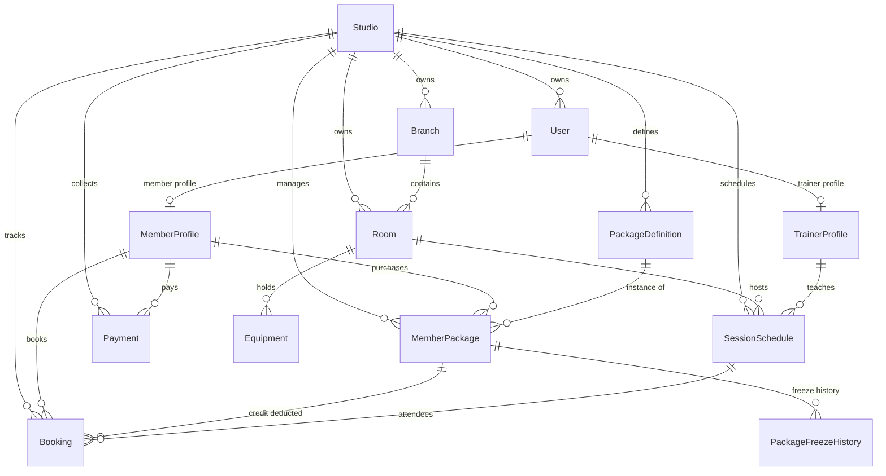

# Database Architecture and Entity-Relationship Diagram

> Note: this schema is being revised. See `HANDOVER.md` section 5 for the target schema
> (removing pilates-specific fields such as `SessionType`, adding tenant-configurable service
> types, a global phone-based `User` with `Membership`, permission-based `RoleTemplate`, and
> more) and section 6 for the backlog order. The diagram below describes the schema as it
> exists in the repository today, not the target state.

The platform runs on PostgreSQL 16 with Prisma ORM, using a row-level multi-tenant
architecture: every tenant-scoped table carries a `studio_id` column.

## 1. Entity-relationship diagram

## 2. Core tables and their roles

### `studios`
- `id` (UUID, primary key)
- `name` (studio name, e.g. "Zen Reformer Pilates")
- `slug` (unique URL segment, e.g. `zen-pilates`)
- `cancellation_deadline_hours` (e.g. cancel up to 4 hours before class)
- `reminder_hours_before` (SMS reminder lead time, e.g. 2 hours before)
- `max_advance_booking_days` (how far ahead a member may book, e.g. 14 days)

### `users` and `member_profiles`
- Each studio's members are defined independently today.
- `phone` and `studio_id` form a unique compound index: the same phone number can belong to a
  member in more than one studio without the records colliding. Note that the target schema
  (`HANDOVER.md` section 5) makes `User` global and phone-unique, linked to studios through a
  `Membership` table instead.
- `medical_conditions` holds free-text notes (e.g. herniated disc, scoliosis, pregnancy) shown
  to trainers as a warning badge on the calendar.

### `package_definitions` and `member_packages`
- `PackageDefinition` is the sellable template (e.g. "10-session 1:1 reformer package", 60-day
  validity).
- `MemberPackage` is the member's live instance of that package:
  - `total_sessions`: sessions purchased
  - `used_sessions`: attended or late-cancelled
  - `remaining_sessions`: remaining balance
  - `status`: `ACTIVE`, `FROZEN`, `EXPIRED`, `DEPLETED`

### `session_schedules` and `bookings`
- The calendar/appointment tables.
- Each session has a start/end time, a trainer, a room and a `capacity`.
- Booking a session checks the member's package, decrements `remaining_sessions`, and creates a
  `bookings` row.
- On cancellation: with more than `cancellation_deadline_hours` left, the credit is refunded
  (`CANCELLED_EARLY`); once past that deadline, the credit is consumed (`CANCELLED_LATE`).

## 3. Indexing strategy

To keep query latency low on a resource-constrained (6 GB RAM) database server, the following
composite indexes are in place:

1. `@@index([studio_id, start_time, end_time])` - fast calendar range queries.
2. `@@index([trainer_id, start_time, end_time])` - trainer conflict checks.
3. `@@index([studio_id, member_id, status])` - fetching a member's active packages without a
   full table scan.
4. `@@index([studio_id, paid_at])` - monthly revenue reporting.
