# Platform Veritabanı Şeması

Platform, her kiracının (stüdyonun) tam veri izolasyonuyla bağımsız çalıştığı çok kiracılı (multi-tenant) bir üyelik ve randevu SaaS'ıdır. Veritabanı, sıkı kiracı kapsamını (tenant scoping) zorunlu kılar: kiracı verisi içeren her tablo bir `studio_id` kolonu taşır ve tüm sorgular bununla filtrelenmelidir. Kullanıcılar global kapsamlıdır ve E.164 telefon numarasıyla (benzersiz) tanımlanır; RoleTemplate'ler aracılığıyla rol tabanlı izinler atayan Membership kayıtları üzerinden stüdyolara katılırlar. Hizmet türleri, kaynak türleri ve form kelime dağarcığı gibi sektöre özgü kavramlar enum değil, kiracı verisidir; bu da her stüdyonun kendi kataloğunu ve iş akışlarını tanımlamasına olanak tanır.

## Varlık-İlişki Diyagramı (Entity-Relationship Diagram)

```mermaid
erDiagram
    Studio ||--o{ Branch : has
    Studio ||--o{ Membership : has
    Studio ||--o{ RoleTemplate : has
    Studio ||--o{ ResourceType : has
    Studio ||--o{ Resource : has
    Studio ||--o{ ServiceType : has
    Studio ||--o{ PackageDefinition : has
    Studio ||--o{ MemberPackage : has
    Studio ||--o{ SessionSchedule : has
    Studio ||--o{ Booking : has
    Studio ||--o{ Waitlist : has
    Studio ||--o{ Payment : has
    Studio ||--o{ StoredCard : has
    Studio ||--o{ MemberSubscription : has
    Studio ||--o{ SmsWallet : has
    Studio ||--o{ NotificationLog : has
    Studio ||--o{ PayrollRun : has
    Studio ||--o{ Lead : has
    Studio ||--o{ LeadActivity : has
    Studio ||--o| InvoiceSettings : configures
    Studio ||--o{ InvoiceCounter : sequences
    Studio ||--o{ Invoice : issues
    Studio ||--o{ BillingProfile : has

    User ||--o{ Membership : creates
    Membership ||--o| MemberProfile : member
    Membership ||--o| TrainerProfile : trainer
    Membership ||--o{ Consent : accepts
    Membership ||--o{ MembershipBranch : limited_to
    Branch ||--o{ MembershipBranch : grants
    Branch ||--o{ MemberProfile : home_of

    RoleTemplate ||--o{ RoleTemplatePermission : grants
    RoleTemplate ||--o{ InviteToken : assigns

    ResourceType ||--o{ Resource : has
    Resource ||--o{ BookingResource : fills
    Resource ||--o{ SessionSchedule : hosts

    ServiceType ||--o{ SessionSchedule : offers
    ServiceType ||--o{ ServiceTypeResourceType : requires
    ServiceType ||--o{ PackageDefinitionService : covers
    ServiceType ||--o{ TrainerQualification : needs

    PackageDefinition ||--o{ PackageDefinitionService : includes
    PackageDefinition ||--o{ MemberPackage : sold_as

    MemberProfile ||--o{ MemberPackage : holds
    MemberProfile ||--o{ Booking : makes
    MemberProfile ||--o{ Waitlist : joins
    MemberProfile ||--o{ Payment : pays
    MemberProfile ||--o{ StoredCard : owns
    MemberProfile ||--o{ MemberSubscription : subscribes
    MemberProfile ||--o{ MeasurementEntry : records
    MemberProfile ||--o{ PackageTransfer : transfers

    PackageDefinition ||--o{ MemberSubscription : renews_as
    StoredCard ||--o{ MemberSubscription : charges
    StoredCard ||--o{ Payment : charges
    MemberSubscription ||--o{ Payment : bills
    MemberSubscription ||--o{ PaymentAttempt : attempts
    Payment ||--o{ PaymentAttempt : records
    Payment ||--o| Invoice : billed_as
    Branch ||--o{ Invoice : issued_from
    MemberProfile ||--o| BillingProfile : declares

    TrainerProfile ||--o{ SessionSchedule : teaches
    TrainerProfile ||--o{ TrainerQualification : has

    MemberPackage ||--o{ Booking : debits
    MemberPackage ||--o{ PackageFreezeHistory : freezes
    MemberPackage ||--o{ PackageTransfer : transfers

    SessionSchedule ||--o{ Booking : has
    SessionSchedule ||--o{ Waitlist : queues

    Booking ||--o{ BookingResource : assigns

    NotificationLog ||--o{ SmsTransaction : triggers

    Studio ||--o{ MessageTemplate : overrides
    Studio ||--o{ CommunicationConsent : has
    User ||--o{ CommunicationConsent : grants
    Branch ||--o{ PayrollRun : scopes
    PayrollRun ||--o{ PayrollLine : has
    TrainerProfile ||--o{ PayrollLine : earns

    Lead ||--o{ LeadActivity : logs
    Membership ||--o{ Lead : owns
    Membership ||--o{ LeadActivity : acts_on
    ServiceType ||--o{ Lead : interests
    Branch ||--o{ Lead : at

    Studio ||--o{ AutomationRule : configures
    Studio ||--o{ AutomationRun : has
    AutomationRule ||--o{ AutomationRun : produces
    User ||--o{ AutomationRun : targeted_by

    Studio ||--o{ TrialRedemption : has
    Studio ||--o{ RedemptionCounter : has
    Studio ||--o{ PromoCode : has
    Studio ||--o{ PromoRedemption : has
    Studio ||--o{ GiftCard : has
    Studio ||--o{ GiftCardTransaction : has
    PackageDefinition ||--o{ TrialRedemption : redeemed_as
    User ||--o{ TrialRedemption : redeems
    MemberPackage ||--o| TrialRedemption : granted_by
    User ||--o{ PromoCode : creates
    PromoCode ||--o{ PromoRedemption : redeemed_as
    User ||--o{ PromoRedemption : redeems
    Payment ||--o| PromoRedemption : discounted_by
    User ||--o{ GiftCard : purchases
    GiftCard ||--o{ GiftCardTransaction : logs
    Payment ||--o{ GiftCardTransaction : records
    Payment ||--o{ GiftCard : paid_with
```

## Platform Seviyesi

| Tablo | Amaç | Kısıtlar |
|-------|---------|-------------|
| `business_type_templates` | Sektör başlangıç kiti: kelime dağarcığı, varsayılanlar, form modülleri | key benzersiz |
| `plans` | Özellik limitleriyle SaaS abonelik seviyeleri | key benzersiz |
| `sms_packages` | Satılık SMS kredi paketleri | key benzersiz |

## Kiracı ve Kimlik

| Tablo | Amaç | Kısıtlar |
|-------|---------|-------------|
| `studios` | Kiracı: marka (logo, varsayılan tema ailesi `theme_family`, ana renk, gradyan), saat dilimi, bildirim ayarları | slug benzersiz |
| `branches` | Stüdyo lokasyonları: adres, iletişim, saat dilimi (boşsa işletmeninki), sıra, aktiflik | (studio_id, name) benzersiz; (id, studio_id) benzersiz (bileşik yabancı anahtar hedefi); studio_id index |
| `membership_branches` | Personelin işlem yapabileceği şubeler; kayıt yoksa tüm şubeler, işletme sahibi hiçbir zaman kısıtlanmaz | (membership_id, branch_id) birincil anahtar; (branch_id, studio_id) bileşik yabancı anahtar ile şubenin aynı işletmeye ait olması zorunlu |
| `users` | E.164 telefon ile tanımlanan global kullanıcılar; görünüm tercihi (`theme_family` boşsa işletmenin teması, `color_scheme` SYSTEM/LIGHT/DARK) | phone benzersiz, email benzersiz |
| `memberships` | Rol tabanlı erişimle kullanıcı-stüdyo bağlantıları | (user_id, studio_id) benzersiz; (studio_id, status) index |
| `role_templates` | Stüdyo başına izin kümeleri; owner rolü zorunlu | (studio_id, key) benzersiz; stüdyo başına bir owner |
| `role_template_permissions` | Bir rol tarafından verilen izinler | role_template_id index |
| `invite_tokens` | Token hash ile QR/bağlantı onboarding'i | token_hash benzersiz; (studio_id, phone) index |
| `document_versions` | Sözleşmeler, KVKK, onay formları (platform veya stüdyo kapsamı) | (studio_id, type, version) NULLS NOT DISTINCT ile benzersiz |
| `consents` | Üyenin bir doküman sürümüne onayı | (membership_id, document_version_id) benzersiz |
| `member_profiles` | Üye verisi: doğum tarihi, sağlık durumu, aile, ana şube (`home_branch_id`) | (membership_id) benzersiz; studio_id index |
| `trainer_profiles` | Antrenör verisi: nitelikler, komisyon kuralı | (membership_id) benzersiz; studio_id index |
| `trainer_qualifications` | Bir hizmet türü için antrenör sertifikaları | (trainer_profile_id, service_type_id) bileşik anahtar |

## Katalog

| Tablo | Amaç | Kısıtlar |
|-------|---------|-------------|
| `resource_types` | Kaynak sınıfları: oda, reformer, EMS cihazı, kort | (studio_id, name) benzersiz; `is_active` (W1: aktif kaynağı olan bir tür pasifleştirilemez) |
| `resources` | Tekil kaynak birimleri; hiyerarşik (oda ekipman içerir) | (studio_id, resource_type_id) index; capacity >= 1; `is_active`, `is_maintenance`; W5: opsiyonel `layout_x`, `layout_y` (yer haritası ızgara koordinatları) ve `label` (yer haritasında görünen kısa etiket, örn. "3" veya "Kort 2") |
| `cancellation_policies` | İptal kuralları: ücretsiz süre, geç iptal ücreti, gelmeme (no-show) ücreti | studio_id index; `is_active`; stüdyo başına en fazla bir `is_default = true` satır (uygulama seviyesinde, katalog modülünde transaction ile korunur) |
| `commission_rules` | Antrenör komisyonu: sabit, yüzde veya maaş | studio_id index |
| `service_types` | Rezerve edilebilir hizmetler: "Özel reformer", "EMS 20 dk" | (studio_id, name) benzersiz; min_repeat_interval_days opsiyonel |
| `service_type_resource_types` | Hizmet rezervasyonu başına gerekli kaynaklar | (service_type_id, resource_type_id) bileşik anahtar |

## Paketler ve Haklar (Entitlements)

| Tablo | Amaç | Kısıtlar |
|-------|---------|-------------|
| `package_definitions` | Satılabilir paketler: seans sayısı, süre-sınırsız veya kredi | (studio_id, is_active) index |
| `package_definition_services` | Bir paketin kapsadığı hizmetler ve birim maliyetler | (package_definition_id, service_type_id) bileşik anahtar |
| `member_packages` | Aktif üye paketi örneği: bakiye takibi, dondurmalar | (studio_id, member_id, status) index; remaining_units >= 0 veya null |
| `package_freeze_history` | Dondurma dönemleri: başlangıç, bitiş, sebep | member_package_id index |
| `package_transfers` | Üyeler arasında transfer edilen birimler (aile paketleri) | (studio_id, created_at) index |
| `family_groups` | Paylaşımlı/aile paketleri için gruplar | studio_id index |

## Planlama ve Rezervasyonlar

| Tablo | Amaç | Kısıtlar |
|-------|---------|-------------|
| `session_schedules` | Dersler ve randevular: zaman, antrenör, kaynaklar, kapasite | (studio_id, start_time, end_time) index; (trainer_id, start_time, end_time) index; (resource_id, start_time, end_time) index; capacity > 0; 0 <= booked_count <= capacity |
| `bookings` | Üye rezervasyonları: durum (onaylı, katıldı, erken veya geç iptal, gelmedi), tahsil edilen birimler, politika gereği işletmede kalan birimler (`penalty_units`) | (studio_id, status) index; (member_id) index; (schedule_id, member_id) benzersiz; `penalty_units` 0 ile `units_charged` arasında (check) |
| `booking_resources` | Rezervasyona kaynak birimi ataması ("reformer 3"); schedule zamanlarının kopyası | (resource_id, start_time, end_time) index; (booking_id, resource_id) benzersiz; tek kapasiteli kaynaklar için çakışma yok (veritabanı exclusion constraint) |
| `waitlist` | Üye bekleme listesi kuyruğu: konum, durum (bekliyor, teklif edildi, terfi etti, süresi doldu, iptal), yer açılınca düşülecek paket (`member_package_id`), sonuçlanma zamanı ve başarısızlık gerekçesi | (schedule_id, member_id) benzersiz; (schedule_id, status, position) index |

## Ölçümler

| Tablo | Amaç | Kısıtlar |
|-------|---------|-------------|
| `measurement_form_templates` | Form tanımları: alanlar (JSON), sürüm, kapsam (platform veya stüdyo) | studio_id index; opsiyonel iş türü şablonu ilişkisi |
| `measurement_entries` | Tamamlanmış değerlendirmeler: kaydedilen değerler (JSON), kullanıcı, zaman damgası | (studio_id, member_id, recorded_at) index |

## Finans

| Tablo | Amaç | Kısıtlar |
|-------|---------|-------------|
| `payments` | Üye işlemleri: tutar, para birimi, iade edilen tutar, yöntem (nakit, kart, banka, online), durum, sağlayıcı (mock/iyzico/paytr) ve sağlayıcı referansı, taksit sayısı, satışın yapıldığı şube, beklemedeki (örn. havale) ödemeler için paket bilgisini taşıyan `metadata` | (studio_id, paid_at) index; (branch_id, paid_at) index; (provider, provider_reference) index |
| `stored_cards` | Üye başına saklanan kart: yalnızca sağlayıcı kart token'ı + son 4 hane + marka + son kullanma tarihi; PAN veya CVV asla saklanmaz | (studio_id, member_id) index |
| `member_subscriptions` | Bir pakete bağlı, otomatik yenilenen üye aboneliği: durum (aktif, ödeme gecikmiş, iptal, duraklatıldı), dönem tarihleri, sonraki tahsilat zamanı, dönem sonunda iptal bayrağı, taksit sayısı | (studio_id, member_id) index; (status, next_charge_at) index (dunning taramasi için) |
| `payment_attempts` | Bir aboneliğin tahsilat denemesi (dunning): deneme numarası, durum, hata kodu, sonraki deneme zamanı | member_subscription_id index |
| `expenses` | İşletme giderleri: kategori, tutar, spent_at, kaydeden kullanıcı | (studio_id, spent_at) index; (branch_id) opsiyonel |

## e-Arşiv / e-Fatura (W8)

| Tablo | Amaç | Kısıtlar |
|-------|---------|-------------|
| `invoice_settings` | Stüdyo başına fatura yapılandırması: unvan, vergi dairesi, vergi numarası (VKN/TCKN, shared'de checksum doğrulanır), e-fatura modu (yok/e-Arşiv/e-Fatura), entegratör sağlayıcısı, varsayılan KDV oranı, seri kodu, ödeme sonrası otomatik kesim bayrağı | studio_id benzersiz |
| `invoice_counters` | Stüdyo + seri + yıl başına atomik sıra sayacı; fatura oluşturulurken aynı transaction içinde artırılır | (studio_id, series_prefix, year) birincil anahtar |
| `billing_profiles` | Üyenin fatura kimliği: bireysel (TCKN opsiyonel, yoksa e-Arşiv'in standart tüketici TCKN'si "11111111111" kullanılır) veya şirket (unvan, vergi dairesi, VKN zorunlu) | member_id benzersiz; studio_id index |
| `invoices` | Bir ödemeye bağlı e-Arşiv/e-Fatura belgesi: seri+yıl+sıra numarası, alıcı ve kalem anlık görüntüsü (JSON), ara toplam/KDV/toplam (KDV dahil fiyattan geriye bölünerek hesaplanır), durum (taslak, kesildi, iptal, başarısız), sağlayıcı ve sağlayıcı referansı, PDF bağlantısı, iptal/hata gerekçesi | payment_id benzersiz; (studio_id, number) benzersiz; (studio_id, issue_date) index; (branch_id) index; (status) index |

## Bildirimler ve SMS

| Tablo | Amaç | Kısıtlar |
|-------|---------|-------------|
| `sms_wallets` | Stüdyo SMS kredi bakiyesi | studio_id benzersiz; balance >= 0 |
| `sms_transactions` | SMS defteri: satın alma, kullanım, düzeltme, iade | (studio_id, created_at) index; notification_log_id benzersiz |
| `notification_logs` | Giden mesajlar: WhatsApp, SMS, push, email; fallback zinciri | (studio_id, created_at) index; tekrar deneme zincirleri için (fallback_of_id) kendine referans |
| `message_templates` | Kanal başına mesaj şablonu ({{ad}} yer tutucularıyla); studio_id null olan satırlar süper adminin küresel varsayılanı, doldurulmuş satırlar kiracı geçersiz kılması | (studio_id, key, channel, locale) benzersiz; key index |
| `communication_consents` | Ticari mesaj için İYS tarzı onay durumu (kanal başına) | (studio_id, user_id, channel) benzersiz; (studio_id, status) ve (iys_synced_at) index |

## Hakediş Bordrosu (Payroll, W14)

| Tablo | Amaç | Kısıtlar |
|-------|---------|-------------|
| `payroll_runs` | Bir dönem (opsiyonel şube kapsamlı) için hakediş çalıştırması: durum (taslak, onaylandı, ödendi), toplamlar | (studio_id, branch_id, period_start, period_end) index; (studio_id, status) index |
| `payroll_lines` | Çalıştırma başına antrenör satırı: seans/katılımcı sayıları, brüt, düzeltme, net, hesaplama detayı (JSON) | (run_id, trainer_profile_id) benzersiz; (studio_id, trainer_profile_id) index |

Formül ve durum makinesi için bkz. `docs/PAYROLL.md`.

## Potansiyel Müşteri Hattı (W11)

| Tablo | Amaç | Kısıtlar |
|-------|---------|-------------|
| `leads` | Henüz üye olmamış aday: kaynak (web formu, Instagram, kapıdan gelen, tavsiye, telefon, diğer), aşama (yeni, görüşüldü, deneme planlandı, deneme yapıldı, üye oldu, kaybedildi), sorumlu personel, bir sonraki takip tarihi, UTM alanları; üyeliğe dönüşünce `converted_membership_id` doldurulur | (studio_id, stage) index; (studio_id, phone) index; (studio_id, next_follow_up_at) index; (studio_id, open_phone) benzersiz: `open_phone` aday açıkken telefonu, üye olunca veya kaybedilince NULL tutar; böylece aynı telefondan tek açık aday olur ve kısıt Prisma şemasında ifade edilebilir |
| `lead_activities` | Bir adayın geçmişi: not, arama, mesaj, aşama değişikliği, deneme dersi kaydı | (lead_id, created_at) index |

Açık (WON/LOST olmayan) bir aday aynı telefonla tekrar başvurursa (web formundan veya personel tarafından), yeni bir `leads` satırı açılmaz; bu, o adayın geçmişine bir `lead_activities` notu olarak eklenir (bkz. `LeadsService.create` ve `LeadsService.submitPublicForm`, `apps/api/src/modules/leads/leads.service.ts`). Aday WON veya LOST olduktan sonra aynı telefonla yeni bir aday açılabilir.

## Otomasyon (Otomatik Pazarlama ve Yaşam Döngüsü Akışları)

| Tablo | Amaç | Kısıtlar |
|-------|---------|-------------|
| `automation_rules` | Kiracı kuralı: tür (WIN_BACK, PACKAGE_EXPIRING, BIRTHDAY, FIRST_CLASS_FOLLOW_UP, BOOKING_REMINDER, NO_SHOW_FOLLOW_UP), tür başına doğrulanmış `params` JSON, hedef `message_templates.key`, aktif/pasif | (studio_id, type) ve (studio_id, is_active) index |
| `automation_runs` | Bir kural/kullanıcı/hedef için tek gönderim denemesi; en-fazla-bir-kez teslimatın koruma anahtarı | (rule_id, user_id, target_ref) benzersiz; (studio_id, rule_id, created_at) index |

`automation_rules.params`, `packages/shared/src/automations.ts` içindeki `AutomationRuleParamsSchema` (Zod ayrık birleşimi) ile doğrulanır; kural 7 gereği enum değildir. `automation_runs` satırı, değerlendirici göndermeden **önce** oluşturulur (insert-first) ve unique kısıt bir sonraki değerlendirme döngüsünün aynı hedefi tekrar göndermesini engeller (idempotency guard). Bkz. `docs/AUTOMATIONS.md`.

## Satış Araçları (W9): Deneme Dersi, Promosyon Kodu, Hediye Kartı

| Tablo | Amaç | Kısıtlar |
|-------|---------|-------------|
| `package_definitions.is_trial`, `.trial_limit_per_user` | Bir paket tanımını deneme teklifi olarak işaretler; kullanıcı başına izin verilen satın alma sayısı | `(studio_id, is_trial)` index |
| `trial_redemptions` | Bir kullanıcının bir deneme paketini kullandığı kaydı (denetim/iz) | `(studio_id, user_id, package_definition_id)` index |
| `redemption_counters` | Deneme teklifi ve promosyon kodu için kullanıcı başına kullanım sayacı; `(studio_id, subject, subject_id, user_id)` benzersiz index üzerinden tek bir `INSERT ... ON CONFLICT DO UPDATE ... WHERE count < limit` deyimiyle yarış durumuna karşı güvenli okunup artırılır | `(studio_id, subject, subject_id, user_id)` benzersiz |
| `promo_codes` | Promosyon kodu: tür (yüzde/sabit tutar/ücretsiz hak), değer, geçerlilik aralığı, toplam ve kullanıcı başına kullanım limiti, minimum tutar, uygulanabilir paketler, yalnızca yeni üyeler kısıtı | `(studio_id, code)` benzersiz (kod her zaman büyük harfle saklanır) |
| `promo_redemptions` | Bir kodun bir ödemeye uygulanması: indirim tutarı | `payment_id` benzersiz (ödeme başına bir kod); `(promo_code_id, user_id)` ve `(studio_id, user_id)` index |
| `gift_cards` | Hediye kartı: yalnızca sha256 kod özeti + son 4 hane saklanır (gerçek kod yalnızca oluşturulduğunda bir kez döndürülür), başlangıç tutarı, güncel bakiye, alıcı bilgisi, son kullanma tarihi, durum | `(studio_id, code_hash)` benzersiz; `(studio_id, status)` ve `(purchaser_user_id)` index |
| `gift_card_transactions` | Kart hareketleri: satış, kullanım, iade, manuel düzeltme | `(gift_card_id, created_at)` index |
| `payments.promo_code_id`, `.discount_amount`, `.gift_card_id`, `.gift_card_amount`, `.gift_card_refunded` | Bir ödemeye uygulanan promosyon indirimi ve hediye kartından karşılanan tutar; iade edilen hediye kartı payı | `(promo_code_id)` ve `(gift_card_id)` index |

## Ayrılma Riski (Churn Risk, W12)

| Tablo | Amaç | Kısıtlar |
|-------|---------|-------------|
| `member_risk_snapshots` | Aktif üye başına en güncel ayrılma riski puanı (0-100), seviyesi (LOW/MEDIUM/HIGH), gerekçeleri (JSON: makine anahtarı + Türkçe etiket + puan), yeni üye bayrağı, önceki puan, görüşüldü/ertelendi durumu | `member_id` benzersiz (üye başına tek satır, `ChurnService.recomputeStudio` upsert eder); (studio_id, level, score) index |
| `member_risk_history` | Her yeniden hesaplamada üye başına bir satır: puan, seviye, hesaplama zamanı; haftalık değişim ve özet trendleri için kullanılır | (studio_id, member_id, computed_at) index; (studio_id, computed_at) index |

Puanlama fonksiyonu (`apps/api/src/modules/churn/churn-scoring.ts`) saf ve iş kuralı olduğu için `apps/api` içinde yaşar; ağırlıkları `studios.churn_weights` (JSONB, null ise `packages/shared/src/churn.ts` içindeki varsayılanlar geçerli olur) üzerinden kiracı ayarlanabilir. Sinyaller, ağırlıklar ve seviye eşikleri için bkz. `docs/CHURN.md`.

## Oyunlaştırma (W16)

| Tablo | Amaç | Kısıtlar |
|-------|---------|-------------|
| `badge_definitions` | Rozet tanımı, veri olarak (kod değil): `studio_id` null olan satırlar her kiracıya sunulan küresel varsayılanlardır, kiracı kendi rozetlerini de ekleyebilir. `kind` (MILESTONE_SESSIONS, STREAK_WEEKS, MONTHLY_GOAL_MET, FIRST_SESSION, EARLY_BIRD, VARIETY) ve `threshold` (kind'a göre şekillenen Json; `@platform/shared`'daki paylaşılan Zod discriminated union ile doğrulanır) | (studio_id, key) benzersiz; (studio_id, is_active) index |
| `member_badges` | Bir üyenin kazandığı bir rozet; `source_ref` genellikle tetikleyen booking id'sidir | (member_id, badge_definition_id) benzersiz -- kazanma her zaman idempotenttir; (studio_id, member_id) index |
| `member_goals` | Üyenin kendi belirlediği aylık seans hedefi ("YYYY-MM"); ilerleme hiçbir zaman burada saklanmaz, her okumada katılım geçmişinden hesaplanır | (member_id, month) benzersiz; (studio_id, month) index |

`studios.gamification_enabled` (varsayılan true) oyunlaştırmayı stüdyo bazında kapatır; kapalıyken `GamificationService.onAttendance` hiçbir rozet vermez ama check-in'in kendisi hiçbir zaman başarısız olmaz (best-effort, try/catch). `member_profiles.leaderboard_opt_in` (varsayılan false) gizlilik öncelikli liderlik tablosu katılımıdır; katılmayan üyeler listede hiç görünmez, katılanlar yalnızca ad + soyadın ilk harfiyle görünür. Seri ve kilometre taşı hesaplamaları stüdyonun saat dilimine göre ISO hafta bazlı saf fonksiyonlardır (`apps/api/src/modules/gamification/gamification-calculations.ts`). Detaylar: `docs/GAMIFICATION.md`.

## Puan ve Tavsiye (W15)

| Tablo | Amaç | Kısıtlar |
|-------|---------|-------------|
| `session_ratings` | Bir üyenin bir rezervasyona verdiği puan (1-5) ve isteğe bağlı yorum; `trainer_profile_id` puanlama anındaki değil, seansı veren eğitmeni (`SessionSchedule.trainerId`) yansıtır; `is_anonymous_to_trainer` (varsayılan true) eğitmenin kendi görünümünde üye kimliğini gizler | (booking_id) benzersiz: üye başına rezervasyon başına tek puan; (studio_id, trainer_profile_id), (studio_id, service_type_id), (studio_id, created_at) index |
| `referral_codes` | Üye başına tek kısa tavsiye kodu | (member_id) benzersiz (bir üyenin tek kodu olur); (code) global benzersiz |
| `referrals` | Bir tavsiye kaydı: tavsiye eden üye, tavsiye edilen (global) kullanıcı, durum (beklemede, hak kazandı, ödüllendirildi, iptal edildi), hak kazanma ve ödül zaman damgaları, ödül türü ve miktarı | (studio_id, referred_user_id) benzersiz: kullanıcılar telefonla global benzersiz olduğundan aynı telefon bir stüdyoda iki kez tavsiye olarak kaydedilemez; (studio_id, status), (studio_id, referrer_member_id) index |

`bookings.rating_prompt_sent_at` (nullable): "seansını değerlendir" push bildiriminin gönderildiği an; `RatingPromptService.promptRecentAttendees()` için idempotency anahtarıdır. `studios.google_review_url` (nullable, yalnızca g.page/search.google.com/local/writereview/google.com/maps ile başlayan https bağlantı) ve `studios.referral_reward_units` (varsayılan 1) çalışma zamanı kuralları için `docs/FEEDBACK_REFERRAL.md` içindedir.

## Sağlık Entegrasyonu (Apple Health / Health Connect, W21)

| Tablo | Amaç | Kısıtlar |
|-------|---------|-------------|
| `member_health_settings` | Üye başına gizlilik öncelikli açık/kapalı ayarları: `write_workouts` (katılınan dersleri sağlığa yaz), `read_aggregates` (günlük özetleri cihazda oku), `share_with_studio` (bu özetleri işletmeyle paylaş, ayrı bir onay). Üçü de varsayılan `false` | (member_id) benzersiz |
| `health_sync_records` | Bir rezervasyonun bir platforma daha önce yazıldığını izler; aynı rezervasyon aynı platforma asla iki kez yazılmaz (mobil uygulama da aynı anahtarla cihaz üzerinde ayrıca önbellekler) | (member_id, booking_id, platform) benzersiz; (studio_id, member_id) index |
| `health_daily_summaries` | Yalnızca günlük özet (adım, aktif enerji kcal, dinlenme nabzı); ham örnek asla saklanmaz | (member_id, date) benzersiz; (studio_id, member_id, date) index |

`service_types.health_activity_type` (varsayılan `OTHER`) bir hizmetin genel `HealthActivityType` (STRENGTH, FLEXIBILITY, YOGA, PILATES, DANCE, MARTIAL_ARTS, SWIMMING, CYCLING, RUNNING, WALKING, TENNIS, OTHER) ile eşlemesidir; sektöre özgü kod içermez, kiracı verisidir. Sağlık verisi KVKK kapsamında özel nitelikli kişisel veridir: `document_versions.type = HEALTH_DATA` ayrı, isteğe bağlı bir onam metnidir (zorunlu üyelik belgelerinden biri değildir); yükleme uç noktaları bu türden aktif bir `consents` kaydı olmadan 403 döner. Üyenin "Verilerimi sil" eylemi `health_daily_summaries` ve `health_sync_records` satırlarını kalıcı olarak siler, `member_health_settings`'i sıfırlar, HEALTH_DATA onayını geri alır ve bir `audit_logs` kaydı (`member_health.data_deleted`) oluşturur. Personel görünümü `members.health.view` iznini (mevcut izin, üye sağlık notları görünürlüğüyle paylaşılır) VE üyenin `share_with_studio` açığını gerektirir; şube kısıtlı personel yalnızca kendi şubesindeki üyeleri görür. Detaylar: `docs/HEALTH_INTEGRATION.md`.

## Denetim (Audit)

| Tablo | Amaç | Kısıtlar |
|-------|---------|-------------|
| `audit_logs` | İşlem günlüğü: kim neyi hangi varlığa yaptı; platform işlemleri için studio_id nullable | (studio_id, created_at) index |

## Abonelikler

| Tablo | Amaç | Kısıtlar |
|-------|---------|-------------|
| `subscriptions` | SaaS aboneliği: durum (deneme, aktif, gecikmiş, iptal edildi), dönem tarihleri | (studio_id, status) index; stüdyo başına bir canlı abonelik (status IN trialing/active/past_due) |
| `feature_flags` | Özellik bayrakları: kapsam (global, iş türü, stüdyo); çözümleme sırası: kiracı > iş türü > global | (studio_id) index; (key, scope, business_type_template_id, studio_id) NULLS NOT DISTINCT ile benzersiz |

## Veritabanı Tarafından Zorunlu Kılınan Kurallar

1. **Rezervasyon Kaynağı Dışlama (Booking Resource Exclusion)** (`booking_resources_no_overlap`): Tek kapasiteli kaynaklar (capacity=1) çakışan aktif rezervasyonlara sahip olamaz. PostgreSQL exclusion constraint (btree_gist) ile (resource_id WITH =, tsrange(start_time, end_time) WITH &&) WHERE is_active AND exclusive üzerinde uygulanır.

2. **Zaman Aralığı Geçerliliği**:
   - `booking_resources_valid_range`: end_time > start_time
   - `session_schedules_valid_range`: end_time > start_time

3. **Seans Kapasitesi**:
   - `session_schedules_capacity_positive`: capacity > 0
   - `session_schedules_booked_within_capacity`: 0 <= booked_count <= capacity

4. **Paket Bakiyesi**: `member_packages_units_non_negative`: remaining_units null veya >= 0

5. **SMS Cüzdan Bakiyesi**: `sms_wallets_balance_non_negative`: balance >= 0

6. **Feature Flag'ler NULLS NOT DISTINCT**: (key, scope, business_type_template_id, studio_id) benzersiz index, NULL'ları farklı değerler olarak ele alır, yinelenen global bayrakları ve platform dokümanlarını önler.

7. **Doküman Sürümleri NULLS NOT DISTINCT**: (studio_id, type, version) NULLS NOT DISTINCT ile benzersiz index, yinelenen platform dokümanlarını önler (studio_id null).

8. **Stüdyo Başına Bir Owner Rolü**: (studio_id) WHERE is_owner üzerindeki benzersiz index, her stüdyo için tam olarak bir owner rol şablonu bulunmasını zorunlu kılar.

9. **Stüdyo Başına Bir Canlı Abonelik**: (studio_id) WHERE status IN ('TRIALING', 'ACTIVE', 'PAST_DUE') üzerindeki benzersiz index, kiracı başına yalnızca bir aktif abonelik olmasını zorunlu kılar.

10. **İade Sınırı** (uygulama seviyesinde, `PaymentsService.refundPayment` içinde koşullu `updateMany` ile): `refunded_amount`, okunan anlık değer üzerinden koşullu güncellenir; eşzamanlı iki iade isteği `amount`'u asla aşamaz ve ikinci istek `409 Conflict` alır.

10. **Açık Aday Başına Tek Telefon**: (studio_id, open_phone) benzersiz kısıtı, aynı işletmede aynı telefonla birden fazla açık aday oluşmasını engeller. `open_phone` yalnızca aday açıkken dolu olduğu için kapanmış (WON/LOST) adaylar kısıtın dışında kalır.

11. **Satış Araçları Yarış Güvenliği** (W9, uygulama seviyesinde): deneme teklifi ve promosyon kodu kullanıcı limitleri `redemption_counters` üzerinde tek bir `INSERT ... ON CONFLICT DO UPDATE ... WHERE count < limit` deyimiyle; promosyon kodunun toplam kullanım limiti `promo_codes.redeemed_count` üzerinde koşullu `updateMany` (`redeemed_count < max_redemptions`) ile; hediye kartı bakiyesi `gift_cards.balance` üzerinde koşullu `updateMany` (`balance >= amount`) ile korunur. Her üçü de eşzamanlı isteklerde tam olarak izin verilen sayıda işlemin başarılı olmasını garanti eder.

## Konvansiyonlar

- Tüm kolonlar snake_case kullanır ve `@map` ile Prisma camelCase'ine eşlenir.
- Birincil anahtarlar `@default(uuid())` ile UUID'dir.
- Veri bütünlüğü restrict veya set null gerektirmedikçe (örn. üyelikler için rol şablonları restrict'tir), yabancı anahtarlar silme işleminde cascade uygular.
- Kiracı verisi sorguları studio_id ile filtrelenmelidir; SUPER_ADMIN kapsamlamayı atlar.
- Migration'lar yalnızca ileri yönlüdür (forward-only): önce genişlet sonra daralt; asla yıkıcı değil.
- Kiracı verisi üzerindeki index'ler, bir kiracı içinde verimli tarama için önce studio_id içerir (örn. (studio_id, start_time, end_time)).
