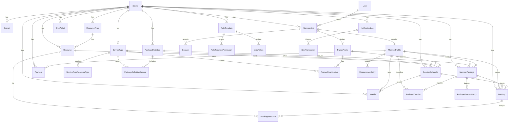

# Pilates Studio OS Veritabanı Şeması

Pilates Studio OS, her kiracının (stüdyonun) tam veri izolasyonuyla bağımsız çalıştığı çok kiracılı (multi-tenant) bir butik stüdyo yönetim sistemidir. Veritabanı, sıkı kiracı kapsamını (tenant scoping) zorunlu kılar: kiracı verisi içeren her tablo bir `studio_id` kolonu taşır ve tüm sorgular bununla filtrelenmelidir. Kullanıcılar global kapsamlıdır ve E.164 telefon numarasıyla (benzersiz) tanımlanır; RoleTemplate'ler aracılığıyla rol tabanlı izinler atayan Membership kayıtları üzerinden stüdyolara katılırlar. Hizmet türleri, kaynak türleri ve form kelime dağarcığı gibi sektöre özgü kavramlar enum değil, kiracı verisidir; bu da her stüdyonun kendi kataloğunu ve iş akışlarını tanımlamasına olanak tanır.

## Varlık-İlişki Diyagramı (Entity-Relationship Diagram)

## Platform Seviyesi

| Tablo | Amaç | Kısıtlar |
|-------|---------|-------------|
| `business_type_templates` | Sektör başlangıç kiti: kelime dağarcığı, varsayılanlar, form modülleri | key benzersiz |
| `plans` | Özellik limitleriyle SaaS abonelik seviyeleri | key benzersiz |
| `sms_packages` | Satılık SMS kredi paketleri | key benzersiz |

## Kiracı ve Kimlik

| Tablo | Amaç | Kısıtlar |
|-------|---------|-------------|
| `studios` | Kiracı: marka, saat dilimi, bildirim ayarları | slug benzersiz |
| `branches` | Stüdyo lokasyonları | studio_id index |
| `users` | E.164 telefon ile tanımlanan global kullanıcılar | phone benzersiz, email benzersiz |
| `memberships` | Rol tabanlı erişimle kullanıcı-stüdyo bağlantıları | (user_id, studio_id) benzersiz; (studio_id, status) index |
| `role_templates` | Stüdyo başına izin kümeleri; owner rolü zorunlu | (studio_id, key) benzersiz; stüdyo başına bir owner |
| `role_template_permissions` | Bir rol tarafından verilen izinler | role_template_id index |
| `invite_tokens` | Token hash ile QR/bağlantı onboarding'i | token_hash benzersiz; (studio_id, phone) index |
| `document_versions` | Sözleşmeler, KVKK, onay formları (platform veya stüdyo kapsamı) | (studio_id, type, version) NULLS NOT DISTINCT ile benzersiz |
| `consents` | Üyenin bir doküman sürümüne onayı | (membership_id, document_version_id) benzersiz |
| `member_profiles` | Üye verisi: doğum tarihi, sağlık durumu, aile | (membership_id) benzersiz; studio_id index |
| `trainer_profiles` | Antrenör verisi: nitelikler, komisyon kuralı | (membership_id) benzersiz; studio_id index |
| `trainer_qualifications` | Bir hizmet türü için antrenör sertifikaları | (trainer_profile_id, service_type_id) bileşik anahtar |

## Katalog

| Tablo | Amaç | Kısıtlar |
|-------|---------|-------------|
| `resource_types` | Kaynak sınıfları: oda, reformer, EMS cihazı, kort | (studio_id, name) benzersiz |
| `resources` | Tekil kaynak birimleri; hiyerarşik (oda ekipman içerir) | (studio_id, resource_type_id) index; capacity >= 1 |
| `cancellation_policies` | İptal kuralları: ücretsiz süre, geç iptal ücreti, gelmeme (no-show) ücreti | studio_id index |
| `commission_rules` | Antrenör komisyonu: sabit, yüzde veya maaş | studio_id index |
| `service_types` | Rezerve edilebilir hizmetler: "Özel reformer", "EMS 20 dk" | (studio_id, name) benzersiz; min_repeat_interval_days opsiyonel |
| `service_type_resource_types` | Hizmet rezervasyonu başına gerekli kaynaklar | (service_type_id, resource_type_id) bileşik anahtar |

## Paketler ve Haklar (Entitlements)

| Tablo | Amaç | Kısıtlar |
|-------|---------|-------------|
| `package_definitions` | Satılabilir paketler: seans sayısı, süre-sınırsız veya kredi | (studio_id, is_active) index |
| `package_definition_services` | Bir paketin kapsadığı hizmetler ve birim maliyetler | (package_definition_id, service_type_id) bileşik anahtar |
| `member_packages` | Aktif üye paketi örneği: bakiye takibi, dondurmalar | (studio_id, member_id, status) index; remaining_units >= 0 veya null |
| `package_freeze_history` | Dondurma dönemleri: başlangıç, bitiş, sebep | member_package_id index |
| `package_transfers` | Üyeler arasında transfer edilen birimler (aile paketleri) | (studio_id, created_at) index |
| `family_groups` | Paylaşımlı/aile paketleri için gruplar | studio_id index |

## Planlama ve Rezervasyonlar

| Tablo | Amaç | Kısıtlar |
|-------|---------|-------------|
| `session_schedules` | Dersler ve randevular: zaman, antrenör, kaynaklar, kapasite | (studio_id, start_time, end_time) index; (trainer_id, start_time, end_time) index; (resource_id, start_time, end_time) index; capacity > 0; 0 <= booked_count <= capacity |
| `bookings` | Üye rezervasyonları: durum (onaylı, katıldı, erken veya geç iptal, gelmedi), tahsil edilen birimler, politika gereği işletmede kalan birimler (`penalty_units`) | (studio_id, status) index; (member_id) index; (schedule_id, member_id) benzersiz; `penalty_units` 0 ile `units_charged` arasında (check) |
| `booking_resources` | Rezervasyona kaynak birimi ataması ("reformer 3"); schedule zamanlarının kopyası | (resource_id, start_time, end_time) index; (booking_id, resource_id) benzersiz; tek kapasiteli kaynaklar için çakışma yok (veritabanı exclusion constraint) |
| `waitlist` | Üye bekleme listesi kuyruğu: konum, durum (bekliyor, teklif edildi, terfi etti, süresi doldu, iptal), yer açılınca düşülecek paket (`member_package_id`), sonuçlanma zamanı ve başarısızlık gerekçesi | (schedule_id, member_id) benzersiz; (schedule_id, status, position) index |

## Ölçümler

| Tablo | Amaç | Kısıtlar |
|-------|---------|-------------|
| `measurement_form_templates` | Form tanımları: alanlar (JSON), sürüm, kapsam (platform veya stüdyo) | studio_id index; opsiyonel iş türü şablonu ilişkisi |
| `measurement_entries` | Tamamlanmış değerlendirmeler: kaydedilen değerler (JSON), kullanıcı, zaman damgası | (studio_id, member_id, recorded_at) index |

## Finans

| Tablo | Amaç | Kısıtlar |
|-------|---------|-------------|
| `payments` | Üye işlemleri: tutar, yöntem (nakit, kart, banka, online), durum | (studio_id, paid_at) index |
| `expenses` | İşletme giderleri: kategori, tutar, spent_at, kaydeden kullanıcı | (studio_id, spent_at) index; (branch_id) opsiyonel |

## Bildirimler ve SMS

| Tablo | Amaç | Kısıtlar |
|-------|---------|-------------|
| `sms_wallets` | Stüdyo SMS kredi bakiyesi | studio_id benzersiz; balance >= 0 |
| `sms_transactions` | SMS defteri: satın alma, kullanım, düzeltme, iade | (studio_id, created_at) index; notification_log_id benzersiz |
| `notification_logs` | Giden mesajlar: WhatsApp, SMS, push, email; fallback zinciri | (studio_id, created_at) index; tekrar deneme zincirleri için (fallback_of_id) kendine referans |

## Denetim (Audit)

| Tablo | Amaç | Kısıtlar |
|-------|---------|-------------|
| `audit_logs` | İşlem günlüğü: kim neyi hangi varlığa yaptı; platform işlemleri için studio_id nullable | (studio_id, created_at) index |

## Abonelikler

| Tablo | Amaç | Kısıtlar |
|-------|---------|-------------|
| `subscriptions` | SaaS aboneliği: durum (deneme, aktif, gecikmiş, iptal edildi), dönem tarihleri | (studio_id, status) index; stüdyo başına bir canlı abonelik (status IN trialing/active/past_due) |
| `feature_flags` | Özellik bayrakları: kapsam (global, iş türü, stüdyo); çözümleme sırası: kiracı > iş türü > global | (studio_id) index; (key, scope, business_type_template_id, studio_id) NULLS NOT DISTINCT ile benzersiz |

## Veritabanı Tarafından Zorunlu Kılınan Kurallar

1. **Rezervasyon Kaynağı Dışlama (Booking Resource Exclusion)** (`booking_resources_no_overlap`): Tek kapasiteli kaynaklar (capacity=1) çakışan aktif rezervasyonlara sahip olamaz. PostgreSQL exclusion constraint (btree_gist) ile (resource_id WITH =, tsrange(start_time, end_time) WITH &&) WHERE is_active AND exclusive üzerinde uygulanır.

2. **Zaman Aralığı Geçerliliği**:
   - `booking_resources_valid_range`: end_time > start_time
   - `session_schedules_valid_range`: end_time > start_time

3. **Seans Kapasitesi**:
   - `session_schedules_capacity_positive`: capacity > 0
   - `session_schedules_booked_within_capacity`: 0 <= booked_count <= capacity

4. **Paket Bakiyesi**: `member_packages_units_non_negative`: remaining_units null veya >= 0

5. **SMS Cüzdan Bakiyesi**: `sms_wallets_balance_non_negative`: balance >= 0

6. **Feature Flag'ler NULLS NOT DISTINCT**: (key, scope, business_type_template_id, studio_id) benzersiz index, NULL'ları farklı değerler olarak ele alır, yinelenen global bayrakları ve platform dokümanlarını önler.

7. **Doküman Sürümleri NULLS NOT DISTINCT**: (studio_id, type, version) NULLS NOT DISTINCT ile benzersiz index, yinelenen platform dokümanlarını önler (studio_id null).

8. **Stüdyo Başına Bir Owner Rolü**: (studio_id) WHERE is_owner üzerindeki benzersiz index, her stüdyo için tam olarak bir owner rol şablonu bulunmasını zorunlu kılar.

9. **Stüdyo Başına Bir Canlı Abonelik**: (studio_id) WHERE status IN ('TRIALING', 'ACTIVE', 'PAST_DUE') üzerindeki benzersiz index, kiracı başına yalnızca bir aktif abonelik olmasını zorunlu kılar.

## Konvansiyonlar

- Tüm kolonlar snake_case kullanır ve `@map` ile Prisma camelCase'ine eşlenir.
- Birincil anahtarlar `@default(uuid())` ile UUID'dir.
- Veri bütünlüğü restrict veya set null gerektirmedikçe (örn. üyelikler için rol şablonları restrict'tir), yabancı anahtarlar silme işleminde cascade uygular.
- Kiracı verisi sorguları studio_id ile filtrelenmelidir; SUPER_ADMIN kapsamlamayı atlar.
- Migration'lar yalnızca ileri yönlüdür (forward-only): önce genişlet sonra daralt; asla yıkıcı değil.
- Kiracı verisi üzerindeki index'ler, bir kiracı içinde verimli tarama için önce studio_id içerir (örn. (studio_id, start_time, end_time)).
