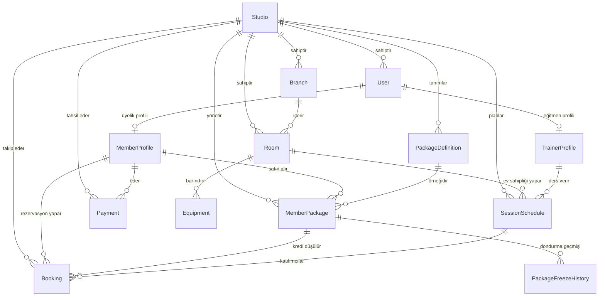

# Veritabanı Mimarisi ve Varlık-İlişki Diyagramı (ERD)

Pilates Studio OS, PostgreSQL 16 veritabanı ve Prisma ORM üzerinde kurgulanmış **Row-Level Multi-Tenant** (Satır Düzeyinde Çoklu Kiracı) bir mimariye sahiptir.

---

## 1. Varlık-İlişki Diyagramı (ERD)

---

## 2. Temel Tablolar ve Roller

### `studios` (Stüdyolar)
- `id` (UUID, Primary Key)
- `name` (Stüdyo Adı: örn. *Zen Reformer Pilates*)
- `slug` (Benzersiz URL eki: `zen-pilates`)
- `cancellation_deadline_hours` (İptal süresi: örn. derse 4 saat kala)
- `reminder_hours_before` (SMS hatırlatması: örn. derse 2 saat kala)
- `max_advance_booking_days` (En fazla kaç gün sonraya rezervasyon alınabilir: örn. 14 gün)

### `users` & `member_profiles`
- Her iki stüdyoda da bağımsız üyeler tanımlanabilir.
- `phone` ve `studio_id` çifti benzersizdir (Unique Compound Index). Bir üye her iki stüdyoya da aynı telefonla kaydolabilir ancak verileri birbirine karışmaz.
- `medical_conditions`: Bel fıtığı (L4-L5), skolyoz, boyun düzleşmesi, protez veya gebelik bilgisi tutulur. Takvimde eğitmenlere otomatik uyarı rozeti olarak gösterilir.

### `package_definitions` & `member_packages`
- `PackageDefinition`: Şablon pakettir (örn. "10 Seans Birebir Reformer", 60 gün geçerlilik, 12.000 TL).
- `MemberPackage`: Üyenin satın aldığı canlı pakettir:
  - `total_sessions`: Toplam satın alınan (örn. 10)
  - `used_sessions`: Katılınan veya geç iptal edilen (örn. 2)
  - `remaining_sessions`: Kalan bakiye (örn. 8)
  - `status`: `ACTIVE`, `FROZEN`, `EXPIRED`, `DEPLETED`

### `session_schedules` & `bookings`
- Randevu ve takvim tablosudur.
- Her dersin başlangıç-bitiş saati, eğitmeni, odası ve kapasitesi (`capacity`) bulunur.
- Rezervasyon anında üyenin paketi kontrol edilir, `remaining_sessions` 1 azaltılır ve `bookings` kaydı açılır.
- İptal durumunda:
  - Eğer seansa `cancellation_deadline_hours` süresinden fazla varsa kredi iade edilir (`CANCELLED_EARLY`).
  - Eğer süre dolmuşsa seans kredisi düşülür (`CANCELLED_LATE`).

---

## 3. İndeksleme ve Performans Stratejisi

6 GB RAM sunucuda PostgreSQL'in sorguları anında yanıtlaması için aşağıdaki bileşik indeksler eklenmiştir:

1. `@@index([studio_id, start_time, end_time])`: Takvim sorguları için milisaniye seviyesinde filtreleme.
2. `@@index([trainer_id, start_time, end_time])`: Eğitmen çakışma kontrolü için anlık tarama.
3. `@@index([studio_id, member_id, status])`: Üyenin aktif paketlerini ararken tüm tabloyu taramadan doğrudan getirme.
4. `@@index([studio_id, paid_at])`: Aylık gelir ve ciro raporlarının anında hesaplanması.
