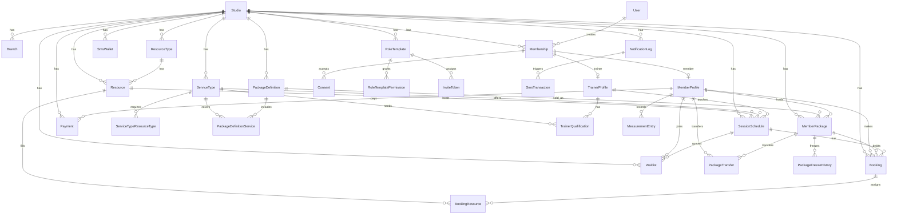

# Pilates Studio OS Database Schema

Pilates Studio OS is a multi-tenant boutique studio management system where each tenant (studio) operates independently with complete data isolation. The database enforces strict tenant scoping: every table containing tenant data carries a `studio_id` column, and all queries must filter by it. Users are globally scoped and identified by E.164 phone number (unique); they join studios through Membership records that assign role-based permissions via RoleTemplates. Sector-specific concepts like service types, resource types, and form vocabularies are tenant data, not enums, allowing each studio to define its own catalog and workflows.

## Entity-Relationship Diagram

## Platform Level

| Table | Purpose | Constraints |
|-------|---------|-------------|
| `business_type_templates` | Sector starter kit: vocabulary, defaults, form modules | key unique |
| `plans` | SaaS subscription tiers with feature limits | key unique |
| `sms_packages` | SMS credit packages for sale | key unique |

## Tenant and Identity

| Table | Purpose | Constraints |
|-------|---------|-------------|
| `studios` | Tenant: branding, timezone, notification settings | slug unique |
| `branches` | Studio locations | studio_id index |
| `users` | Global users identified by E.164 phone | phone unique, email unique |
| `memberships` | User-studio links with role-based access | (user_id, studio_id) unique; (studio_id, status) index |
| `role_templates` | Per-studio permission sets; owner role required | (studio_id, key) unique; one owner per studio |
| `role_template_permissions` | Permissions granted by a role | role_template_id index |
| `invite_tokens` | QR/link onboarding with token hash | token_hash unique; (studio_id, phone) index |
| `document_versions` | Contracts, KVKK, consent forms (platform or studio scope) | (studio_id, type, version) unique with NULLS NOT DISTINCT |
| `consents` | Member consent to a document version | (membership_id, document_version_id) unique |
| `member_profiles` | Member data: birth date, medical conditions, family | (membership_id) unique; studio_id index |
| `trainer_profiles` | Trainer data: qualifications, commission rule | (membership_id) unique; studio_id index |
| `trainer_qualifications` | Trainer certifications for a service type | (trainer_profile_id, service_type_id) composite key |

## Catalogue

| Table | Purpose | Constraints |
|-------|---------|-------------|
| `resource_types` | Resource classes: room, reformer, EMS device, court | (studio_id, name) unique |
| `resources` | Individual resource units; hierarchical (room contains equipment) | (studio_id, resource_type_id) index; capacity >= 1 |
| `cancellation_policies` | Cancellation rules: free period, late charge, no-show charge | studio_id index |
| `commission_rules` | Trainer commission: fixed, percentage, or salary | studio_id index |
| `service_types` | Bookable services: "Private reformer", "EMS 20 min" | (studio_id, name) unique; min_repeat_interval_days optional |
| `service_type_resource_types` | Resources required per service booking | (service_type_id, resource_type_id) composite key |

## Packages and Entitlements

| Table | Purpose | Constraints |
|-------|---------|-------------|
| `package_definitions` | Sellable packages: session count, time-unlimited, or credits | (studio_id, is_active) index |
| `package_definition_services` | Which services a package covers and unit costs | (package_definition_id, service_type_id) composite key |
| `member_packages` | Active member package instance: balance tracking, freezes | (studio_id, member_id, status) index; remaining_units >= 0 or null |
| `package_freeze_history` | Freeze periods: start, end, reason | member_package_id index |
| `package_transfers` | Units transferred between members (family packages) | (studio_id, created_at) index |
| `family_groups` | Groups for shared/family packages | studio_id index |

## Scheduling and Bookings

| Table | Purpose | Constraints |
|-------|---------|-------------|
| `session_schedules` | Classes and appointments: time, trainer, resources, capacity | (studio_id, start_time, end_time) index; (trainer_id, start_time, end_time) index; (resource_id, start_time, end_time) index; capacity > 0; 0 <= booked_count <= capacity |
| `bookings` | Member bookings: status (confirmed, attended, cancelled), units charged | (studio_id, status) index; (member_id) index; (schedule_id, member_id) unique |
| `booking_resources` | Resource unit assignment to booking ("reformer 3"); copy of schedule times | (resource_id, start_time, end_time) index; (booking_id, resource_id) unique; no overlaps for single-capacity resources (database exclusion constraint) |
| `waitlist` | Member waitlist queue: position, status (waiting, offered, promoted) | (schedule_id, member_id) unique; (schedule_id, status, position) index |

## Measurements

| Table | Purpose | Constraints |
|-------|---------|-------------|
| `measurement_form_templates` | Form definitions: fields (JSON), version, scope (platform or studio) | studio_id index; optional business type template association |
| `measurement_entries` | Completed assessments: recorded values (JSON), by user, at timestamp | (studio_id, member_id, recorded_at) index |

## Finance

| Table | Purpose | Constraints |
|-------|---------|-------------|
| `payments` | Member transactions: amount, method (cash, card, bank, online), status | (studio_id, paid_at) index |
| `expenses` | Operating costs: category, amount, spent_at, recorded by user | (studio_id, spent_at) index; (branch_id) optional |

## Notifications and SMS

| Table | Purpose | Constraints |
|-------|---------|-------------|
| `sms_wallets` | Studio SMS credit balance | studio_id unique; balance >= 0 |
| `sms_transactions` | SMS ledger: purchase, usage, adjustment, refund | (studio_id, created_at) index; notification_log_id unique |
| `notification_logs` | Outbound messages: WhatsApp, SMS, push, email; fallback chain | (studio_id, created_at) index; (fallback_of_id) self-reference for retry chains |

## Audit

| Table | Purpose | Constraints |
|-------|---------|-------------|
| `audit_logs` | Action log: who did what to which entity; studio_id nullable for platform actions | (studio_id, created_at) index |

## Subscriptions

| Table | Purpose | Constraints |
|-------|---------|-------------|
| `subscriptions` | SaaS subscription: status (trialing, active, past due, cancelled), period dates | (studio_id, status) index; one live subscription per studio (status IN trialing/active/past_due) |
| `feature_flags` | Feature flags: scope (global, business type, studio); resolution order: tenant > business type > global | (studio_id) index; (key, scope, business_type_template_id, studio_id) unique with NULLS NOT DISTINCT |

## Database-Enforced Rules

1. **Booking Resource Exclusion** (`booking_resources_no_overlap`): Single-capacity resources (capacity=1) cannot have overlapping active bookings. Enforced via PostgreSQL exclusion constraint (btree_gist) on (resource_id WITH =, tsrange(start_time, end_time) WITH &&) WHERE is_active AND exclusive.

2. **Time Range Validity**: 
   - `booking_resources_valid_range`: end_time > start_time
   - `session_schedules_valid_range`: end_time > start_time

3. **Session Capacity**: 
   - `session_schedules_capacity_positive`: capacity > 0
   - `session_schedules_booked_within_capacity`: 0 <= booked_count <= capacity

4. **Package Balance**: `member_packages_units_non_negative`: remaining_units is null or >= 0

5. **SMS Wallet Balance**: `sms_wallets_balance_non_negative`: balance >= 0

6. **Feature Flags NULLS NOT DISTINCT**: (key, scope, business_type_template_id, studio_id) unique index treats NULLs as distinct values, preventing duplicate global flags and platform documents.

7. **Document Versions NULLS NOT DISTINCT**: (studio_id, type, version) unique index with NULLS NOT DISTINCT, preventing duplicate platform documents (studio_id null).

8. **One Owner Role Per Studio**: Unique index on (studio_id) WHERE is_owner enforces exactly one owner role template per studio.

9. **One Live Subscription Per Studio**: Unique index on (studio_id) WHERE status IN ('TRIALING', 'ACTIVE', 'PAST_DUE') enforces only one active subscription per tenant.

## Conventions

- All columns use snake_case mapped to Prisma camelCase via `@map`.
- Primary keys are UUIDs with `@default(uuid())`.
- Foreign keys cascade on delete unless data integrity requires restrict or set null (e.g., role templates for memberships are restricted).
- Tenant data queries must filter by studio_id; SUPER_ADMIN bypasses scoping.
- Migrations are forward-only: expand then contract; never destructive.
- Indexes on tenant data include studio_id first (e.g., (studio_id, start_time, end_time)) for efficient scans within a tenant.
