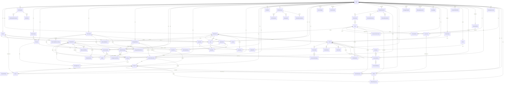

# Platform Veritabanı Şeması

Platform, her kiracının (stüdyonun) tam veri izolasyonuyla bağımsız çalıştığı çok kiracılı (multi-tenant) bir üyelik ve randevu SaaS'ıdır. Veritabanı, sıkı kiracı kapsamını (tenant scoping) zorunlu kılar: kiracı verisi içeren her tablo bir `studio_id` kolonu taşır ve tüm sorgular bununla filtrelenmelidir. Kullanıcılar global kapsamlıdır ve E.164 telefon numarasıyla (benzersiz) tanımlanır; RoleTemplate'ler aracılığıyla rol tabanlı izinler atayan Membership kayıtları üzerinden stüdyolara katılırlar. Hizmet türleri, kaynak türleri ve form kelime dağarcığı gibi sektöre özgü kavramlar enum değil, kiracı verisidir; bu da her stüdyonun kendi kataloğunu ve iş akışlarını tanımlamasına olanak tanır.

## Varlık-İlişki Diyagramı (Entity-Relationship Diagram)

```mermaid
erDiagram
    Studio ||--o{ Branch : has
    Studio ||--o{ Membership : has
    Studio ||--o{ RoleTemplate : has
    Studio ||--o{ ResourceType : has
    Studio ||--o{ Resource : has
    Studio ||--o{ ServiceType : has
    Studio ||--o{ PackageDefinition : has
    Studio ||--o{ MemberPackage : has
    Studio ||--o{ SessionSchedule : has
    Studio ||--o{ Booking : has
    Studio ||--o{ Waitlist : has
    Studio ||--o{ Payment : has
    Studio ||--o{ StoredCard : has
    Studio ||--o{ MemberSubscription : has
    Studio ||--o{ SmsWallet : has
    Studio ||--o{ NotificationLog : has
    Studio ||--o{ PayrollRun : has
    Studio ||--o{ Lead : has
    Studio ||--o{ LeadActivity : has
    Studio ||--o| InvoiceSettings : configures
    Studio ||--o{ InvoiceCounter : sequences
    Studio ||--o{ PartnerConnection : integrates
    PartnerConnection ||--o{ PartnerGuest : brings
    PartnerConnection ||--o{ PartnerSpotAllocation : allots
    PartnerConnection ||--o{ PartnerWebhookEvent : receives
    PartnerConnection ||--o{ Booking : books
    PartnerGuest ||--o| User : identifies
    Studio ||--o{ Invoice : issues
    Studio ||--o{ BillingProfile : has

    User ||--o{ Membership : creates
    Membership ||--o| MemberProfile : member
    Membership ||--o| TrainerProfile : trainer
    Membership ||--o{ Consent : accepts
    Membership ||--o{ MembershipBranch : limited_to
    Branch ||--o{ MembershipBranch : grants
    Branch ||--o{ MemberProfile : home_of

    RoleTemplate ||--o{ RoleTemplatePermission : grants
    RoleTemplate ||--o{ InviteToken : assigns

    ResourceType ||--o{ Resource : has
    Resource ||--o{ BookingResource : fills
    Resource ||--o{ SessionSchedule : hosts

    ServiceType ||--o{ SessionSchedule : offers
    ServiceType ||--o{ ServiceTypeResourceType : requires
    ServiceType ||--o{ PackageDefinitionService : covers
    ServiceType ||--o{ TrainerQualification : needs

    PackageDefinition ||--o{ PackageDefinitionService : includes
    PackageDefinition ||--o{ MemberPackage : sold_as

    MemberProfile ||--o{ MemberPackage : holds
    MemberProfile ||--o{ Booking : makes
    MemberProfile ||--o{ Waitlist : joins
    MemberProfile ||--o{ Payment : pays
    MemberProfile ||--o{ StoredCard : owns
    MemberProfile ||--o{ MemberSubscription : subscribes
    MemberProfile ||--o{ MeasurementEntry : records
    MemberProfile ||--o{ PackageTransfer : transfers

    PackageDefinition ||--o{ MemberSubscription : renews_as
    StoredCard ||--o{ MemberSubscription : charges
    StoredCard ||--o{ Payment : charges
    MemberSubscription ||--o{ Payment : bills
    MemberSubscription ||--o{ PaymentAttempt : attempts
    Payment ||--o{ PaymentAttempt : records
    Payment ||--o| Invoice : billed_as
    Branch ||--o{ Invoice : issued_from
    MemberProfile ||--o| BillingProfile : declares

    TrainerProfile ||--o{ SessionSchedule : teaches
    TrainerProfile ||--o{ TrainerQualification : has

    MemberPackage ||--o{ Booking : debits
    MemberPackage ||--o{ PackageFreezeHistory : freezes
    MemberPackage ||--o{ PackageTransfer : transfers

    SessionSchedule ||--o{ Booking : has
    SessionSchedule ||--o{ Waitlist : queues

    Booking ||--o{ BookingResource : assigns

    NotificationLog ||--o{ SmsTransaction : triggers

    Studio ||--o{ MessageTemplate : overrides
    NotificationLog ||--o{ MessageLink : tracks
    NotificationLog ||--o{ MessageTrackingEvent : records
    Studio ||--o{ MessageSuppression : suppresses
    Contact ||--o{ Conversation : has
    Conversation ||--o{ ConversationMessage : contains
    Studio ||--o{ SavedReply : has
    Studio ||--o{ CommunicationConsent : has
    User ||--o{ CommunicationConsent : grants
    Branch ||--o{ PayrollRun : scopes
    PayrollRun ||--o{ PayrollLine : has
    TrainerProfile ||--o{ PayrollLine : earns

    Lead ||--o{ LeadActivity : logs
    Membership ||--o{ Lead : owns
    Membership ||--o{ LeadActivity : acts_on
    ServiceType ||--o{ Lead : interests
    Branch ||--o{ Lead : at

    Studio ||--o{ Contact : has
    Studio ||--o{ PipelineStage : defines
    Studio ||--o{ ContactFieldDefinition : defines
    Studio ||--o{ Visitor : tracks
    Studio ||--o{ ConversionEvent : records
    PipelineStage ||--o{ Contact : holds
    Membership ||--o| Contact : becomes
    Membership ||--o{ Contact : owns
    Contact ||--o{ ContactActivity : logs
    Contact ||--o{ ContactTask : has
    Contact ||--o{ Touchpoint : attributed
    Contact ||--o{ ConversionEvent : converts
    Contact ||--o{ Contact : merged_into
    Visitor ||--o{ Touchpoint : visits
    Touchpoint ||--o{ ConversionEvent : credited
    ConversionEvent ||--o{ ConversionDelivery : outbox

    Studio ||--o{ AutomationRule : configures
    Studio ||--o{ AutomationRun : has
    AutomationRule ||--o{ AutomationRun : produces
    User ||--o{ AutomationRun : targeted_by

    Studio ||--o{ TrialRedemption : has
    Studio ||--o{ RedemptionCounter : has
    Studio ||--o{ PromoCode : has
    Studio ||--o{ PromoRedemption : has
    Studio ||--o{ GiftCard : has
    Studio ||--o{ GiftCardTransaction : has
    PackageDefinition ||--o{ TrialRedemption : redeemed_as
    User ||--o{ TrialRedemption : redeems
    MemberPackage ||--o| TrialRedemption : granted_by
    User ||--o{ PromoCode : creates
    PromoCode ||--o{ PromoRedemption : redeemed_as
    User ||--o{ PromoRedemption : redeems
    Payment ||--o| PromoRedemption : discounted_by
    User ||--o{ GiftCard : purchases
    GiftCard ||--o{ GiftCardTransaction : logs
    Payment ||--o{ GiftCardTransaction : records
    Payment ||--o{ GiftCard : paid_with
```

## Platform Seviyesi

| Tablo | Amaç | Kısıtlar |
|-------|---------|-------------|
| `business_type_templates` | Sektör başlangıç kiti: kelime dağarcığı, varsayılanlar, form modülleri | key benzersiz |
| `plans` | Özellik limitleriyle SaaS abonelik seviyeleri | key benzersiz |
| `sms_packages` | Satılık SMS kredi paketleri | key benzersiz |
| `languages` | Platform dilleri; `tr` ve `en` kodla birlikte gelir (bundled) ve her zaman etkindir, diğerleri süper admin tarafından eklenir ve varsayılan olarak devre dışı başlar | code birincil anahtar |
| `translation_overrides` | Bir dil için CMS'te düzenlenen, dil paketiyle yüklenen veya yapay zekayla çevrilen değer; yalnızca kodda var olan mesaj anahtarları ve o dilin ihtiyaç duyduğu çoğul uzantı anahtarları (ör. `.few`) için yazılır. `source` (MANUAL/UPLOAD/AI) değerin kaynağı, `reviewed_at` bir kişinin onay zamanı (yapay zeka değerlerinde onaya kadar boş) | (locale, key) benzersiz; (locale, source, reviewed_at) index; locale -> languages.code (cascade silme) |

## Kiracı ve Kimlik

| Tablo | Amaç | Kısıtlar |
|-------|---------|-------------|
| `studios` | Kiracı: marka (logo, varsayılan tema ailesi `theme_family`, ana renk, gradyan), varsayılan dil (`default_locale`, `languages.code`'a işaret eder, varsayılan `tr`), saat dilimi, bildirim ayarları, bölge (`country_code` ISO 3166-1, `currency` ISO 4217, `tax_regime` TR_KDV/EU_VAT/UK_VAT/US_SALES_TAX/NONE, `prices_include_tax`; bkz. `packages/shared/src/growth/regions.ts` ve `GET/PUT /studios/:studioId/region`) | slug benzersiz |
| `branches` | Stüdyo lokasyonları: adres, iletişim, saat dilimi (boşsa işletmeninki), sıra, aktiflik | (studio_id, name) benzersiz; (id, studio_id) benzersiz (bileşik yabancı anahtar hedefi); studio_id index |
| `membership_branches` | Personelin işlem yapabileceği şubeler; kayıt yoksa tüm şubeler, işletme sahibi hiçbir zaman kısıtlanmaz | (membership_id, branch_id) birincil anahtar; (branch_id, studio_id) bileşik yabancı anahtar ile şubenin aynı işletmeye ait olması zorunlu |
| `users` | E.164 telefon ile tanımlanan global kullanıcılar; görünüm tercihi (`theme_family` boşsa işletmenin teması, `color_scheme` SYSTEM/LIGHT/DARK); `locale` boşsa aktif stüdyonun `default_locale`'i kullanılır | phone benzersiz, email benzersiz |
| `memberships` | Rol tabanlı erişimle kullanıcı-stüdyo bağlantıları; `is_partner_guest` yalnızca bir partner (toplayıcı) webhook'unun oluşturduğu, kendisi henüz stüdyoya gerçekten katılmamış misafirlerde true olur - mesajlaşma/etkileşim akışları (otomasyon, churn, oyunlaştırma push, puanlama, tavsiye kodu) bu satırları hariç tutar; kişi normal onboarding'i tamamladığında veya personel onu üyeye dönüştürdüğünde temizlenir (bkz. `docs/PARTNERS.md`, "Partner misafirleri ve mesajlaşma") | (user_id, studio_id) benzersiz; (studio_id, status) index; (studio_id, is_partner_guest) index |
| `role_templates` | Stüdyo başına izin kümeleri; owner rolü zorunlu | (studio_id, key) benzersiz; stüdyo başına bir owner |
| `role_template_permissions` | Bir rol tarafından verilen izinler | role_template_id index |
| `invite_tokens` | Token hash ile QR/bağlantı onboarding'i | token_hash benzersiz; (studio_id, phone) index |
| `document_versions` | Sözleşmeler, KVKK, onay formları (platform veya stüdyo kapsamı) | (studio_id, type, version) NULLS NOT DISTINCT ile benzersiz |
| `consents` | Üyenin bir doküman sürümüne onayı | (membership_id, document_version_id) benzersiz |
| `member_profiles` | Üye verisi: doğum tarihi, sağlık durumu, aile, ana şube (`home_branch_id`) | (membership_id) benzersiz; studio_id index |
| `trainer_profiles` | Antrenör verisi: nitelikler, komisyon kuralı | (membership_id) benzersiz; studio_id index |
| `trainer_qualifications` | Bir hizmet türü için antrenör sertifikaları | (trainer_profile_id, service_type_id) bileşik anahtar |

## Katalog

| Tablo | Amaç | Kısıtlar |
|-------|---------|-------------|
| `resource_types` | Kaynak sınıfları: oda, reformer, EMS cihazı, kort | (studio_id, name) benzersiz; `is_active` (W1: aktif kaynağı olan bir tür pasifleştirilemez) |
| `resources` | Tekil kaynak birimleri; hiyerarşik (oda ekipman içerir) | (studio_id, resource_type_id) index; capacity >= 1; `is_active`, `is_maintenance`; W5: opsiyonel `layout_x`, `layout_y` (yer haritası ızgara koordinatları) ve `label` (yer haritasında görünen kısa etiket, örn. "3" veya "Kort 2") |
| `cancellation_policies` | İptal kuralları: ücretsiz süre, geç iptal ücreti, gelmeme (no-show) ücreti | studio_id index; `is_active`; stüdyo başına en fazla bir `is_default = true` satır (uygulama seviyesinde, katalog modülünde transaction ile korunur) |
| `commission_rules` | Antrenör komisyonu: sabit, yüzde veya maaş | studio_id index |
| `service_types` | Rezerve edilebilir hizmetler: "Özel reformer", "EMS 20 dk" | (studio_id, name) benzersiz; min_repeat_interval_days opsiyonel |
| `service_type_resource_types` | Hizmet rezervasyonu başına gerekli kaynaklar | (service_type_id, resource_type_id) bileşik anahtar |

## Paketler ve Haklar (Entitlements)

| Tablo | Amaç | Kısıtlar |
|-------|---------|-------------|
| `package_definitions` | Satılabilir paketler: seans sayısı, süre-sınırsız veya kredi | (studio_id, is_active) index |
| `package_definition_services` | Bir paketin kapsadığı hizmetler ve birim maliyetler | (package_definition_id, service_type_id) bileşik anahtar |
| `member_packages` | Aktif üye paketi örneği: bakiye takibi, dondurmalar | (studio_id, member_id, status) index; remaining_units >= 0 veya null |
| `package_freeze_history` | Dondurma dönemleri: başlangıç, bitiş, sebep | member_package_id index |
| `package_transfers` | Üyeler arasında transfer edilen birimler (aile paketleri) | (studio_id, created_at) index |
| `family_groups` | Paylaşımlı/aile paketleri için gruplar | studio_id index |

## Planlama ve Rezervasyonlar

| Tablo | Amaç | Kısıtlar |
|-------|---------|-------------|
| `session_schedules` | Dersler ve randevular: zaman, antrenör, kaynaklar, kapasite, teslim şekli (`delivery_mode`: IN_PERSON/ONLINE/HYBRID, W19), çevrimiçi kapasite, yayın bağlantısı (`meeting_provider`, `meeting_url`) | (studio_id, start_time, end_time) index; (trainer_id, start_time, end_time) index; (resource_id, start_time, end_time) index; capacity > 0; 0 <= booked_count <= capacity; `meeting_url` yalnızca https, hiçbir listeleme uç noktasında dönmez (bkz. `docs/VIDEO.md`) |
| `bookings` | Üye rezervasyonları: durum (onaylı, katıldı, erken veya geç iptal, gelmedi), tahsil edilen birimler, politika gereği işletmede kalan birimler (`penalty_units`), katılım bağlantısı hatırlatmasının gönderildiği an (`join_reminder_sent_at`, W19) | (studio_id, status) index; (member_id) index; (schedule_id, member_id) benzersiz; `penalty_units` 0 ile `units_charged` arasında (check) |
| `booking_resources` | Rezervasyona kaynak birimi ataması ("reformer 3"); schedule zamanlarının kopyası | (resource_id, start_time, end_time) index; (booking_id, resource_id) benzersiz; tek kapasiteli kaynaklar için çakışma yok (veritabanı exclusion constraint) |
| `waitlist` | Üye bekleme listesi kuyruğu: konum, durum (bekliyor, teklif edildi, terfi etti, süresi doldu, iptal), yer açılınca düşülecek paket (`member_package_id`), sonuçlanma zamanı ve başarısızlık gerekçesi | (schedule_id, member_id) benzersiz; (schedule_id, status, position) index |

## Check-in Kiosku ve QR (W17)

Kapsam dışı: turnike ve kapı entegrasyonu; bu tablolar yalnızca `bookings.status`
alanını `ATTENDED` yapmak için kullanılır. Detaylar: `docs/CHECKIN.md`.

| Tablo | Amaç | Kısıtlar |
|-------|---------|-------------|
| `studios.check_in_window_before_minutes` / `check_in_window_after_minutes` | Bir taramanın seans başlangıcına göre kabul edildiği pencere (varsayılan 30 / 15 dk) | `Int`, varsayılan sırasıyla 30 ve 15 |
| `check_in_points` | Şubeye bağlı statik giriş QR'ı (poster): ad, aktif/pasif; ham kod saklanmaz, yalnızca `token_hash` | `token_hash` benzersiz (SHA-256); (studio_id) ve (branch_id) index |
| `kiosk_devices` | Şubeye eşleştirilmiş tablet: eşleştirme kodu (tek seferlik, SHA-256 hash, 10 dk geçerli), eşleştirme/son görülme/iptal zamanları | (studio_id) ve (branch_id) index; `pairing_code_hash` yalnızca eşleştirme bekleyen cihazlarda dolu |

## Video (W19): Canlı Yayın ve İsteğe Bağlı Kütüphane

| Tablo | Amaç | Kısıtlar |
|-------|---------|-------------|
| `video_contents` | İsteğe bağlı video içeriği: başlık, süre, kaynak (`provider`: yalnızca EXTERNAL_URL uygulandı, UPLOADED ayrılmış), görünürlük (tüm üyeler / aktif paketi olanlar / belirli paketler), izleme başına opsiyonel kredi maliyeti, yayın durumu | (studio_id, is_published) index; `source_url` yalnızca https |
| `video_content_packages` | SPECIFIC_PACKAGES görünürlüğünde içeriği açan paket tanımları | (video_content_id, package_definition_id) birincil anahtar |
| `video_views` | Üye başına izleme kaydı: kaldığı yer, tamamlanma zamanı, kredi tahsilatının yapıldığı an (`credit_charged_at`) | (video_content_id, member_id) benzersiz; kredi tahsilatı bu benzersiz satır üzerinde koşullu güncelleme ile tam olarak bir kez yapılır |

## Ölçümler

| Tablo | Amaç | Kısıtlar |
|-------|---------|-------------|
| `measurement_form_templates` | Form tanımları: alanlar (JSON), sürüm, kapsam (platform veya stüdyo) | studio_id index; opsiyonel iş türü şablonu ilişkisi |
| `measurement_entries` | Tamamlanmış değerlendirmeler: kaydedilen değerler (JSON), kullanıcı, zaman damgası | (studio_id, member_id, recorded_at) index |

## Finans

| Tablo | Amaç | Kısıtlar |
|-------|---------|-------------|
| `payments` | Üye işlemleri: tutar, para birimi (her zaman `studios.currency` ile aynı; sabit `'TRY'` yazılmaz), iade edilen tutar, yöntem (nakit, kart, banka, online), durum, sağlayıcı (mock/iyzico/paytr/stripe) ve sağlayıcı referansı, taksit sayısı, satışın yapıldığı şube, beklemedeki (örn. havale) ödemeler için paket bilgisini taşıyan `metadata` | (studio_id, paid_at) index; (branch_id, paid_at) index; (provider, provider_reference) index |
| `stored_cards` | Üye başına saklanan kart: yalnızca sağlayıcı kart token'ı + son 4 hane + marka + son kullanma tarihi; PAN veya CVV asla saklanmaz | (studio_id, member_id) index |
| `member_subscriptions` | Bir pakete bağlı, otomatik yenilenen üye aboneliği: durum (aktif, ödeme gecikmiş, iptal, duraklatıldı), dönem tarihleri, sonraki tahsilat zamanı, dönem sonunda iptal bayrağı, taksit sayısı | (studio_id, member_id) index; (status, next_charge_at) index (dunning taramasi için) |
| `payment_attempts` | Bir aboneliğin tahsilat denemesi (dunning): deneme numarası, durum, hata kodu, sonraki deneme zamanı | member_subscription_id index |
| `expenses` | İşletme giderleri: kategori, tutar, spent_at, kaydeden kullanıcı | (studio_id, spent_at) index; (branch_id) opsiyonel |

## e-Arşiv / e-Fatura (W8)

| Tablo | Amaç | Kısıtlar |
|-------|---------|-------------|
| `invoice_settings` | Stüdyo başına fatura yapılandırması: unvan, vergi dairesi, vergi numarası (VKN/TCKN, shared'de checksum doğrulanır), e-fatura modu (yok/e-Arşiv/e-Fatura), entegratör sağlayıcısı, varsayılan KDV oranı, seri kodu, ödeme sonrası otomatik kesim bayrağı | studio_id benzersiz |
| `invoice_counters` | Stüdyo + seri + yıl başına atomik sıra sayacı; fatura oluşturulurken aynı transaction içinde artırılır | (studio_id, series_prefix, year) birincil anahtar |
| `billing_profiles` | Üyenin fatura kimliği: bireysel (TCKN opsiyonel, yoksa e-Arşiv'in standart tüketici TCKN'si "11111111111" kullanılır) veya şirket (unvan, vergi dairesi, VKN zorunlu) | member_id benzersiz; studio_id index |
| `invoices` | Bir ödemeye bağlı e-Arşiv/e-Fatura belgesi: seri+yıl+sıra numarası, alıcı ve kalem anlık görüntüsü (JSON), ara toplam/KDV/toplam (KDV dahil fiyattan geriye bölünerek hesaplanır), durum (taslak, kesildi, iptal, başarısız), sağlayıcı ve sağlayıcı referansı, PDF bağlantısı, iptal/hata gerekçesi | payment_id benzersiz; (studio_id, number) benzersiz; (studio_id, issue_date) index; (branch_id) index; (status) index |

## Bildirimler ve SMS

| Tablo | Amaç | Kısıtlar |
|-------|---------|-------------|
| `sms_wallets` | Stüdyo SMS kredi bakiyesi | studio_id benzersiz; balance >= 0 |
| `sms_transactions` | SMS defteri: satın alma, kullanım, düzeltme, iade | (studio_id, created_at) index; notification_log_id benzersiz |
| `notification_logs` | Teslim kaydı (G1c ile genişledi): WhatsApp, SMS, push, e-posta, uygulama içi; amaç (TRANSACTIONAL/COMMERCIAL), kullanıcı ve kişi, e-posta adresi (telefon artık isteğe bağlı), şablon, dil, konu, sağlayıcı, tekilleştirme anahtarı, kampanya/akış kimliği, iletildi/açıldı/makine açılışı/tıklandı/geri döndü/şikâyet/okundu zamanları; fallback zinciri | (studio_id, created_at), provider_message_id, (studio_id, contact_id, purpose, created_at) ve (studio_id, user_id, created_at) index; (studio_id, idempotency_key) benzersiz; tekrar deneme zincirleri için (fallback_of_id) kendine referans |
| `message_templates` | Kanal ve dil başına mesaj şablonu (`{ad}` yer tutucuları; eski `{{ad}}` da okunur); e-posta için konu ve tipli blok gövde (`blocks`), WhatsApp için Meta onay durumu (`whatsapp_status`); studio_id null olan satırlar süper adminin küresel varsayılanı, doldurulmuş satırlar kiracı geçersiz kılması | (studio_id, key, channel, locale) NULLS NOT DISTINCT ile benzersiz; key index |
| `message_links` | Takip edilen e-posta bağlantısının sunucuda saklı hedefi (G1c) | notification_log_id index; teslim kaydı silinince silinir |
| `message_tracking_events` | Teslim, açılma, tıklama, geri dönme, şikâyet, abonelikten çıkma olayları; makine işareti (G1c) | notification_log_id ve (studio_id, type, occurred_at) index |
| `message_suppressions` | Ticari gönderim bastırma listesi: abonelikten çıkma, STOP, kalıcı geri dönme, şikâyet (G1c) | (studio_id, channel, address) benzersiz |
| `conversations` | Gelen kutusu konuşması: kişi, kanal, durum, atanan personel, son mesaj ve son gelen mesaj zamanı (WhatsApp 24 saat penceresi), okunmamış sayısı (G1c) | kişi ve kanal başına tek açık konuşma (kısmi benzersiz index, migration SQL'inde); (studio_id, status, last_message_at) index |
| `conversation_messages` | Konuşmadaki gelen/giden mesaj, sağlayıcı kimliği, durum, ekler, yazan personel, teslim kaydı bağlantısı (G1c) | (conversation_id, created_at) index; gelen mesajda (studio_id, provider_message_id) kısmi benzersiz |
| `saved_replies` | Kiracının hazır cevapları (G1c) | studio_id index |

`studios.messaging_settings` (JSON): kiracının SMS sağlayıcısı sabitlemesi, ticari mesaj sıklık sınırı, e-posta gönderen adı ve yanıt adresi; gelen mesaj numaraları (yalnızca süper admin).
| `communication_consents` | Ticari mesaj için İYS tarzı onay durumu (kanal başına) | (studio_id, user_id, channel) benzersiz; (studio_id, status) ve (iys_synced_at) index |

Bölgesel gönderim kuralları (`apps/api/src/modules/compliance`) ayrı bir tablo tutmaz: `ComplianceService.canSend()` alıcının ülkesinden türetilen uyum bölgesine (TR/EU/UK/US/CA/DEFAULT) göre saf bir karar fonksiyonu çalıştırır; TR bölgesi için karar `communication_consents` üzerinden okunur (`TrConsentRegistryAdapter`).

## Hakediş Bordrosu (Payroll, W14)

| Tablo | Amaç | Kısıtlar |
|-------|---------|-------------|
| `payroll_runs` | Bir dönem (opsiyonel şube kapsamlı) için hakediş çalıştırması: durum (taslak, onaylandı, ödendi), toplamlar | (studio_id, branch_id, period_start, period_end) index; (studio_id, status) index |
| `payroll_lines` | Çalıştırma başına antrenör satırı: seans/katılımcı sayıları, brüt, düzeltme, net, hesaplama detayı (JSON) | (run_id, trainer_profile_id) benzersiz; (studio_id, trainer_profile_id) index |

Formül ve durum makinesi için bkz. `docs/PAYROLL.md`.

## Potansiyel Müşteri Hattı (W11)

| Tablo | Amaç | Kısıtlar |
|-------|---------|-------------|
| `leads` | Henüz üye olmamış aday: kaynak (web formu, Instagram, kapıdan gelen, tavsiye, telefon, diğer), aşama (yeni, görüşüldü, deneme planlandı, deneme yapıldı, üye oldu, kaybedildi), sorumlu personel, bir sonraki takip tarihi, UTM alanları; üyeliğe dönüşünce `converted_membership_id` doldurulur | (studio_id, stage) index; (studio_id, phone) index; (studio_id, next_follow_up_at) index; (studio_id, open_phone) benzersiz: `open_phone` aday açıkken telefonu, üye olunca veya kaybedilince NULL tutar; böylece aynı telefondan tek açık aday olur ve kısıt Prisma şemasında ifade edilebilir |
| `lead_activities` | Bir adayın geçmişi: not, arama, mesaj, aşama değişikliği, deneme dersi kaydı | (lead_id, created_at) index |

Açık (WON/LOST olmayan) bir aday aynı telefonla tekrar başvurursa (web formundan veya personel tarafından), yeni bir `leads` satırı açılmaz; bu, o adayın geçmişine bir `lead_activities` notu olarak eklenir (bkz. `LeadsService.create` ve `LeadsService.submitPublicForm`, `apps/api/src/modules/leads/leads.service.ts`). Aday WON veya LOST olduktan sonra aynı telefonla yeni bir aday açılabilir.

**G1b ile birlikte `leads` ve `lead_activities` artık yazılmaz** (yalnızca okunur, uygulama kodu onları kullanmaz). Veriler `20260929000000_crm_attribution` migration'ı ile `contacts` ve `contact_activities` tablolarına taşındı; tablolar bir sürüm boyunca yerinde kalır ve daraltma (contract) sürümünde `crm_backfill_contacts()` fonksiyonu ile birlikte kaldırılır. Ayrıntılar: `docs/CRM_VE_ATIF.md`.

## CRM ve Atıf (G1b)

| Tablo | Amaç | Kısıtlar |
|-------|---------|-------------|
| `contacts` | Kiracı başına tanınan her kişi (aday, deneme, üye, eski üye): ad, telefon (E.164), e-posta, dil, ülke, saat dilimi, yaşam döngüsü (`LEAD`, `TRIAL`, `MEMBER`, `LAPSED`, `LOST`), satış hattı aşaması, sorumlu personel, şube, etiketler, özel alanlar (JSON), bağlı üyelik, ilk/son temas noktası ve hızlı raporlama için ilk/son kaynak özet kolonları (kaynak, medium, kampanya adı, kampanya/reklam seti/reklam kimliği), elle girilen kanal (`source_channel`), test işareti, birleştirme (`merged_into_id`) | `(studio_id, phone)` ve `(studio_id, lower(email))` üzerinde `merged_into_id IS NULL` koşullu kısmi benzersiz index'ler (migration SQL'inde, Prisma şemasında ifade edilemez); `membership_id` benzersiz; `tags` üzerinde GIN index; (studio_id, lifecycle_stage), (studio_id, pipeline_stage_id), (studio_id, owner_membership_id), (studio_id, phone), (studio_id, next_follow_up_at), (studio_id, first_source), (studio_id, last_source) index |
| `contact_activities` | Kişi zaman çizelgesi (`lead_activities`'in yerine): not, arama, mesaj, aşama ve yaşam döngüsü değişikliği, form, birleştirme | (contact_id, created_at) ve (studio_id, created_at) index |
| `contact_field_definitions` | Kiracının özel kişi alanları: anahtar, dile göre etiket (JSON), tür (`string`, `number`, `date`, `boolean`, `enum`), seçenekler | (studio_id, key) benzersiz |
| `pipeline_stages` | Kiracının satış hattı aşamaları (eski `LeadStage` enum'unun yerine kiracı verisi); sistem aşamaları NEW, CONTACTED, TRIAL_BOOKED, TRIAL_DONE, WON, LOST; `kind` OPEN/WON/LOST | (studio_id, key) benzersiz; (studio_id, sort_order) index |
| `contact_tasks` | Kişi üzerindeki takip görevi: başlık, bitiş zamanı, atanan personel, durum (OPEN, DONE, CANCELLED) | (studio_id, status, due_at), (contact_id), (assignee_membership_id, status) index |
| `visitors` | Anonim ziyaretçi (`pw_vid` çerezi) ve tanındıysa bağlı kişi | birincil anahtar (studio_id, id) |
| `touchpoints` | Oturumun ilk isteği veya takip parametresi taşıyan her istek: açılış host'u ve yolu (sorgu dizesi olmadan), yönlendiren host, UTM kolonları, reklam platformu, `pw_cid`/`pw_asid`/`pw_adid`/`pw_plc`, tıklama kimlikleri ve `fbp`/`fbc` (yalnızca reklam izniyle), dil, kaba ülke kodu (IP saklanmaz), cihaz türü, sayfa varyantı, etiketsiz ücretli trafik işareti | ziyaretçiye (studio_id, visitor_id) bileşik yabancı anahtar; (studio_id, visitor_id, occurred_at), (studio_id, contact_id, occurred_at), (studio_id, occurred_at), (studio_id, session_id) index |
| `conversion_events` | Dönüşüm olayı (`lead`, `trial_booked`, `trial_attended`, `purchase`, `subscription_started`, `subscription_renewed`; platform kiracısında `studio_signup`, `studio_paid`): tutar + para birimi, olay kimliği, kişi, atfedilen son temas noktası, test işareti | (studio_id, event_id) benzersiz; idempotency için (studio_id, source_kind, source_id) benzersiz; (studio_id, type, occurred_at) index |
| `conversion_deliveries` | Reklam platformlarına sunucu tarafı gönderim kuyruğu (outbox): hedef, durum, deneme sayısı, sonraki deneme, son hata. Yalnızca kiracının bağlı reklam hesabı varsa PENDING satır yazılır (G2b) | (conversion_event_id, target) benzersiz; (status, next_attempt_at) index |

`studios.is_platform`: platformun kendi kiracısı (slug `platform`); `WHERE is_platform` kısmi benzersiz index'i en fazla bir satırın işaretli olmasını zorunlu kılar.

`studios.attribution_window_days` (varsayılan 30): atıf penceresi artık kiracı ayarıdır, sabit `DEFAULT_ATTRIBUTION_WINDOW_DAYS` yalnızca varsayılan değerdir (G2b, migration `20260930000000_ads_integration`). `touchpoints.advertising_consent`: temas noktası kaydedilirken `consent.advertising` değeri; reklam platformlarına gönderim bu alana bakarak izinsiz hiçbir şey göndermez.

## Reklam Entegrasyonu (G2b)

| Tablo | Amaç | Kısıtlar |
|-------|---------|-------------|
| `ad_connections` | Kiracının bir reklam platformu hesabına bağlantısı: platform (META/GOOGLE/TIKTOK), durum (DISCONNECTED/CONNECTED/ERROR), hesap kimliği, pixel/dataset kimliği, şifreli kimlik bilgileri (`CredentialCipher`), son 4 karakter (görüntüleme için düz metin), dönüşüm olayı türü başına platform dönüşüm eylemi kimliği (JSON), test modu, son senkron, son hata | (studio_id, platform, label) benzersiz; (studio_id, status) index |
| `ad_entities` | Senkronize edilen kampanya/reklam seti/reklam yapısı: seviye, harici kimlik, ad (yenilenir), durum, üst harici kimlik. Atıf her zaman kimlikle yapılır; bu tablo yalnızca insan tarafından okunabilir adı günceller | (studio_id, platform, level, external_id) benzersiz; (studio_id, platform, parent_external_id) index |
| `ad_spend_daily` | Varlık başına günlük harcama: tutar + para birimi, gösterim, tıklama | (studio_id, platform, level, external_id, date) benzersiz; (studio_id, platform, date) index |

Atıf raporu (`GET /crm/studios/:studioId/attribution`), `groupBy` seviyesine karşılık gelen `ad_spend_daily` satırlarını eşleştirerek harcama, CPL, CAC ve ROAS hesaplar (`source` grubu, çifte saymayı önlemek için yalnızca kampanya seviyesi harcamayı toplar). Ayrıntılar: `docs/REKLAM_ENTEGRASYONU.md`.

`conversion_deliveries` artık gerçek bir işçi tarafından tüketilir: `ConversionDeliveryDispatcherService`, `JobsService.runAll()` içindeki 15 dakikalık kalp atışından (veya Redis varsa BullMQ tekrarlayan işinden) çağrılır; `PENDING` ve zamanı gelmiş satırları alır, `Meta CAPI` / `Google Ads` / `TikTok Events` adaptörlerinden birine gönderir ve `CONVERSION_RETRY_DELAYS_SECONDS` ile üstel geri çekilme uygular. Son denemeden sonra `FAILED` (ölü mektup) kalır; izin veya eşleşme yoksa `SKIPPED_NO_CONSENT` / `SKIPPED_NO_MATCH` ile hemen sonlanır, yeniden denenmez.

## Segmentler, kişi izni, kampanyalar ve akışlar (G2a)

| Tablo | Amaç | Kısıtlar |
|-------|---------|-------------|
| `segments` | Kayıtlı kitle: `DYNAMIC` (kurallar arka planda yeniden hesaplanır) veya `STATIC` (elle); `rules` JSON (`SegmentGroupSchema` ile doğrulanır), `cached_count`, `refreshed_at`, `archived_at` | (studio_id, archived_at) index |
| `segment_members` | Segmentin güncel üyeleri; `entered_at` `segment_entered` tetikleyicisini besler | PK (segment_id, contact_id); (studio_id, contact_id), (segment_id, entered_at) index |
| `contact_consents` | Kişi düzeyinde ticari izin (SMS/WhatsApp/e-posta), kaynak ve kanıt notu, İYS senkron zamanı | (contact_id, channel) benzersiz; (studio_id, status), (iys_synced_at) index |
| `campaigns` | Bir segmente tek seferlik ticari gönderim: kanal (boşsa işletme sırası), şablon anahtarı, durum, zamanlar, kitle sayısı | segment_id -> segments (RESTRICT); (studio_id, status), (status, scheduled_at) index |
| `campaign_recipients` | Kampanyanın alıcı anlık görüntüsü ve kişi başına sonuç (durum, neden kodu, kanal, `notification_log_id`, deneme, sonraki deneme) | (campaign_id, contact_id) benzersiz; (campaign_id, status, next_attempt_at) index |
| `journeys` | Çok adımlı akış: `definition` JSON (`JourneyDefinitionSchema` + `validateJourneyGraph`), durum, şablon anahtarı, taşınan eski kural (`legacy_rule_id` benzersiz, `legacy_rule_type`), `activated_at` | (studio_id, status), (status) index |
| `journey_enrollments` | Bir kişinin akıştaki çalışması: geçerli adım, adıma varış, sonraki çalışma, işçi kilidi, tetikleyici değişkenleri, bitiş nedeni | (journey_id, contact_id, trigger_ref) benzersiz (idempotent kayıt); (journey_id, contact_id, lock_key) benzersiz (tekrar giriş politikası); (status, next_run_at) index |
| `journey_step_runs` | Çalışmış her adım (DONE/SKIPPED/FAILED, neden, mesaj kaydı) | (enrollment_id, step_id) benzersiz |

`notification_logs.campaign_id` ve `journey_run_id` artık `campaigns` ve `journey_enrollments` tablolarına yabancı anahtardır (SET NULL); migration öncesindeki değerler (G1c'de hiç yazılmamıştı) boşaltıldı. `automation_rules` tablosuna `migrated_journey_id` (benzersiz, `journeys`'e SET NULL) ve `migrated_at` eklendi. Migration: `20261003000000_growth_engagement`. Ayrıntılar: `docs/KAMPANYA_VE_AKISLAR.md`.

## Otomasyon (Otomatik Pazarlama ve Yaşam Döngüsü Akışları)

> Kullanımdan kaldırıldı (G2a): kurallar akışlara taşınır, tablolar daraltma sürümüne kadar okunabilir kalır.

| Tablo | Amaç | Kısıtlar |
|-------|---------|-------------|
| `automation_rules` | Kiracı kuralı: tür (WIN_BACK, PACKAGE_EXPIRING, BIRTHDAY, FIRST_CLASS_FOLLOW_UP, BOOKING_REMINDER, NO_SHOW_FOLLOW_UP), tür başına doğrulanmış `params` JSON, hedef `message_templates.key`, aktif/pasif | (studio_id, type) ve (studio_id, is_active) index |
| `automation_runs` | Bir kural/kullanıcı/hedef için tek gönderim denemesi; en-fazla-bir-kez teslimatın koruma anahtarı | (rule_id, user_id, target_ref) benzersiz; (studio_id, rule_id, created_at) index |

`automation_rules.params`, `packages/shared/src/automations.ts` içindeki `AutomationRuleParamsSchema` (Zod ayrık birleşimi) ile doğrulanır; kural 7 gereği enum değildir. `automation_runs` satırı, değerlendirici göndermeden **önce** oluşturulur (insert-first) ve unique kısıt bir sonraki değerlendirme döngüsünün aynı hedefi tekrar göndermesini engeller (idempotency guard). Bkz. `docs/AUTOMATIONS.md`.

## Satış Araçları (W9): Deneme Dersi, Promosyon Kodu, Hediye Kartı

| Tablo | Amaç | Kısıtlar |
|-------|---------|-------------|
| `package_definitions.is_trial`, `.trial_limit_per_user` | Bir paket tanımını deneme teklifi olarak işaretler; kullanıcı başına izin verilen satın alma sayısı | `(studio_id, is_trial)` index |
| `trial_redemptions` | Bir kullanıcının bir deneme paketini kullandığı kaydı (denetim/iz) | `(studio_id, user_id, package_definition_id)` index |
| `redemption_counters` | Deneme teklifi ve promosyon kodu için kullanıcı başına kullanım sayacı; `(studio_id, subject, subject_id, user_id)` benzersiz index üzerinden tek bir `INSERT ... ON CONFLICT DO UPDATE ... WHERE count < limit` deyimiyle yarış durumuna karşı güvenli okunup artırılır | `(studio_id, subject, subject_id, user_id)` benzersiz |
| `promo_codes` | Promosyon kodu: tür (yüzde/sabit tutar/ücretsiz hak), değer, geçerlilik aralığı, toplam ve kullanıcı başına kullanım limiti, minimum tutar, uygulanabilir paketler, yalnızca yeni üyeler kısıtı | `(studio_id, code)` benzersiz (kod her zaman büyük harfle saklanır) |
| `promo_redemptions` | Bir kodun bir ödemeye uygulanması: indirim tutarı | `payment_id` benzersiz (ödeme başına bir kod); `(promo_code_id, user_id)` ve `(studio_id, user_id)` index |
| `gift_cards` | Hediye kartı: yalnızca sha256 kod özeti + son 4 hane saklanır (gerçek kod yalnızca oluşturulduğunda bir kez döndürülür), başlangıç tutarı, güncel bakiye, alıcı bilgisi, son kullanma tarihi, durum | `(studio_id, code_hash)` benzersiz; `(studio_id, status)` ve `(purchaser_user_id)` index |
| `gift_card_transactions` | Kart hareketleri: satış, kullanım, iade, manuel düzeltme | `(gift_card_id, created_at)` index |
| `payments.promo_code_id`, `.discount_amount`, `.gift_card_id`, `.gift_card_amount`, `.gift_card_refunded` | Bir ödemeye uygulanan promosyon indirimi ve hediye kartından karşılanan tutar; iade edilen hediye kartı payı | `(promo_code_id)` ve `(gift_card_id)` index |

## Ayrılma Riski (Churn Risk, W12)

| Tablo | Amaç | Kısıtlar |
|-------|---------|-------------|
| `member_risk_snapshots` | Aktif üye başına en güncel ayrılma riski puanı (0-100), seviyesi (LOW/MEDIUM/HIGH), gerekçeleri (JSON: makine anahtarı + Türkçe etiket + puan), yeni üye bayrağı, önceki puan, görüşüldü/ertelendi durumu | `member_id` benzersiz (üye başına tek satır, `ChurnService.recomputeStudio` upsert eder); (studio_id, level, score) index |
| `member_risk_history` | Her yeniden hesaplamada üye başına bir satır: puan, seviye, hesaplama zamanı; haftalık değişim ve özet trendleri için kullanılır | (studio_id, member_id, computed_at) index; (studio_id, computed_at) index |

Puanlama fonksiyonu (`apps/api/src/modules/churn/churn-scoring.ts`) saf ve iş kuralı olduğu için `apps/api` içinde yaşar; ağırlıkları `studios.churn_weights` (JSONB, null ise `packages/shared/src/churn.ts` içindeki varsayılanlar geçerli olur) üzerinden kiracı ayarlanabilir. Sinyaller, ağırlıklar ve seviye eşikleri için bkz. `docs/CHURN.md`.

## Oyunlaştırma (W16)

| Tablo | Amaç | Kısıtlar |
|-------|---------|-------------|
| `badge_definitions` | Rozet tanımı, veri olarak (kod değil): `studio_id` null olan satırlar her kiracıya sunulan küresel varsayılanlardır, kiracı kendi rozetlerini de ekleyebilir. `kind` (MILESTONE_SESSIONS, STREAK_WEEKS, MONTHLY_GOAL_MET, FIRST_SESSION, EARLY_BIRD, VARIETY) ve `threshold` (kind'a göre şekillenen Json; `@platform/shared`'daki paylaşılan Zod discriminated union ile doğrulanır) | (studio_id, key) benzersiz; (studio_id, is_active) index |
| `member_badges` | Bir üyenin kazandığı bir rozet; `source_ref` genellikle tetikleyen booking id'sidir | (member_id, badge_definition_id) benzersiz -- kazanma her zaman idempotenttir; (studio_id, member_id) index |
| `member_goals` | Üyenin kendi belirlediği aylık seans hedefi ("YYYY-MM"); ilerleme hiçbir zaman burada saklanmaz, her okumada katılım geçmişinden hesaplanır | (member_id, month) benzersiz; (studio_id, month) index |

`studios.gamification_enabled` (varsayılan true) oyunlaştırmayı stüdyo bazında kapatır; kapalıyken `GamificationService.onAttendance` hiçbir rozet vermez ama check-in'in kendisi hiçbir zaman başarısız olmaz (best-effort, try/catch). `member_profiles.leaderboard_opt_in` (varsayılan false) gizlilik öncelikli liderlik tablosu katılımıdır; katılmayan üyeler listede hiç görünmez, katılanlar yalnızca ad + soyadın ilk harfiyle görünür. Seri ve kilometre taşı hesaplamaları stüdyonun saat dilimine göre ISO hafta bazlı saf fonksiyonlardır (`apps/api/src/modules/gamification/gamification-calculations.ts`). Detaylar: `docs/GAMIFICATION.md`.

## Puan ve Tavsiye (W15)

| Tablo | Amaç | Kısıtlar |
|-------|---------|-------------|
| `session_ratings` | Bir üyenin bir rezervasyona verdiği puan (1-5) ve isteğe bağlı yorum; `trainer_profile_id` puanlama anındaki değil, seansı veren eğitmeni (`SessionSchedule.trainerId`) yansıtır; `is_anonymous_to_trainer` (varsayılan true) eğitmenin kendi görünümünde üye kimliğini gizler | (booking_id) benzersiz: üye başına rezervasyon başına tek puan; (studio_id, trainer_profile_id), (studio_id, service_type_id), (studio_id, created_at) index |
| `referral_codes` | Üye başına tek kısa tavsiye kodu | (member_id) benzersiz (bir üyenin tek kodu olur); (code) global benzersiz |
| `referrals` | Bir tavsiye kaydı: tavsiye eden üye, tavsiye edilen (global) kullanıcı, durum (beklemede, hak kazandı, ödüllendirildi, iptal edildi), hak kazanma ve ödül zaman damgaları, ödül türü ve miktarı | (studio_id, referred_user_id) benzersiz: kullanıcılar telefonla global benzersiz olduğundan aynı telefon bir stüdyoda iki kez tavsiye olarak kaydedilemez; (studio_id, status), (studio_id, referrer_member_id) index |

`bookings.rating_prompt_sent_at` (nullable): "seansını değerlendir" push bildiriminin gönderildiği an; `RatingPromptService.promptRecentAttendees()` için idempotency anahtarıdır. `studios.google_review_url` (nullable, yalnızca g.page/search.google.com/local/writereview/google.com/maps ile başlayan https bağlantı) ve `studios.referral_reward_units` (varsayılan 1) çalışma zamanı kuralları için `docs/FEEDBACK_REFERRAL.md` içindedir.

## Açık Platform (W18)

| Tablo | Amaç | Kısıtlar |
|-------|---------|-------------|
| `api_keys` | Herkese açık API için kimlik bilgisi: ad, önek (görüntülenir), sha256 gizli özet (`secret_hash`, düz metin hiçbir zaman saklanmaz), yetki alanları (`scopes[]`), oluşturan, son kullanım, süre, iptal | `prefix` benzersiz; `(studio_id, revoked_at)` index |
| `webhook_endpoints` | Giden webhook uç noktası: URL (yalnızca https), HMAC imza gizli anahtarı, dinlenen olaylar, aktiflik, ardışık hata sayacı | `(studio_id)` index |
| `webhook_deliveries` | Bir teslimat denemesi kaydı: olay, JSON gövde, durum (PENDING/SUCCEEDED/FAILED/ABANDONED), deneme sayısı, HTTP yanıt kodu, bir sonraki deneme zamanı, kesilmiş hata mesajı (en fazla 500 karakter) | `(endpoint_id, created_at)` ve `(status, next_attempt_at)` index |
| `studios.embed_allowed_origins` | Gömülebilir rezervasyon widget'ının çerçevelenmesine izin verilen kökenler; boş liste herhangi bir kökene izin verir (`frame-ancestors *`) | - |

Ayrıntılar için `docs/PUBLIC_API.md`.

## Toplayıcı / Pazaryeri Partner Entegrasyonları (W20)

Sağlayıcıdan bağımsız (provider-agnostic) bir çerçeve: ClassPass, Urban Sports Club, Wellhub/Gympass ve yerel Türkiye eşdeğerleri için ortak bir adaptör arayüzü, artı gerçek sözleşme/kimlik bilgisi gerektirmeyen bir MOCK adaptör. Gerçek sağlayıcılar için ne gerektiği `docs/PARTNERS.md` içindedir.

| Tablo | Amaç | Kısıtlar |
|-------|---------|-------------|
| `partner_connections` | Bir stüdyonun bir partnere bağlantısı: sağlayıcı (MOCK/CLASSPASS/URBAN_SPORTS/WELLHUB/OTHER), etiket, durum (aktif/duraklatıldı/devre dışı), AES-256-GCM ile şifrelenmiş kimlik bilgisi (`encrypted_credentials`, hiçbir uç nokta tarafından asla döndürülmez), yapılandırma (`config`: paylaşılan hizmet türleri/şubeler, seans başına partner yer kontenjanı, ziyaret başına ödeme oranı, kontenjanın seanstan kaç saat önce serbest bırakılacağı), son senkronizasyon zamanı, ardışık senkronizasyon hatası sayacı | (studio_id, provider, label) benzersiz; (studio_id, status) index |
| `partner_guests` | Bir partner rezervasyonunun getirdiği misafirin kimliği: tam ad, (varsa) telefon, partnerin kendi misafir kimliği, bağlı global `User` | (studio_id, connection_id) index; (connection_id, external_guest_id) index |
| `partner_spot_allocations` | Bir seans için bir partner bağlantısına ayrılan yer kontenjanı: ayrılan/kullanılan yer sayısı, serbest bırakılma zamanı | (connection_id, schedule_id) benzersiz; (studio_id, release_at, is_released) index |
| `partner_webhook_events` | Gelen partner webhook olaylarının tekrar (replay) koruması: partnerin kendi olay kimliği bağlantı başına benzersizdir | (connection_id, event_id) benzersiz |

`bookings` tablosuna eklenenler: `partner_connection_id` (nullable), `external_reservation_id` (nullable, partnerin kendi rezervasyon kimliği), `partner_guest_id` (nullable), `partner_cancelled` (bool, partner tarafından iptal edildiğinde true). `member_id` her zaman dolu kalır (NOT NULL değişmedi): partner misafiri bir `MemberProfile`'a bağlanır ki `Booking.member_id` kısıtı bozulmasın ve mevcut ~30 modülün (hakediş, oyunlaştırma, geri bildirim, otomasyon, raporlar) hepsi partner rezervasyonlarını değişiklik gerektirmeden aynı şekilde işleyebilsin; partnerin kendi kimliği ve görünen adı `partner_guests` üzerindendir (bkz. `docs/PARTNERS.md`, "Tasarım kararı"). (partner_connection_id, external_reservation_id) benzersiz kısıtı idempotency sağlar (PostgreSQL'de NULL değerler birbirinden farklı sayıldığından normal rezervasyonlar bu kısıttan etkilenmez).

Sahip kararı: partner misafiri kendisi stüdyoya katılana kadar mesajlaşma/etkileşim açısından sıradan bir üye sayılmaz. `memberships.is_partner_guest` bu ayrımı taşır ve otomasyon, churn, oyunlaştırma push, puanlama ve tavsiye kodu üretimi bu satırları hariç tutar; kendi rezervasyonuna ait işlemsel hatırlatmalar (randevu, no-show takibi) etkilenmez. Ayrıntı: `docs/PARTNERS.md`, "Partner misafirleri ve mesajlaşma".

## Sağlık Entegrasyonu (Apple Health / Health Connect, W21)

| Tablo | Amaç | Kısıtlar |
|-------|---------|-------------|
| `member_health_settings` | Üye başına gizlilik öncelikli açık/kapalı ayarları: `write_workouts` (katılınan dersleri sağlığa yaz), `read_aggregates` (günlük özetleri cihazda oku), `share_with_studio` (bu özetleri işletmeyle paylaş, ayrı bir onay). Üçü de varsayılan `false` | (member_id) benzersiz |
| `health_sync_records` | Bir rezervasyonun bir platforma daha önce yazıldığını izler; aynı rezervasyon aynı platforma asla iki kez yazılmaz (mobil uygulama da aynı anahtarla cihaz üzerinde ayrıca önbellekler) | (member_id, booking_id, platform) benzersiz; (studio_id, member_id) index |
| `health_daily_summaries` | Yalnızca günlük özet (adım, aktif enerji kcal, dinlenme nabzı); ham örnek asla saklanmaz | (member_id, date) benzersiz; (studio_id, member_id, date) index |

`service_types.health_activity_type` (varsayılan `OTHER`) bir hizmetin genel `HealthActivityType` (STRENGTH, FLEXIBILITY, YOGA, PILATES, DANCE, MARTIAL_ARTS, SWIMMING, CYCLING, RUNNING, WALKING, TENNIS, OTHER) ile eşlemesidir; sektöre özgü kod içermez, kiracı verisidir. Sağlık verisi KVKK kapsamında özel nitelikli kişisel veridir: `document_versions.type = HEALTH_DATA` ayrı, isteğe bağlı bir onam metnidir (zorunlu üyelik belgelerinden biri değildir); yükleme uç noktaları bu türden aktif bir `consents` kaydı olmadan 403 döner. Üyenin "Verilerimi sil" eylemi `health_daily_summaries` ve `health_sync_records` satırlarını kalıcı olarak siler, `member_health_settings`'i sıfırlar, HEALTH_DATA onayını geri alır ve bir `audit_logs` kaydı (`member_health.data_deleted`) oluşturur. Personel görünümü `members.health.view` iznini (mevcut izin, üye sağlık notları görünürlüğüyle paylaşılır) VE üyenin `share_with_studio` açığını gerektirir; şube kısıtlı personel yalnızca kendi şubesindeki üyeleri görür. Detaylar: `docs/HEALTH_INTEGRATION.md`.

## Sayfa motoru (Sites, G2c)

| Tablo | Amaç | Kısıtlar |
|-------|---------|-------------|
| `sites` | Bir kiracının web sitesi: `kind` (PLATFORM/TENANT), birincil alan adı, varsayılan/etkin diller | `studio_id` benzersiz (kiracı başına en fazla bir site) |
| `site_domains` | Özel alan adı ve doğrulama durumu (PENDING/VERIFIED/FAILED), DNS doğrulama jetonu | `domain` genel benzersiz |
| `pages` | Bir sayfa: tür (HOME/LANDING/CORPORATE/LEGAL/CUSTOM), sektör/teklif anahtarı, durum (DRAFT/PUBLISHED), A/B varyant grubu | `(site_id, kind)` index |
| `page_locales` | Sayfanın dil başına yolu, SEO alanları, hukuki onay bayrağı | `(site_id, locale, slug)` benzersiz |
| `blocks` | Sayfanın dilden bağımsız yapılandırma + dile göre metin taşıyan bir bölümü, sırası ve isteğe bağlı A/B varyant anahtarı | `(page_id, position)` index |
| `page_versions` | Yayınlanan anın değişmez anlık görüntüsü (geri alma için) | `(page_id, version)` benzersiz, artan |
| `company_info` | Tekil satır: platformun ticari unvanı, adresi, MERSIS/vergi bilgisi, iletişim, sosyal medya | tekil kayıt (sabit id) |

`site.view`/`site.manage` izinleri kiracının kendi sitesini kapsar; platform sitesi aynı tablolar üzerinde, platform kiracısının `studio_id`'siyle, yalnızca süper admin tarafından yönetilir. Ayrıntılar: `docs/SAYFA_MOTORU.md`.

## Yapay zeka çekirdeği (G3b)

| Tablo | Amaç | Kısıtlar |
|-------|---------|-------------|
| `ai_settings` | Tekil platform satırı (`id = 'platform'`): şifreli sağlayıcı anahtarı (`encrypted_api_key`, AES-256-GCM, `INTEGRATION_ENCRYPTION_KEY`) ve son 4 karakteri, görev başına model (`models` JSON), fiyat özelleştirmeleri (`price_overrides` JSON), varsayılan aylık limit (`default_monthly_budget_cents`, 500), son bağlantı testi | tekil kayıt (sabit id); anahtar API yanıtlarında hiç dönmez |
| `ai_usage` | Her model çağrısı: işletme (platform işlerinde boş), kullanıcı, görev (`AiTask`: TRANSLATION/COPYWRITING/REPLY_SUGGESTION), model, girdi/çıktı/önbellek token'ları, mikro-dolar (1e-6 USD) tahmini maliyet, başarı ve hata kodu, çeviri işi | (studio_id, created_at) index -- aylık limit sorgusu; (created_at) index; studio_id -> studios (cascade silme); translation_job_id -> ai_translation_jobs (set null) |
| `ai_glossary_terms` | Dil başına sözlük: aynen kalacak (translation boş) veya sabit çevrilecek terimler; her çeviri isteğine eklenir | (locale, term) benzersiz; locale -> languages.code (cascade silme) |
| `ai_translation_jobs` | Arka plan "yapay zeka ile çevir" işi: dil, bölümler, üzerine yazma, durum (`AiTranslationJobStatus`: QUEUED/RUNNING/COMPLETED/FAILED/CANCELLED), toplam/tamamlanan/başarısız/atlanan sayaçları, model, işçi kilidi (`locked_until`), art arda geçici hata sayısı, son hata, iptal zamanı | (locale, created_at) index; (status) index; locale -> languages.code (cascade silme) |
| `ai_translation_job_items` | İşin anahtar (veya `<grup>.*` çoğul birimi) başına kalemi: durum (`AiTranslationItemStatus`: PENDING/DONE/FAILED/SKIPPED), deneme sayısı (en fazla 2), hata nedeni; devam ettirmenin birimi | (job_id, key) benzersiz; (job_id, status) index; job_id -> ai_translation_jobs (cascade silme) |

`studios.ai_monthly_budget_cents` süper adminin işletmeye özel aylık yapay zeka limitidir (boşsa planın `limits.aiMonthlyBudgetCents` değeri, o da yoksa `ai_settings.default_monthly_budget_cents`); 0 yapay zekayı kapatır. Tüm AI tabloları platform verisidir; kiracıya ait tek satır türü `ai_usage`'dır ve `studio_id` taşır. Ayrıntılar: `docs/YAPAY_ZEKA.md`.

## Sadakat puanı (G3a)

| Tablo | Amaç | Kısıtlar |
|---|---|---|
| `loyalty_settings` | İşletme başına program ayarı: açık/kapalı, son kullanma (`LoyaltyExpiryMode`: NONE / MONTHS_AFTER_EARN + ay), bildirim günü, üyenin uygulamadan ödül kullanması | PK studio_id -> studios (cascade silme); satır yoksa program kapalı |
| `loyalty_rules` | Kiracının kazanma kuralı: `kind` (LOYALTY_RULE_KINDS anahtarı), ad, puan, `per_amount` + `currency` (tutar kuralı), `conditions` JSON (hizmet türü, paket tanımı, rozet listeleri), etkinlik | (studio_id, kind, is_active) index |
| `loyalty_rewards` | Kiracının ödül kataloğu: `type` (LOYALTY_REWARD_TYPES anahtarı), puan bedeli, değer + para birimi (tutar indirimi), yüzde veya hak sayısı, kod geçerlilik günü, etkinlik, üye kullanımı | (studio_id, is_active) index; kullanılmış ödül silinmez (redemptions -> restrict), pasif yapılır |
| `loyalty_accounts` | Üyelik başına önbellekli bakiye, toplam kazanılan/harcanan, `next_expiry_at` (süre dolumu ipucu), `expiry_notice_for` | membership_id benzersiz (cascade silme); `balance >= 0` CHECK; (studio_id, balance) ve (next_expiry_at) index |
| `loyalty_ledger` | Yalnızca ekleme yapılan puan defteri: `delta`, `balance_after`, `reason`, `source_type` + `source_id`, kural, parti son kullanma tarihi (`expires_at`), elle düzeltmeyi yapan üyelik, not, ilgili kişi | (studio_id, source_type, source_id, reason) benzersiz (tekillik); `delta <> 0` ve `balance_after >= 0` CHECK; (studio_id, membership_id, created_at) ve (studio_id, expires_at) index; membership -> cascade, oluşturan -> set null |
| `loyalty_redemptions` | Kullanılan ödül: negatif defter satırı, ödülün o anki adı/türü/değeri/para birimi, üretilen promosyon kodu veya hak eklenen paket | ledger_id benzersiz; promo_code_id -> promo_codes (set null); (studio_id, membership_id, created_at) index |

`promo_codes.restricted_to_user_id` (boş olabilir): sadakat ödülüyle üretilen kodu tek kullanıcıyla sınırlar; boşsa herkes kullanabilir. Bakiye defterden türetilir, hesap satırı aynı işlemde güncellenen bir önbellektir. Ayrıntılar: `docs/SADAKAT.md`.

## Etkinlikler (G3c-1)

| Tablo | Amaç | Kısıtlar |
|---|---|---|
| `events` | Etkinlik, atölye veya kurs: başlık, açıklama, şube, `kind` (SINGLE/SERIES), `status` (DRAFT/PUBLISHED/CANCELLED/COMPLETED), kontenjan ve `seats_taken`, bekleme listesi, `visibility` (PUBLIC/MEMBERS_ONLY), kapak görseli, kayıt penceresi, ilk/son oturum zamanı (`starts_at`/`ends_at`), `full_refund_hours_before`, yayın/iptal/tamamlanma zamanları | Değer listeleri CHECK ile; `capacity > 0`, `0 <= seats_taken <= capacity` CHECK; (studio_id, status, starts_at) ve (status, ends_at) index; branch -> set null |
| `event_occurrences` | Etkinliğin oturumu: başlangıç, bitiş, kaynak, eğitmen, `reminder_sent_at` | `ends_at > starts_at` CHECK; event -> cascade; resource/trainer -> set null; (event_id, starts_at), (studio_id, starts_at), (starts_at, reminder_sent_at) index |
| `event_ticket_types` | Bilet türü: ad, `price_amount` + `currency`, `quantity_limit` + `sold_count`, satış penceresi, `members_only`, `allow_multiple`, paket hakkıyla ödeme (`credit_service_type_id` + `credit_units`), satışta mı, sıra | `price_amount >= 0` ve `0 <= sold_count <= quantity_limit` CHECK; event -> cascade; kaydı olan bilet silinmez (registrations -> restrict) |
| `event_registrations` | Kayıt: üye (`member_id`) veya CRM kişisi (`contact_id`), bilet, `status` (PENDING_PAYMENT/CONFIRMED/WAITLIST/CANCELLED/ATTENDED/NO_SHOW), `source` (STAFF/MEMBER/PUBLIC), `dedupe_key`, bekleme sırası, ödenecek/ödenen/iade tutarı + `currency`, `payment_id`, ödeme yöntemi/bağlantısı/son zamanı, paket ve düşülen/iade hak, giriş ve iptal zamanı | (event_id, dedupe_key) benzersiz (kişi başına tek canlı kayıt; iptalde anahtar silinir); `payment_id` benzersiz (payments -> set null); üye veya kişiden biri zorunlu (CHECK); member ve contact -> cascade; (studio_id, event_id, status), (event_id, status, waitlist_position), (studio_id, status, payment_due_at) index |

Oturumlar bilerek `session_schedules` tablosunda değildir: kapasite, bilet ve kayıt etkinlik başınadır (gerekçe `docs/ETKINLIKLER.md`). Ayrıntılar: `docs/ETKINLIKLER.md`.

## Denetim (Audit)

| Tablo | Amaç | Kısıtlar |
|-------|---------|-------------|
| `audit_logs` | İşlem günlüğü: kim neyi hangi varlığa yaptı; platform işlemleri için studio_id nullable | (studio_id, created_at) index |

## Abonelikler

| Tablo | Amaç | Kısıtlar |
|-------|---------|-------------|
| `subscriptions` | SaaS aboneliği: durum (deneme, aktif, gecikmiş, iptal edildi), dönem tarihleri | (studio_id, status) index; stüdyo başına bir canlı abonelik (status IN trialing/active/past_due) |
| `feature_flags` | Özellik bayrakları: kapsam (global, iş türü, stüdyo); çözümleme sırası: kiracı > iş türü > global | (studio_id) index; (key, scope, business_type_template_id, studio_id) NULLS NOT DISTINCT ile benzersiz |

## Veritabanı Tarafından Zorunlu Kılınan Kurallar

1. **Rezervasyon Kaynağı Dışlama (Booking Resource Exclusion)** (`booking_resources_no_overlap`): Tek kapasiteli kaynaklar (capacity=1) çakışan aktif rezervasyonlara sahip olamaz. PostgreSQL exclusion constraint (btree_gist) ile (resource_id WITH =, tsrange(start_time, end_time) WITH &&) WHERE is_active AND exclusive üzerinde uygulanır.

2. **Zaman Aralığı Geçerliliği**:
   - `booking_resources_valid_range`: end_time > start_time
   - `session_schedules_valid_range`: end_time > start_time

3. **Seans Kapasitesi**:
   - `session_schedules_capacity_positive`: capacity > 0
   - `session_schedules_booked_within_capacity`: 0 <= booked_count <= capacity

4. **Paket Bakiyesi**: `member_packages_units_non_negative`: remaining_units null veya >= 0

5. **SMS Cüzdan Bakiyesi**: `sms_wallets_balance_non_negative`: balance >= 0

6. **Feature Flag'ler NULLS NOT DISTINCT**: (key, scope, business_type_template_id, studio_id) benzersiz index, NULL'ları farklı değerler olarak ele alır, yinelenen global bayrakları ve platform dokümanlarını önler.

7. **Doküman Sürümleri NULLS NOT DISTINCT**: (studio_id, type, version) NULLS NOT DISTINCT ile benzersiz index, yinelenen platform dokümanlarını önler (studio_id null).

7b. **Mesaj Şablonları NULLS NOT DISTINCT** (backlog 4.1-4.3, migration `20260925000000_super_admin`): (studio_id, key, channel, locale) benzersiz index'i NULLS NOT DISTINCT'e çevrildi; öncesinde studio_id null olan (küresel varsayılan) satırlar için yinelenen kayıtlara izin veriliyordu, feature_flags ve document_versions'da zaten uygulanan düzeltmeyle aynı kapsam.

8. **Stüdyo Başına Bir Owner Rolü**: (studio_id) WHERE is_owner üzerindeki benzersiz index, her stüdyo için tam olarak bir owner rol şablonu bulunmasını zorunlu kılar.

9. **Stüdyo Başına Bir Canlı Abonelik**: (studio_id) WHERE status IN ('TRIALING', 'ACTIVE', 'PAST_DUE') üzerindeki benzersiz index, kiracı başına yalnızca bir aktif abonelik olmasını zorunlu kılar.

10. **İade Sınırı** (uygulama seviyesinde, `PaymentsService.refundPayment` içinde koşullu `updateMany` ile): `refunded_amount`, okunan anlık değer üzerinden koşullu güncellenir; eşzamanlı iki iade isteği `amount`'u asla aşamaz ve ikinci istek `409 Conflict` alır.

10. **Açık Aday Başına Tek Telefon**: (studio_id, open_phone) benzersiz kısıtı, aynı işletmede aynı telefonla birden fazla açık aday oluşmasını engeller. `open_phone` yalnızca aday açıkken dolu olduğu için kapanmış (WON/LOST) adaylar kısıtın dışında kalır.

10b. **CRM Kişi Tekilliği** (G1b, migration `20260929000000_crm_attribution`): `contacts_studio_phone_active_key` (studio_id, phone) ve `contacts_studio_email_active_key` (studio_id, lower(email)) kısmi benzersiz index'leri, birleştirilmemiş (`merged_into_id IS NULL`) kişiler arasında aynı işletmede aynı telefon veya (büyük/küçük harf duyarsız) aynı e-postayla iki kişi olmasını engeller. Birleştirilen kişi gizlenir ve kısıtın dışında kalır. `studios_single_platform_key` en fazla bir platform kiracısına izin verir. Bu index'ler Prisma şemasında ifade edilemediği için yalnızca migration SQL'indedir; drift kontrolü kısmi ve ifade index'lerini yok sayar.

11. **Satış Araçları Yarış Güvenliği** (W9, uygulama seviyesinde): deneme teklifi ve promosyon kodu kullanıcı limitleri `redemption_counters` üzerinde tek bir `INSERT ... ON CONFLICT DO UPDATE ... WHERE count < limit` deyimiyle; promosyon kodunun toplam kullanım limiti `promo_codes.redeemed_count` üzerinde koşullu `updateMany` (`redeemed_count < max_redemptions`) ile; hediye kartı bakiyesi `gift_cards.balance` üzerinde koşullu `updateMany` (`balance >= amount`) ile korunur. Her üçü de eşzamanlı isteklerde tam olarak izin verilen sayıda işlemin başarılı olmasını garanti eder.

## Konvansiyonlar

- Tüm kolonlar snake_case kullanır ve `@map` ile Prisma camelCase'ine eşlenir.
- Birincil anahtarlar `@default(uuid())` ile UUID'dir.
- Veri bütünlüğü restrict veya set null gerektirmedikçe (örn. üyelikler için rol şablonları restrict'tir), yabancı anahtarlar silme işleminde cascade uygular.
- Kiracı verisi sorguları studio_id ile filtrelenmelidir; SUPER_ADMIN kapsamlamayı atlar.
- Migration'lar yalnızca ileri yönlüdür (forward-only): önce genişlet sonra daralt; asla yıkıcı değil.
- Kiracı verisi üzerindeki index'ler, bir kiracı içinde verimli tarama için önce studio_id içerir (örn. (studio_id, start_time, end_time)).
