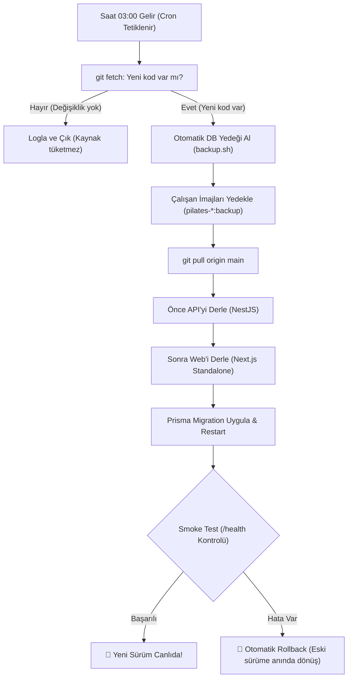

# 100% Ücretsiz Self-Hosted & Gece 03:00 Otomatik Dağıtım Rehberi

Bu rehber; GitHub Actions, harici container registry veya üçüncü parti CI/CD araçlarına **hiçbir ücret ödemeden**, tüm build ve dağıtım sürecini **kendi Ubuntu 24.04 sunucunuzda** gece 03:00'te otomatik çalışacak şekilde kurmanızı sağlar.

---

## 1. Neden Bu Yöntem 6 GB RAM'de Kusursuz Çalışır?

1. **Sıfır Gece Trafiği:** Saat 03:00'te stüdyo kapalı olduğu için veritabanı ve Redis boştadır.
2. **Sıralı Derleme (Sequential Build):** Scriptimiz API ve Web konteynerlerini aynı anda değil, **sırayla** derler. Böylece derleme sırasındaki anlık RAM kullanımı hiçbir zaman 2 GB'ı geçmez.
3. **4 GB Swap Güvencesi:** Kurduğumuz 4 GB Swap alanı sayesinde sunucu belleği asla taşmaz veya kilitlenmez.
4. **Akıllı Güncelleme Kontrolü:** Eğer siz o gün kodda bir değişiklik yapmadıysanız script boşuna derleme yapmaz; 1 saniyede kapanır.

---

## 2. Sunucuda Kurulum Adımları (Tek Seferlik)

### Adım 1: Projenizi Sunucuya Çekin
Sunucunuza SSH ile bağlanıp `/opt/pilates-studio` klasörüne projenizi klonlayın:

```bash
sudo mkdir -p /opt/pilates-studio
sudo chown -R $USER:$USER /opt/pilates-studio
cd /opt/pilates-studio

# Reponuzu klonlayın:
git clone <git-repo-adresiniz> .
```

### Adım 2: Ortam Değişkenlerini Oluşturun
```bash
cp .env.example .env
nano .env
# Alan adlarınızı (WEB_DOMAIN, API_DOMAIN) ve güçlü DB/Redis şifrelerinizi yazıp kaydedin.
```

### Adım 3: İlk Çalıştırma (Sistemi Ayağa Kaldırma)
İlk kez derleyip çalıştırmak için:

```bash
chmod +x deploy/scripts/*.sh
bash deploy/scripts/nightly-deploy.sh
```

Bu komut:
- API ve Web'i sırayla derler.
- PostgreSQL ve Redis'i başlatır.
- Veritabanı tablolarını oluşturur (`prisma migrate`).
- Caddy'yi başlatıp otomatik SSL sertifikasını alır.
- Sistem sağlığını denetler (Smoke Test).

---

## 3. Gece 03:00 Cron Görevinin Eklenmesi

Sistemin her gece 03:00'te otomatik kontrol yapması için sunucunuzda crontab'ı açın:

```bash
crontab -e
```

En alta şu satırı ekleyin:

```cron
0 3 * * * /bin/bash /opt/pilates-studio/deploy/scripts/nightly-deploy.sh >> /opt/pilates-studio/deploy.log 2>&1
```

### Gece 03:00'te Ne Olur?


---

## 4. Acil Durumda Gündüz Manuel Dağıtım Yapmak İsterseniz

Gece 03:00'ü beklemeden hemen canlıya bir düzeltme atmak isterseniz, tek yapmanız gereken sunucuya girip şu komutu çalıştırmaktır:

```bash
cd /opt/pilates-studio
bash deploy/scripts/nightly-deploy.sh
```

---

## 5. Sunucuda Container'da Ayrı Dev (Geliştirme) Ortamı Kurmak İster misiniz?

Eğer sunucuda prodüksiyona dokunmadan geliştirme yapmak veya test etmek isterseniz:

1. `deploy/docker-compose.dev.yml` dosyamız zaten hazırdır.
2. Dev ortamı için `dev.studyonuz.com` şeklinde bir alt alan adı açıp, Caddy üzerinden farklı bir porta yönlendirebilirsiniz.
3. 6 GB RAM sunucuda hem Prodüksiyon hem de Dev ortamı rahatça yan yana çalışabilir (toplam ~3.5 GB RAM kullanırlar).
